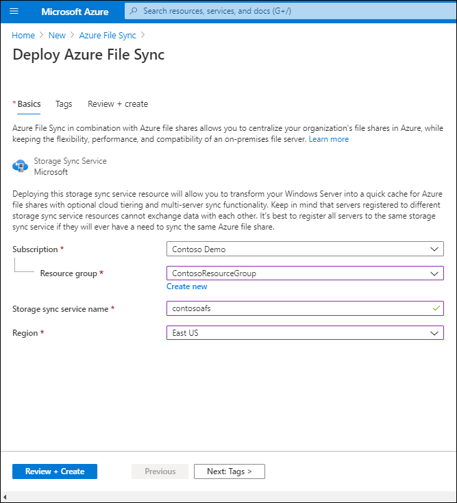
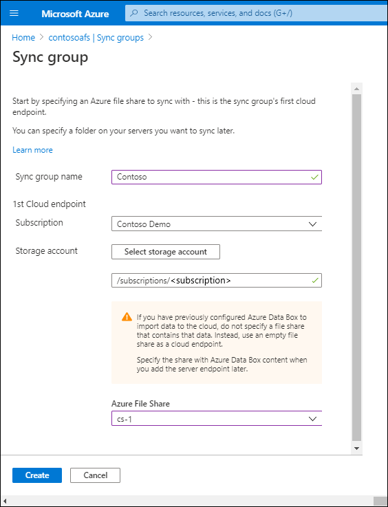
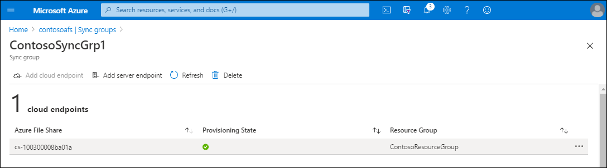

You can implement Azure File Sync manually, or by using Windows Admin Center. When you use Windows Admin Center, you only need to provide basic configuration settings because this method satisfies all the prerequisites. For manual deployment, you use either Azure portal or Azure PowerShell. However, for manual deployment, you must already have an Azure storage account with an Azure file share that's going to be a cloud endpoint. In both cases, you must have on-premises Windows file servers that you want to use as server endpoints. In this unit, you'll learn how to implement Azure File Sync using both methods.

## Implement Azure File Sync manually

To implement Azure File sync manually, you must complete the following high-level steps:

1. Deploy the Storage Sync Service
1. Install the Azure File Sync agent
1. Register Windows Server with Storage Sync Service
1. Create a sync group
1. Add server endpoints

### 1. Deploy the Storage Sync Service

Storage Sync Service is the top-level Azure resource for File Sync. You can have multiple instances of Storage Sync Service, but Windows Server can only register with a single Storage Sync Service, and servers that are registered with other Storage Sync Service instances can't sync with each other. Storage Sync Service can be used only with Azure file shares that are in the same Azure region.

You deploy Storage Sync Service in the Azure portal by selecting **Create a resource**, searching for **Azure File Sync**, and then selecting **Create**. Enter a Resource group name, a Storage sync service name, and a Region, and then select **Review + Create**.

> [!NOTE]
> You deploy Storage Sync Service in Azure PowerShell by using the `New-AzStorageSyncService` cmdlet.

### 2. Install the Azure File Sync agent

You can download the File Sync agent installation package from the Azure portal at the Microsoft Download Center. You must install the agent on all servers that will be server endpoints. If you want to use File Sync with a failover cluster, you must install the agent on every node in the cluster.

By default, the installed agent tries to upgrade itself within 21 days of its posted expiration date. It will start trying to upgrade once a week within 21 days prior to the expiration. and in the selected maintenance window.

You install the File Sync agent on Windows Server 2019 by running the StorageSyncAgent_WS2019.msi installer package on Windows Server.

### 3. Register Windows Server with Storage Sync Service

When the File Sync agent installation completes, the **Server Registration** window automatically opens. Registering Windows Server with Storage Sync Service establishes a trust relationship between your server (or cluster) and Storage Sync Service. After you authenticate with Azure credentials, registration requires information on your Azure subscription, resource group, and Storage Sync Service, which you created in the first step. 

> [!TIP]
> You can register a server (or cluster) with only one Storage Sync Service at a time.

You can register an Azure File Sync agent by running the PowerShell `Register-AzStorageSyncServer` cmdlet. This cmdlet must run locally on the Windows Server computer that you want to register. If you want to register Server Core, you need a second computer with Desktop Experience to perform device sign-in.

### 4. Create a sync group

A sync group contains endpoints that you want to keep synced with each other. It effectively defines the sync topology. A sync group must always have one cloud endpoint and can have up to 50 server endpoints. Server endpoints in the same sync group must be from different registered servers. All server endpoints sync with a cloud endpoint, which makes the cloud endpoint the hub.

You can make changes in a cloud endpoint or any server endpoint because File Sync uses multi-master replication. If you make a change to a server endpoint, the change is detected immediately, synced to the cloud endpoint, and from there synced to other server endpoints. But if you make a change to the cloud endpoint directly, the change must first be discovered by a File Sync change detection job. A change detection job runs only once every 24 hours for a cloud endpoint.

You create a sync group in the Azure portal by selecting **+ Sync Group** in the **Storage Sync Service** blade.

You create a sync group in Azure PowerShell by using the `New-AzStorageSyncGroup` cmdlet.

### 5. Add server endpoints

*Server endpoints* represent a specific location on a registered Windows Server computer, such as a folder or a volume, that you want to sync with an Azure file share (a cloud endpoint in the same sync group). You can only sync files on NTFS-formatted volumes because the Resilient File System (ReFS) and other file systems aren't supported. You can add multiple server endpoints for the same registered server to different sync groups, but their paths must not overlap. You can add only one server endpoint per registered server per sync group.

When adding a server endpoint, you can also configure cloud tiering and offline data transfer. With offline data transfer, you can use alternative means, such as Azure Data Box, to transport large amounts of files to Azure. Cloud tiering transforms a server endpoint into a file cache on an Azure file share. However, be aware that cloud tiering is supported only on data volumes; cloud tiering isn't supported on a system volume.

You add a server endpoint in the Azure portal by selecting **Add server endpoint** in the **Sync group** blade.

You add a server endpoint in Azure PowerShell by using the `New-AzStorageSyncServerEndpoint` cmdlet.

## Implement Azure File Sync by using Windows Admin Center

Windows Admin Center simplifies File Sync deployment. It can automatically create all the prerequisites (Storage Sync Service, a storage account, and an Azure file share) if needed, or use existing ones if they already exist in the Azure subscription. All you need are Azure subscription credentials and a Windows Server computer that you want to make a server endpoint.

> [!NOTE]
> To be able to set up File Sync, you must register Windows Admin Center with Azure.

After connecting Windows Admin Center to the appropriate Windows Server computer, in Windows Admin Center, you must select **Azure File Sync** and then select **Set up**. Windows Admin Center detects if File Sync prerequisites already exist in the subscription or if it must create them. When the prerequisites are in place, you can edit them and then select **Set up**. Setup downloads and installs an Azure File Sync agent and registers Windows Server with the sync group. The last step is to select **Sync a folder**, where you can specify which local folder you want to add as a server endpoint, and to which sync group.

> [!TIP]
> You can add Windows Server as a server endpoint to a sync group and enable cloud tiering by using the Windows Admin Center. However, you still need to use the Azure portal to configure other settings, such as the cloud tiering date policy.
