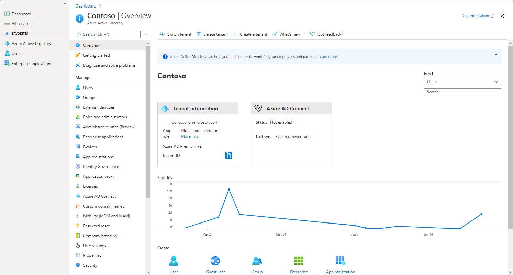

Azure AD is not AD DS in the cloud; instead, it's an entirely new directory service designed for cloud-based and web-based applications, which shares some functionalities with AD DS. The Contoso IT team can implement Azure AD and synchronize its on-premises identities to the cloud. These steps would enable Contoso staff to use SSO to access both on-premises resources and those related resources in their Azure tenant.

The IT team can use Azure AD to increase employee productivity, streamline IT processes, and improve security for adopting various cloud services. Contoso employees can access online applications by using a single user account. Contoso can also perform central user management by using well-known Windows PowerShell cmdlets. It's also worth noting that because Azure AD is highly scalable and highly available by design, the IT team won't have to maintain related infrastructure or worry about disaster recovery.

As a component of Azure, Azure AD can support multi-factor authentication as part of an overall access strategy for cloud services, thus providing an additional layer of security. Role-based access control (RBAC), self-service password, group management, and device registration provide enterprise-ready identity management solutions. Azure AD also provides advanced identity protection in addition to enhanced reporting and alerting that can help you recognize threats more efficiently.

## Overview of Azure AD

Azure AD is part of the platform as a service (PaaS) offering and operates as a Microsoft-managed directory service in the cloud. It's not a part of the core infrastructure that customers own and manage, nor is it an IaaS offering. While this implies that you have less control over its implementation, it also means that you don't have to dedicate resources to its deployment or maintenance.

With Azure AD, you also have access to a set of features that are not natively available in AD DS, such as support for multi-factor authentication, identity protection, and self-service password reset. You can use Azure AD to provide more secure access to cloud-based resources for organizations and individuals by:

- Configuring access to applications.
- Configuring SSO to cloud-based SaaS applications.
- Managing users and groups.
- Provisioning users.
- Enabling federation between organizations.
- Providing an identity management solution.
- Identifying irregular sign-in activity.
- Configuring multi-factor authentication.
- Extending existing on-premises Active Directory implementations to Azure AD.
- Configuring Application Proxy for cloud and local applications.
- Configuring conditional access for users and devices.

## Azure AD tenants

Unlike on-premises AD DS, Azure AD is multitenant by design and is implemented specifically to ensure isolation between its individual directory instances. It is the world’s largest multitenant directory, hosting over a million directory services instances, with billions of authentication requests per week. The term *tenant* in this context typically represents a company or organization that signed up for a subscription to a Microsoft cloud-based service such as Microsoft 365, Microsoft Intune, or Azure, each of which uses Azure AD. 

However, from the technical standpoint, the term *tenant* represents an individual Azure AD instance. Within an Azure subscription, you can create multiple Azure AD tenants. Having multiple Azure AD tenants might be convenient if you want to test Azure AD functionality in one tenant without affecting the others.

> [!NOTE]
> At any given time, an Azure subscription must be associated with one, and only one Azure AD tenant. However, you can associate the same Azure AD tenant with multiple Azure subscriptions.

Each Azure AD tenant is assigned the default DNS domain name that consists of a unique prefix. The prefix is derived from the name of the Microsoft account you use to create an Azure subscription, or provided explicitly when creating an Azure AD tenant, and is followed by the `onmicrosoft.com` suffix. Adding at least one custom domain name to the same Azure AD tenant is possible and common. This name utilizes the DNS domain namespace that the corresponding company or organization owns; for example, `Contoso.com`. The Azure AD tenant serves as the security boundary and a container for Azure AD objects such as users, groups, and applications.

## Characteristics of Azure AD

Although Azure AD has many similarities to AD DS, there are also many differences. It's important to realize that using Azure AD is not the same as deploying an AD DS domain controller on an Azure VM and then adding it to your on-premises domain.

When comparing Azure AD with AD DS, it's important to note the Azure AD characteristics that differ from AD DS:
- Azure AD is primarily an identity solution, and it is designed for internet-based applications by using HTTP (port 80) and HTTPS (port 443) communications.
- Azure AD is a multi-tenant directory service.
- Azure AD users and groups are created in a flat structure, and there are no organizational units (OUs) or Group Policy Objects (GPOs).
- You cannot query Azure AD by using LDAP; instead, Azure AD uses the REST API over HTTP and HTTPS.
- Azure AD doesn't use Kerberos authentication; instead, it uses HTTP and HTTPS protocols such as Security Assertion Markup Language (SAML), Web Services Federation (WS-Federation), and OpenID Connect for authentication. It also uses Open Authorization (OAuth) for authorization.
- Azure AD includes federation services, and many third-party services are federated with and trust Azure AD.

## Azure AD integration options

Small organizations that don't have an on-premises directory such as AD DS can fully rely on Azure AD as an authentication and authorization service. However, the number of these organizations is still quite small, so most companies search for a way to integrate on-premises AD DS with Azure AD. Microsoft offers cloud-scale identity and access management via Azure AD, which provides several options for integrating AD DS with Azure. These options are described in the following table.

|Options|Description|
|----|----|
|Extending on-premises AD DS to Azure|With this option, you host VMs in Azure that you then promote to be domain controllers in your on-premises AD DS.|
|Synchronizing on-premises AD DS with Azure AD|Directory synchronization propagates user, group, and contact information to Azure AD and keeps that information synchronized. In this scenario, users will utilize different passwords to access cloud and on-premises resources, and the authentication processes are separate.|
|Synchronizing AD DS with Azure AD by using password hash synchronization|In this approach, on-premises AD DS synchronizes objects with Azure AD, but also sends password hashes for user objects to Azure AD. With this option, users can access Azure AD–aware applications and resources by providing the same password as their current on-premises sign-in. For end users, this approach provides the same sign-in experience.|
|Implementing SSO between on-premises AD DS and Azure AD|This option supports the largest range of integration features, and it allows a user to sign in to Azure after authenticating via the on-premises AD DS. The technology that provides this functionality is called *federation*, which you can implement by using Active Directory Federation Services (AD FS). AD FS relies on a set of federation servers and proxies, which take the form of the Web Application Proxy server role service. As an alternative to deploying AD FS, you can also use pass-through authentication technology, which provides almost the same results as AD FS. However, it does not use a Web Application Proxy and requires a less complex infrastructure than AD FS.|

The Azure AD directory is not an extension of an on-premises directory. Rather, it's a copy that contains the same objects and identities. Changes made to these items on-premises are copied to Azure AD, but changes made in Azure AD are not replicated back to the on-premises domain.

> [!TIP]
> You can also use Azure AD without using an on-premises directory. In this case, Azure AD acts as the primary source of all identity information, rather than containing data replicated from an on-premises directory.
