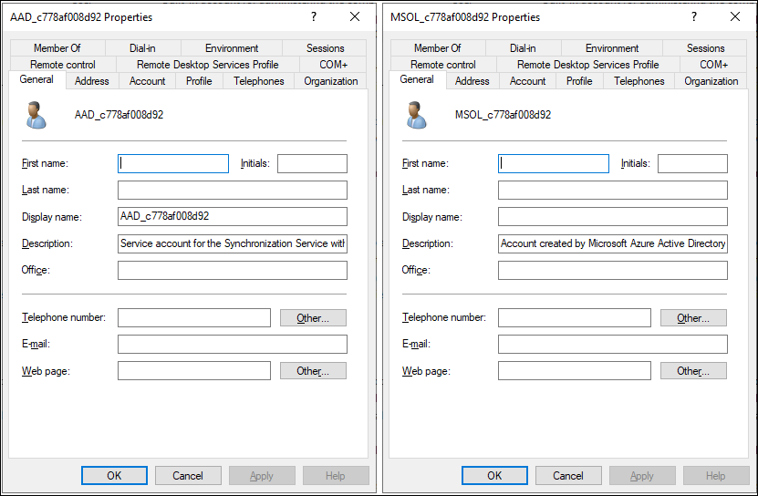

When IT staff at Contoso implements a cloud service or an application in their IT environment, they typically want to use a single identity store for their local and cloud-based applications. By using directory synchronization, they can connect their on-premises AD DS with Microsoft Entra ID.

## What is directory synchronization? 

Directory synchronization enables synchronization between on-premises AD DS and Microsoft Entra ID for users, groups, and contacts. In its simplest form, you install a Directory synchronization component on a server in your on-premises domain. You then provide an account with Domain Admin and Enterprise Admin access to on-premises AD DS, and another account with administrator access to Microsoft Entra ID, and let it run.

User accounts, groups, and contacts that you select from AD DS are then replicated into Microsoft Entra ID. Users can then use those accounts to sign in to and access Azure services that rely on Microsoft Entra ID for authentication.

Unless you activate Password Synchronization, users will have a separate password from their on-premises environment to sign in to an Azure resource. Even if you implement Password Sync, users are still prompted for their credentials when they access the Azure resource on domain-joined computers. The advantage with Password Sync is that to sign in to the Azure resource, users can use the same user name and password as their domain login. Don't confuse this with SSO. The behavior provided with Password Sync is called *same sign-in*.

With Azure, the synchronization flow is one-way from local AD DS to Azure. However, with Microsoft Entra ID P1 or P2 features, some attributes replicate in the other direction. For example, you can configure Azure to write passwords back to an on-premises AD DS, and to groups and devices from Microsoft Entra ID. If you don't want to synchronize your entire on-premises AD DS, directory synchronization for Microsoft Entra ID supports limited filtering and customization of attribute flow based on the following values:

- OU
- Domain
- User attributes
- Applications

## Microsoft Entra Connect

You can use Microsoft Entra Connect (Microsoft Entra Connect) to perform synchronization between on-premises AD DS and Microsoft Entra ID. Microsoft Entra Connect is a wizard-based tool designed to enable connectivity between an on-premises identity infrastructure and Azure. Using the wizard, you can choose your topology and requirements and then the wizard deploys and configures all the required components for you. Depending on the requirements selected, this can include:

- Azure Active Directory Sync (Azure AD Sync)
- Exchange Hybrid deployment
- Password change writeback
- AD FS and AD FS proxy servers or Web Application Proxy 
- [Microsoft Graph PowerShell](/powershell/microsoftgraph/overview) module

> [!NOTE]
> Most organizations deploy a dedicated synchronization server to host Microsoft Entra Connect.

When you run Microsoft Entra Connect, the following occurs:

- New users, groups, and contact objects in on-premises AD DS are added to Microsoft Entra ID. However, licenses for cloud services such as Microsoft 365 are not automatically assigned to these objects.
- Attributes of existing users, groups, or contact objects that are modified in on-premises AD DS are modified in Microsoft Entra ID. However, not all on-premises AD DS attributes are synchronized to Microsoft Entra ID. You can configure a set of attributes that synchronize to Microsoft Entra ID by using Synchronization Manager component of Microsoft Entra Connect.
- Existing users, groups, and contact objects that are deleted from the on-premises AD DS are deleted from Microsoft Entra ID.
- Existing user objects that are disabled on-premises are disabled in Azure. However, licenses are not automatically unassigned.

Microsoft Entra ID requires that you have a single source of authority for every object. Therefore, it's important to understand that in a Microsoft Entra Connect scenario, when you're running Active Directory synchronization you're mastering objects from within your on-premises AD DS, using tools such as Active Directory Users and Computers or Windows PowerShell. However, the source of authority is the on-premises AD DS. After the first synchronization cycle is complete, the source of authority is transferred from the cloud to the on-premises AD DS. All subsequent changes to cloud objects (except for licensing) are mastered from the on-premises AD DS tools. The corresponding cloud objects are read-only, and Microsoft Entra administrators cannot edit cloud objects if the source of authority is on-premises AD DS, unless you implement some of the technologies that allow writeback.

## Permissions and accounts required to run Microsoft Entra Connect

To implement Microsoft Entra Connect, you must have an account with required permissions assigned on both the local AD DS and Microsoft Entra ID. Installing and configuring Microsoft Entra Connect requires the following accounts:

- An Azure account with Global Administrator permission in the Azure tenant (such as an organizational account), that is not the account that was used to set up the account itself.
- An on-premises account with Enterprise Administrator permissions in the on-premises AD DS. In the **Microsoft Entra Connect Wizard**, you can choose to use an existing account for this purpose, or let the wizard create an account for you.

Microsoft Entra Connect uses an Azure Global Administrator account to provision and update objects when the **Microsoft Entra Connect Configuration Wizard** is run. You should create a dedicated service account in Azure for directory synchronization to use, because you cannot use the Azure tenant administrator account. This restriction is because the account that you used to set up Azure might not have a domain name suffix that matches the domain name. The account needs to be a member of the Global Administrators role group.

In the on-premises environment, the account that is used to install and configure Microsoft Entra Connect must have the following permissions:

- Enterprise Administrator permissions in AD DS. This permission is required to create the synchronization user account in Active Directory.
- Local machine administrator permissions. This permission is required to install the Microsoft Entra Connect software.

The account used to configure Microsoft Entra Connect and run the configuration wizard must reside in the local machine’s **ADSyncAdmins** group. By default, the account used to install Microsoft Entra Connect is automatically added to this group.

> [!NOTE]
> The account you use to install AD Connect is automatically added to the ADSyncAdmins group when you install the product. You must sign out and sign in again to use the Synchronization Service Manager interface, because the account will not pick up the group security identifier (SID) until the next time the account is used to sign in.

The Enterprise Administrator account is only required when you install and configure Microsoft Entra Connect, but its credential is not stored or saved by the configuration wizard. Therefore, you should create a special Microsoft Entra Connect administrator account for installing and configuring Microsoft Entra Connect, and assign this account to the Enterprise Administrators group when Microsoft Entra Connect is set up. However, this Microsoft Entra Connect Administrator account should be removed from the Enterprise Administrators group after Microsoft Entra Connect setup is complete. The following table details the accounts created during Microsoft Entra Connect configuration.

|Account|Description|
|----|----|
|`MSOL_<id>`|This account is created during Microsoft Entra Connect installation and is configured to synchronize to the Azure tenant. The account has directory-replication permissions in the on-premises AD DS and write permission on certain attributes to enable hybrid deployment.|
|`AAD_<id>`| This is the service account for the synchronization engine. It's created with a randomly generated complex password automatically configured to never expire. When the directory synchronization service runs, it uses the service account credentials to read from the local Active Directory and then write the contents of the synchronization database to Azure. This is done using the tenant administrator credentials that you enter in the **Microsoft Entra Connect Configuration Wizard**.|

> [!CAUTION]
> You should not change the service account for Microsoft Entra Connect after you install Microsoft Entra Connect, because Microsoft Entra Connect always attempts to run using the account created during setup. If you change the account, Microsoft Entra Connect stops running and the scheduled synchronizations no longer occur.

### Additional reading

To learn more, review the following document. 

- [Topologies for Microsoft Entra Connect](https://aka.ms/plan-connect-topologies?azure-portal=true).
