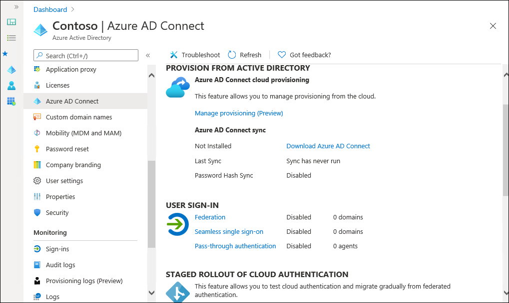
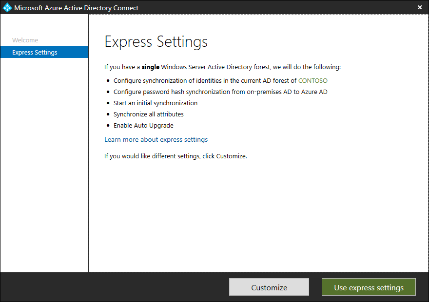
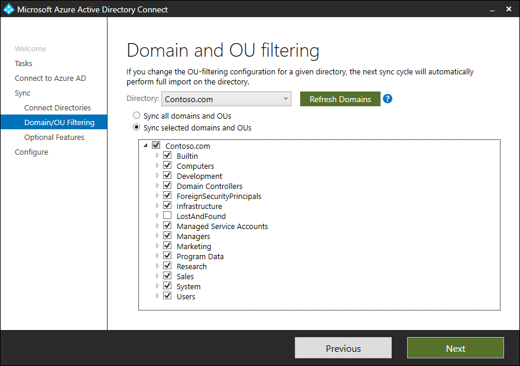

Microsoft Entra Connect requires a domain-joined computer to host the synchronization service. Most organizations deploy a dedicated synchronization server.

## Requirements

After you have set up Azure with an Active Directory tenant, you must complete the primary tasks to deploy directory synchronization using the following steps:

1. Add your AD DS domain into Azure, verify the domain, and then set the domain as the primary domain.
2. Download and install Microsoft Entra Connect.

   

3. Run the **Microsoft Entra Connect Configuration Wizard**. (Optionally, you can configure Microsoft Entra Connect to synchronize specific OUs in the on-premises AD DS environment).

   

4. Enable optional features such as password hash sync, password writeback, and Exchange hybrid deployment.
5. Run Microsoft Entra Connect, and let it configure the environment for directory synchronization
6. Validate the synchronization results.

   

After you set up Microsoft Entra Connect and perform the initial synchronization, you can reconfigure synchronization options if needed. The Microsoft Entra Connect software installation includes several applications related to directory synchronization. When you run Microsoft Entra Connect, you have the option to use Express installation settings, which sets up directory synchronization with the most commonly used settings, or you can choose to customize setup options.

If you choose to use custom installation, at the beginning of the setup you can choose to use a custom SQL server instead of a local database. You can also choose to use an existing service account, instead of the one created by the automatic setup process. In addition, you can specify custom sync groups. By default, the Administrators, Operators, Browse, and the Password Reset groups are created by Microsoft Entra Connect, but you can choose to use your own custom groups for this purpose.

By default, Microsoft Entra Connect sets up password hash synchronization for the directory synchronization mode. If you choose custom installation, you can also choose the **Federation with AD FS** option, or pass-through authentication. Alternatively, you can manually configure directory synchronization if you have a non-Microsoft federation server or another existing solution deployed.

Custom Microsoft Entra Connect installation also allows you to choose the way you identify your users. By default, Setup presumes that your users are represented only once across all directories. However, if you have a scenario where user identities exist across multiple directories, you must choose the matching attribute. You can choose between the options described in the following table.

|Option|Description|
|----|----|
|mail attribute|This option joins users and contacts if the mail attribute has the same value in different forests.|
|ObjectSID and msExchangeMasterAccountSID|This option joins an enabled user in an account forest with a disabled user in an Exchange resource forest. In Exchange, this is also known as *linked mailbox*.|
|sAMAccountName and mailNickname|This option joins additional attributes on locations in a directory where the login ID for the user is expected to be found.|
|My own attribute|This option allows you to select your own attribute.|
|Source Anchor|This is an attribute that stays immutable during the lifetime of a user object. In other words, this attribute is the primary key that links the on-premises user object with the user object in Microsoft Entra ID. Because this attribute cannot be changed later, you must carefully choose an attribute to use for this purpose. A default choice is `objectGUID`, as this attribute doesn't change unless the user account is moved between forests and domains.|

You can configure the `UserPrincipalName` attribute in the same window. This is the attribute that users use when they sign in to Microsoft Entra ID. The domains used for this purpose, also known as the *UPN-suffix*, should be verified in Microsoft Entra ID before synchronizing the user objects.

In some cases, you might want to synchronize only a subset of your users from your local AD DS. Microsoft Entra Connect allows you to select a specific group of users that you want to synchronize to Microsoft Entra ID. You should create this group before you run Microsoft Entra Connect. After you complete the setup, you can add and remove users from this group to maintain the list of user objects that should be present in Microsoft Entra ID. You also can use OUs from your local AD DS as the scope for replication. In the final step, Microsoft Entra Connect lets you set up some optional features available in Microsoft Entra ID P1 or P2.
