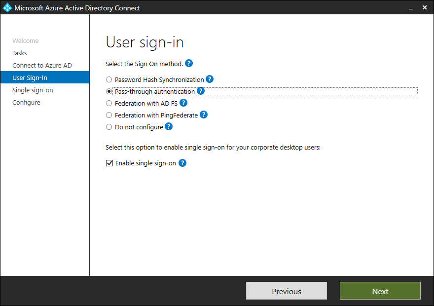

The Contoso IT team wants a way to enable users to use SSO to access both on-premises resources and resources in Azure. Azure AD Seamless SSO is a technology that works with AD FS or with pass-through authentication. If the IT team enables this option, it automatically signs in users to Azure AD resources when they connect to Contoso's corporate network from their corporate devices.

Additionally, when Seamless SSO is enabled, users rarely need to type in their usernames, and never their passwords to sign in to Azure AD. This feature provides Contoso's users with easy access to their cloud-based applications without requiring any additional on-premises components.

## Supported scenarios for pass-through authentication

Azure AD pass-through authentication helps ensure that services which rely on Azure AD always validate passwords against an on-premises AD DS instance.

You can configure Azure AD pass-through authentication by using Azure AD Connect, which uses an on-premises agent that listens for external password validation requests. You can deploy this agent to one or more servers to provide high availability. It's not necessary to deploy this server to a perimeter network because all communication is outbound only.

You should join a server that runs the pass-through authentication agent to the AD DS domain where users are located. Before you deploy Azure AD pass-through authentication, you should know which authentication scenarios are supported and which are not.

You can use pass-through authentication for the following authentication scenarios:

- User sign-ins to all web browser–based applications supported by Azure AD.
- User sign-ins to Office applications that support modern authentication. 

  > [!NOTE]
  > These Office apps include Office 2019, Office 2016, and Office 2013 with modern authentication.

- User sign-ins to Microsoft Outlook clients by using legacy protocols, such as Exchange ActiveSync, Simple Mail Transfer Protocol (SMTP), Post Office Protocol (POP), and Internet Message Access Protocol (IMAP).
- User sign-ins to Skype for Business application that supports modern authentication, including online and hybrid topologies.
- Azure AD domain joins for Windows 10 devices.
- App passwords for multi-factor authentication.

## Unsupported scenarios for pass-through authentication

Although pass-through authentication supports most common authentication scenarios, there are still some scenarios in which you can’t use this method. These scenarios include:

- User sign-ins to legacy Office client applications, excluding Outlook. 

  > [!NOTE]
  > These legacy client apps include Office 2010 and Office 2013 without modern authentication.

- Access to calendar sharing and free/busy information in Exchange hybrid environments on Office 2010 only.
- User sign-ins to Skype for Business client applications without modern authentication.
- User sign-ins to Windows PowerShell version 1.0.
- Detection of users with leaked credentials.
- Scenarios that require Azure AD DS. Azure AD DS requires tenants to have password hash synchronization enabled, so tenants that use only pass-through authentication won’t work in these scenarios.
- Scenarios that require Azure AD Connect Health. Pass-through authentication is not integrated with Azure AD Connect Health.
- If you use the Apple Device Enrollment Program (Apple DEP) that uses the iOS Setup Assistant, then you can’t use modern authentication as it isn't supported. It will fail to enroll Apple DEP devices into Intune for managed domains that use pass-through authentication. Consider using the Intune Company Portal app as an alternative.

## How pass-through authentication works

Before you deploy pass-through authentication, you should understand how it works and how this method of authentication differs from AD FS. Pass-through authentication is not just a simpler form of AD FS authentication. Both methods use the on-premises infrastructure to authenticate users when accessing resources such as Microsoft 365, but not in the same way.

Pass-through authentication uses a component called Authentication Agent to authenticate users. Azure AD Connect installs the Authentication Agent during configuration.

After installation, the Authentication Agent registers itself in your Microsoft 365 tenant’s Azure AD. During registration, Azure AD assigns the Authentication Agent a unique digital-identity certificate. This certificate (with a key pair) enables secure communication with Azure AD. The registration procedure also binds the Authentication Agent to your Azure AD tenant.

  > [!NOTE]
  > Authentication requests are not pushed to the Authentication Agent. Instead, during its initialization, the Authentication Agent connects to Azure AD over port 443, an HTTPS channel that is secured by using mutual authentication. After establishing the connection, Azure AD provides the Authentication Agent with access to the Azure Service Bus queue. From this queue, the Authentication Agent retrieves and manages password validation requests. Because of this, there is no inbound traffic, so it's not necessary to install the Authentication Agent in the perimeter network.

### Example

When Contoso IT staff enable pass-through authentication on their Microsoft 365 tenant and a user tries to authenticate on Outlook Web App, the following steps occur:

1. If not already signed in, the user is redirected to the **Azure AD User Sign-in** page. On this page, the user signs in with a username and password. Azure AD receives the request to sign in and places the username and password in a queue. An Azure AD security token service (STS) uses the Authentication Agent public key to encrypt these credentials. The STS service retrieves this public key from the certificate that the Authentication Agent receives during the registration process.

   > [!NOTE]
   > Although Azure AD temporarily places user credentials in the Azure Service Bus queue, they are never stored in the cloud.

2. The Authentication Agent, which is persistently connected to the Azure Service Bus queue, notices the change in the queue and retrieves the encrypted credentials from the queue. Because the credentials are encrypted with the Authentication Agent public key, the Agent uses its private key to decrypt the data.
3. The Authentication Agent validates the username and password against the local AD DS by using standard Windows APIs. At this point, this mechanism is similar to what AD FS uses. A username can be either the on-premises default username, usually `userPrincipalName`, or another attribute configured in Azure AD Connect, known as *Alternate ID*.
4. The on-premises AD DS evaluates the request and returns the appropriate response to the Authentication Agent: success, failure, password expired, or user locked out.
5. After it receives the response from AD DS, the Authentication Agent returns this response to Azure AD.
6. Azure AD evaluates the response and responds to the user as appropriate. For example, Azure AD either signs in the user immediately, or requests Multi-Factor Authentication<!-- So far we've only used lowercase "multi-factor authentication." -->. If the user sign-in is successful, the user can access the application.

> [!NOTE]
> You can consider deploying Azure AD Seamless SSO together with pass-through authentication to make the user experience even better when accessing cloud-based resources from domain-joined computers. When you deploy this feature, your users can access cloud resources without signing in if they are already signed in on their corporate domain-joined computers with their domain credentials.

### Additional reading

To learn more, review the following documents.

- [Azure Active Directory Seamless Single Sign-On](https://aka.ms/how-to-connect-sso?azure-portal=true).
- [User sign-in with Azure Active Directory Pass-through Authentication](https://aka.ms/how-to-connect-pta?azure-portal=true).
