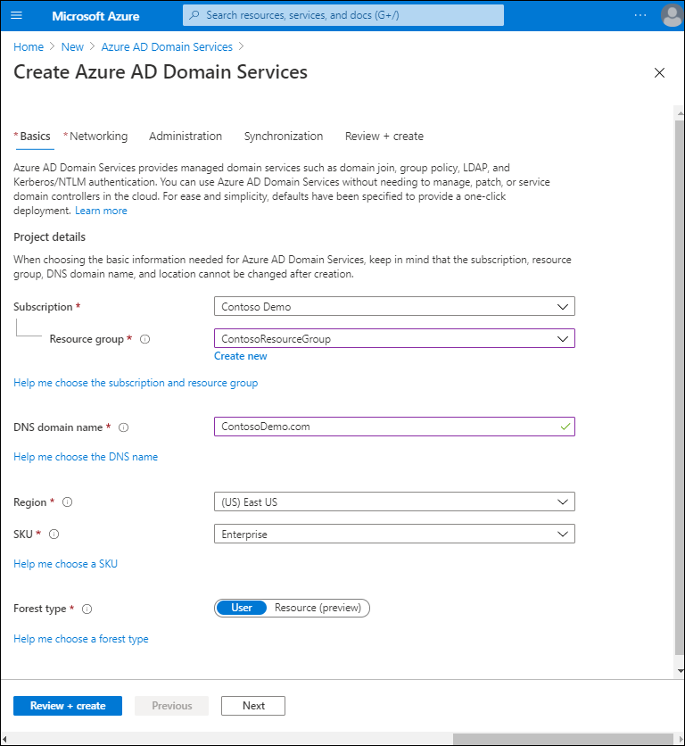
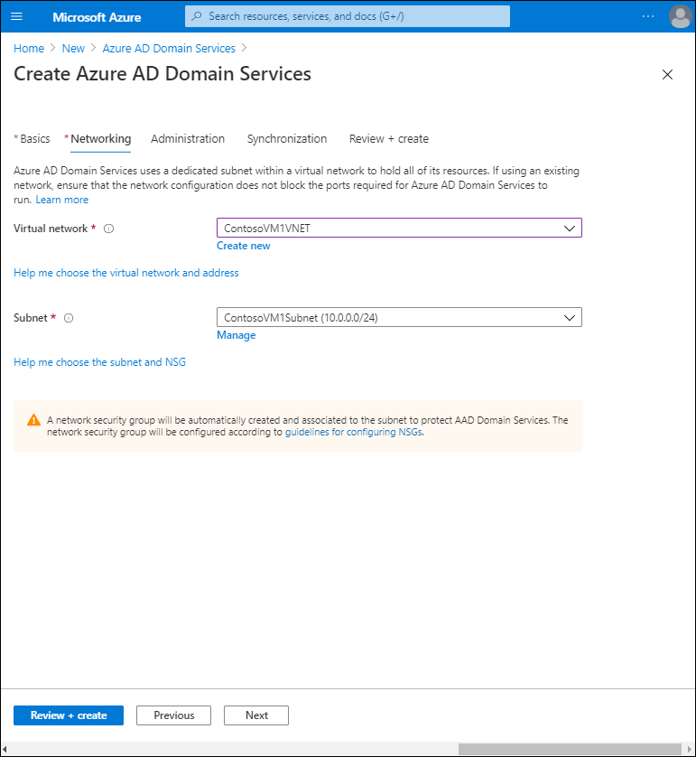

Organizations that use cloud-only Microsoft Entra ID can enable Microsoft Entra Domain Services for an Azure VNet, and then get a new managed domain. Users and groups in Microsoft Entra ID are available in the newly created domain, which has directory services similar to on-premises AD DS, including Group Policy, Kerberos protocol, and LDAP support.

You can join Azure VMs running Windows to the newly created domain, and you can manage them by using basic Group Policy settings. By enabling Microsoft Entra Domain Services, credential hashes that are required for NTLM and Kerberos authentication are stored in Microsoft Entra ID.

Because Contoso is a hybrid organization, they can integrate their identities from their on-premises AD DS with Microsoft Entra Domain Services by using Microsoft Entra Connect. Users in hybrid organizations can have the same experience when accessing domain-based resources in an on-premises infrastructure, or when accessing resources from VMs that run in an Azure virtual network that integrates with Microsoft Entra Domain Services.

## Implement Microsoft Entra Domain Services

To implement, configure, and use Microsoft Entra Domain Services you must have a Microsoft Entra tenant created on a Microsoft Entra subscription. Additionally, to use Microsoft Entra Domain Services, you must have password hash synchronization deployed with Microsoft Entra Connect. This is necessary because Microsoft Entra Domain Services provides NTLM and Kerberos authentication, so users’ credentials are required.

When you enable Microsoft Entra Domain Services for your tenant, you have to select the DNS domain name that you will use for this service. You also need to select the domain that you will synchronize with your on-premises environment.

> [!CAUTION]
> You should not use an existing Azure or on-premises DNS domain name space.

The following table describes the available DNS domain name options.

|Option|Description|
|----|----|
|Built-in domain name|By default, the directory's built-in domain name is used (a .onmicrosoft.com suffix). If you want to enable secure LDAP access to the managed domain over the internet, you cannot create a digital certificate to secure the connection with this default domain. Microsoft owns the .onmicrosoft.com domain, so a Certificate Authority (CA) won't issue a certificate.|
|Custom domain names|The most common approach is to specify a custom domain name, typically one that you already own and is routable. When you use a routable, custom domain, traffic can correctly flow as needed to support your applications.|
|Non-routable domain suffixes |We generally recommend that you avoid a non-routable domain name suffix, such as contoso.local. The .local suffix is not routable and can cause issues with DNS resolution.|

> [!TIP]
> You might need to create additional DNS records for other services in your environment or conditional DNS forwarders between existing DNS namespaces in your environment.

During implementation, you must also select which type of forest to provision. A *forest* is a logical construct used by AD DS to group one or more domains. There are two forest types, as described in the following table.

|Forest type|Description|
|----|----|
|User|This type of forest synchronizes all objects from Microsoft Entra ID, including any user accounts created in an on-premises AD DS environment.|
|Resource|This type of forest synchronizes only users and groups created directly in Microsoft Entra ID.|

Next, you will need to choose the Azure location in which the managed domain should be created. If you choose a region that supports availability zones, the Microsoft Entra Domain Services resources are distributed across zones for additional redundancy. 

> [!NOTE]
> You are not required to configure Microsoft Entra Domain Services to be distributed across zones. The Azure platform automatically manages the zone distribution of resources.

You must also select a VNet to which you will connect this service. Because Microsoft Entra Domain Services provides functionalities for on-premises resources, you must have a VNet between your local and Azure environments.

During provisioning, Microsoft Entra Domain Services creates two enterprise applications in your Microsoft Entra tenant. These applications are needed to service your managed domain, and therefore you should not delete these applications. The enterprise applications are:

- Domain Controller Services.
- AzureActiveDirectoryDomainControllerServices.

After you deploy the Microsoft Entra Domain Services instance, you must configure the VNet to enable other connected VMs and applications to use the managed domain. To provide this connectivity, you must update the DNS server settings for your VNet to point to the IP addresses associated with your Microsoft Entra Domain Services instance.

To authenticate users on the managed domain, Microsoft Entra Domain Services needs password hashes in a format that's suitable for NTLM and Kerberos authentication. Microsoft Entra ID doesn't generate or store password hashes in the format that's required for NTLM or Kerberos authentication until you enable Microsoft Entra Domain Services for your tenant. For security reasons, Microsoft Entra ID also doesn't store any password credentials in clear-text form. Therefore, Microsoft Entra ID can't automatically generate these NTLM or Kerberos password hashes based on users' existing credentials. After the usable password hashes are configured, they are stored in the Microsoft Entra Domain Services-managed domain. 

> [!NOTE]
> If you delete the Microsoft Entra Domain Services-managed domain, any password hashes stored at that point are also deleted. 

Synchronized credential information in Microsoft Entra ID can't be re-used if you later create a Microsoft Entra Domain Services-managed domain - you must reconfigure the password hash synchronization to store the password hashes again. Previously domain-joined VMs or users won't be able to immediately authenticate - Microsoft Entra ID needs to generate and store the password hashes in the new Microsoft Entra Domain Services managed domain.

The steps to generate and store these password hashes are different for cloud-only user accounts created in Microsoft Entra ID versus user accounts that are synchronized from your on-premises directory using Microsoft Entra Connect. A cloud-only user account is an account that was created in your Microsoft Entra directory using either the Azure portal or [Microsoft Graph PowerShell](/powershell/microsoftgraph/overview) cmdlets. These user accounts aren't synchronized from an on-premises directory.

For cloud-only user accounts, users must change their passwords before they can use Microsoft Entra Domain Services. This password change process causes the password hashes for Kerberos authentication and NTLM authentication to be generated and stored in Microsoft Entra ID. The account isn't synchronized from Microsoft Entra ID to Microsoft Entra Domain Services until the password is changed. Either expire the passwords for all cloud users in the tenant who need to use Microsoft Entra Domain Services, which forces a password change on next sign-in, or instruct cloud users to manually change their passwords.

> [!TIP]
> Before a user can reset their password, you must configure the Microsoft Entra tenant for self-service password reset.

### Additional reading

To learn more, review the following documents.

- [Tutorial: Create and configure a Microsoft Entra Domain Services managed domain with advanced configuration options](https://aka.ms/tutorial-create-instance-advanced?azure-portal=true).
- [Tutorial: Create an outbound forest trust to an on-premises domain in Microsoft Entra Domain Services (preview)](https://aka.ms/tutorial-create-forest-trust?azure-portal=true)
- [Implement password hash synchronization with Microsoft Entra Connect Sync](https://aka.ms/connect-password-hash-synchronization?azure-portal=true).
