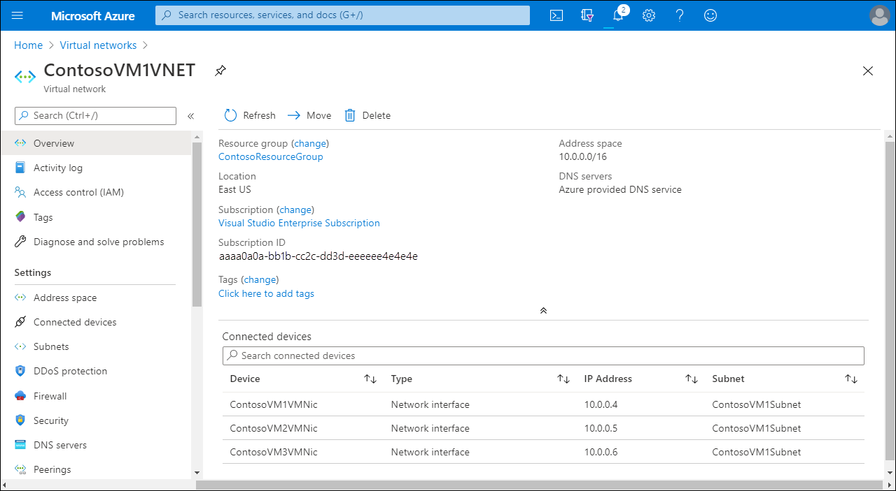
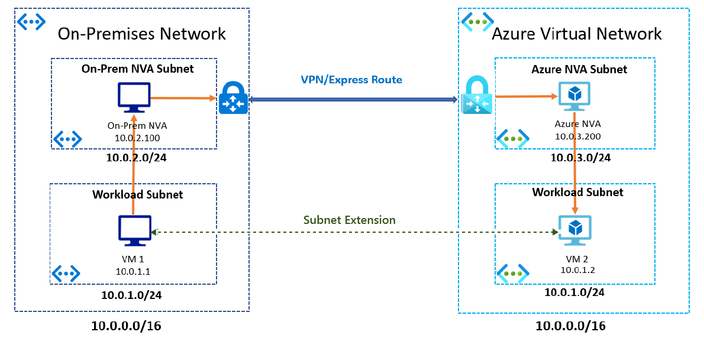

Contoso has an extensive on-premises network that provides a foundation for communications between resources deployed in various datacenters and offices. It's important that IT staff can deploy network components in Azure to enable communications between Azure resources, and between Azure resources and on-premises resources.

As lead system engineer, you determine that Microsoft Azure networking provides connectivity to resources in Azure, between both services in Azure, and between Azure and your on-premises environment. As an added benefit, there are multiple Azure networking components that can deliver and help protect applications, and enhance the security of your network.

## What is a virtual network?

When you deploy computers in your on-premises environment, you typically connect them to a network to enable them to communicate directly with each other. Azure virtual networks (VNets) serve the same basic purpose.

By placing a VM on the same VNet as other VMs, you effectively provide direct IP connectivity among them within the same private IP address space. You can also connect different VNets together. In addition, it's possible to connect VNets in Azure to your on-premises networks, effectively making Azure an extension of your own datacenter.

An Azure VNet constitutes a logical boundary defined by a private IP address space of your choice. You divide this IP address space into one or more subnets, just as you would in an on-premises network. However, in Azure, any additional network management tasks are more straightforward.

For example, some networking features, such as routing between subnets on the same VNet, are automatically available. Similarly, by default, every VM can access the internet, which includes support for outbound connections and DNS name resolution.

## What is a network interface?

A *network interface* is the interconnection between a VM and a VNet. A VM must have at least one network interface (connected to a VNet), but can have more than one, depending on the size of the VM you create. You can create a VM with multiple network interfaces, and add or remove network interfaces throughout the lifecycle of a VM. Multiple network interfaces allow a VM to connect to different subnets in the same VNet, and send or receive traffic over the most appropriate interface.

Each network interface attached to a VM must:

- Exist in the same location and subscription as the VM.
- Be connected to a VNet that exists in the same Azure location and subscription as the VM.

## What is a network security group?

A *network security group* (NSG) filters inbound and outbound network traffic, and contains security rules that are used to allow or deny filtered network traffic. Configuring these NSG security rules enables you to control network traffic by allowing or denying specific traffic types.

You can assign an NSG to:

- A network interface to filter network traffic on just that interface.
- A subnet to filter traffic on all connected network interfaces in the subnet.

You can also assign NSGs to both network interfaces and subnets. Then, each NSG is evaluated independently.

## What is Azure Firewall?

*Azure Firewall* is a cloud-based network security service that helps to protect your VNet resources. By using Azure Firewall, you can centrally create and manage network connectivity profiles across your organization.

Azure Firewall uses a static public IP address for your VNet resources. Consequently, external firewalls can identify traffic that originates from your organization's VNet. Azure Firewall is also fully integrated with Azure Monitor, enabling support for both logging and analytics.

## What is Azure VPN gateway?

A *VPN gateway* is a specific type of VNet gateway that you can use to send encrypted traffic between locations. For example, you can use Azure VPN gateway to send encrypted traffic between:

- An Azure VNet and your on-premises location over the internet.
- Azure VNets and other Azure VNets over the Microsoft network.

Each VNet can have only one VPN gateway, but you can create multiple connections to the same VPN gateway.

## What is Azure ExpressRoute?

With ExpressRoute, you can extend your on-premises networks into the Microsoft cloud. Unlike a VPN connection, ExpressRoute uses a private connection facilitated by a telecoms provider. By using ExpressRoute, you can establish connections to Microsoft cloud services, including Azure and Microsoft Office 365.

## What is Azure Virtual WAN?

Azure Virtual WAN is a networking service that provides networking, security, and routing functionalities. The Virtual WAN uses hub and spoke architecture with scale and performance built in. Azure regions serve as hubs that you can choose to connect to. All hubs are connected in full mesh in a Standard Virtual WAN, making it easier for the user to use the Microsoft backbone for any-to-any (any spoke) connectivity.

Azure Virtual WAN includes following functionalities:

- Branch office connectivity
- Site-to-site (S2S) VPN connectivity
- Point-to-site (P2S) VPN (remote user) connectivity
- ExpressRoute connectivity
- Intra-cloud connectivity
- VPN ExpressRoute inter-connectivity
- Routing
- Azure Firewall
- Encryption

You don't have to enable and use all of these functionalities to start using Virtual WAN. Instead, you can choose the functionality that you require now, and add more as your organizational needs dictate.

## Azure subnet extension

When considering extending their workloads to the cloud, staff at Contoso investigated a number of solutions being offered by Azure, including Azure subnet extensions. Extending a subnet enables you to include Azure resources as part of your own local, on-premises subnets, which essentially makes these separate locations part of the same IP broadcast domain. One particularly attractive feature of a subnet extension is that infrastructure staff at Contoso won't necessarily need to rearchitect the on-premises network topology.

> [!CAUTION] 
> You should avoid using subnet extension, except perhaps as a temporary measure to solve a specific problem.

You can extend an on-premises subnet to Azure using a layer-3 overlay network based solution. Typically, you'll use a  VXLAN solution to extend the layer-2 network using a layer-3 overlay network.

The following diagram demonstrates a generalized scenario. In the scenario, the subnet 10.0.1.0/24 exists on both sides; that is, both in Azure and also on-premises. Both these subnets contain virtualized workloads. Subnet extension connects these two parts of the same subnet. The infrastructure team has assigned IP addresses from the subnet to VMs on both Azure and on-premises.

Elsewhere in the infrastructure, in the on-premises environment, a network virtual appliance (NVA) connects via an ExpressRoute connection to an NVA in a different subnet in Azure. When a VM in the on-premises network tries to communicate with an Azure VM, the on-premises NVA captures the packet, encapsulates it, and sends it over VPN/ExpressRoute connection to the Azure network. The Azure NVA receives the packet, decapsulates it, and forwards it to the intended recipient in its network. The return traffic works using the same logic, but in reverse.

