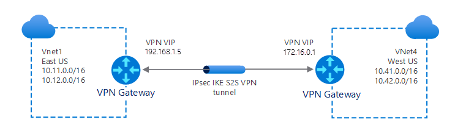

Contoso's datacenters support remote connectivity so users can work remotely. Also, some branch offices are connected to the head office datacenter through site-to-site VPNs. As lead system engineer, you must implement a VPN solution that enables ongoing support for the current use scenarios.

## VPN gateway design

Using an Azure gateway, you can implement the following various types of VPN connections to address your organizational needs:

- S2S
- Multi-site
- P2S
- VNet-to-VNet

### Site-to-site

You implement an S2S connection over Internet Protocol Security (IPsec)/Internet Key Exchange (IKE). You use S2S connections to support cross-premises and hybrid configurations. To implement an S2S connection, you must have a VPN device with a public IP address, as indicated in the following diagram.

### Multi-site

A multi-site connection is a variation of the S2S connection. Using this connection type, you create more than one VPN connection from your VNet gateway. When you implement multi-site connections, you must use a RouteBased VPN type.

As the name suggests, you typically use this connection type to connect to multiple on-premises sites, as indicated in the following diagram.

> [!TIP] 
> A VNet can have only one VPN gateway, so all connections share the bandwidth.

### Point-to-site

A P2S VPN connection enables users to connect to your organization from a remote network, such as their home, or a public Wi-Fi hotspot. Users typically initiate P2S connections, as in the following diagram. In the diagram, two users initiate a Secure Socket Tunneling Protocol (SSTP) connection, while a third uses IKEv2. Unlike with S2S connections, you don't need an on-premises public-facing IP address or a VPN device to implement P2S connections.

> [!TIP] 
> You can use P2S connections together with S2S connections through the same VPN gateway.

### VNet-to-VNet

In some ways, implementing VNet-to-VNet connections is similar to connecting a single VNet to an on-premises site location (S2S). In both scenarios, you use a VPN Gateway to implement an IPsec/IKE tunnel.

> [!NOTE] 
> When you implement a VNet-to-VNet connection through VPN Gateway, the VNets don't need to be in the same Azure region or subscription.

> [!TIP] 
> You can also use peering to connect VNets regardless of the location or subscription. This approach can be faster and more resource efficient.

### ExpressRoute connections

You can use Azure ExpressRoute connections to facilitate a private connection from your on-premises networks to the Microsoft Cloud, or to other sites within your organization. Because the network connection is private, it's more secure, and might also offer significant performance benefits. You configure an ExpressRoute connection by using a VNet gateway. However, with an ExpressRoute connection, you configure the VNet gateway with the gateway type of **ExpressRoute**, rather than **VPN**.

> [!TIP] 
> Although traffic travelling over an ExpressRoute circuit is not encrypted by default, you can configure the connection to send encrypted traffic.

It's also possible to combine ExpressRoute and S2S connections, as indicated in the following diagram. For example, you can configure an S2S VPN:

- As a secure failover path for ExpressRoute.
- To connect to sites that are not part of your network, but that are connected through ExpressRoute.

## Implement VPN gateway

When you configure your VPN gateway, you must select and configure a number of settings. First, you must decide whether to implement a policy-based or route-based configuration.  

### Policy-based

If you choose to implement policy-based gateways (which are based on static routing), then you must define sets of IP addresses that the gateway uses to determine packet destinations. The gateway evaluates every packet against those sets of IP addresses to determine through which tunnel a packet is encrypted and routed.

### Route-based

You can use route-based gateways to avoid the effort of having to define which IP addresses are behind each tunnel. With route-based gateways, IP routing determines across which one of your tunnel interfaces to send each packet.

> [!TIP] 
> You should select route-based VPNs for on-premises devices, because they are more resilient to topology changes—for example, if you create new subnets in your VNet.  

You should always choose a route-based VPN gateway for the following types of connectivity:

- Connections between virtual networks
- P2S connections
- Multi-site connections
- Coexistence with an Azure ExpressRoute gateway

### Additional settings

In addition, you must also define the following settings to implement VPN gateway:

- VPN or ExpressRoute. Choose the fundamental type of connection.
- Gateway subnet address range. Specifies the private IP address range associated with the VPN gateway.
- Public IP address. Specifies the public IP address object that gets associated with the VPN gateway.

### Create a VNet

To implement a VPN Gateway, you must have a VNet. You can create this before or during the VPN Gateway configuration. We'll create one first. To do this, open the Azure portal and complete the following procedure:

1. Select **Create a resource**, and then search for and select **Virtual Network**.
2. On the **Virtual Network** blade, select **Create**.
3. Create a VNet by specifying the appropriate properties: **Subscription**, **Resource group**, **Name**, and **Region**.

   

4. Select **Next: IP Addresses >**.
5. Configure the subnet that you want to associate with the VNet by either accepting the default settings, or configuring your own.
6. Select **Review + create**, and then select **Create**.

### Create the gateway

After you have created the appropriate VNet, you must now create the VPN gateway. For example, to create a route-based VPN gateway using the Azure portal, use the following procedure:

1. In the Azure portal, search for and select **Virtual network gateway**.
2. On the **Virtual network gateway** blade, select **Create**.
3. On the **Create virtual network gateway** blade, create the gateway  by specifying the appropriate properties: **Subscription**, **Name**, and **Region**.
4. Then choose whether you're implementing a **VPN** or **ExpressRoute** connection.
5. For a VPN, select either **Route-based** or **Policy-based**.

   

6. Select the virtual network you earlier created.
7. Configure the **Gateway subnet address range** and the **Public IP address** settings.

   

8. Select **Review + create**, and then select **Create**.

## Try it out

If you would like to work with Azure VPN, then try out these lab exercises. The exercises are based on a sandbox environment, and do not require an Azure subscription to complete:

- [Exercise - Prepare Azure and on-premises virtual networks by using Azure CLI commands](https://aka.ms/prepare-azure-and-vpns-using-cli-commands?azure-portal=true)
- [Exercise - Create a site-to-site VPN gateway by using Azure CLI commands](https://aka.ms/vpn-gateway-azure-cli-commands?azure-portal=true)