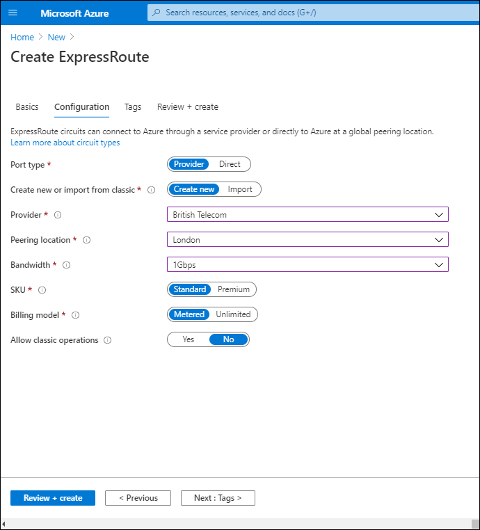
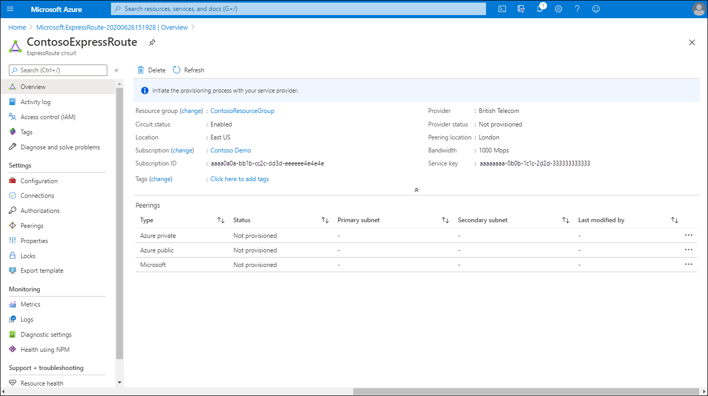
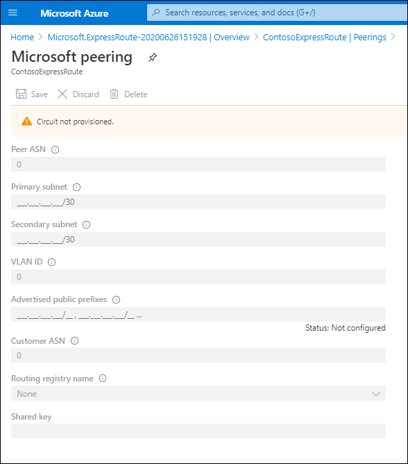
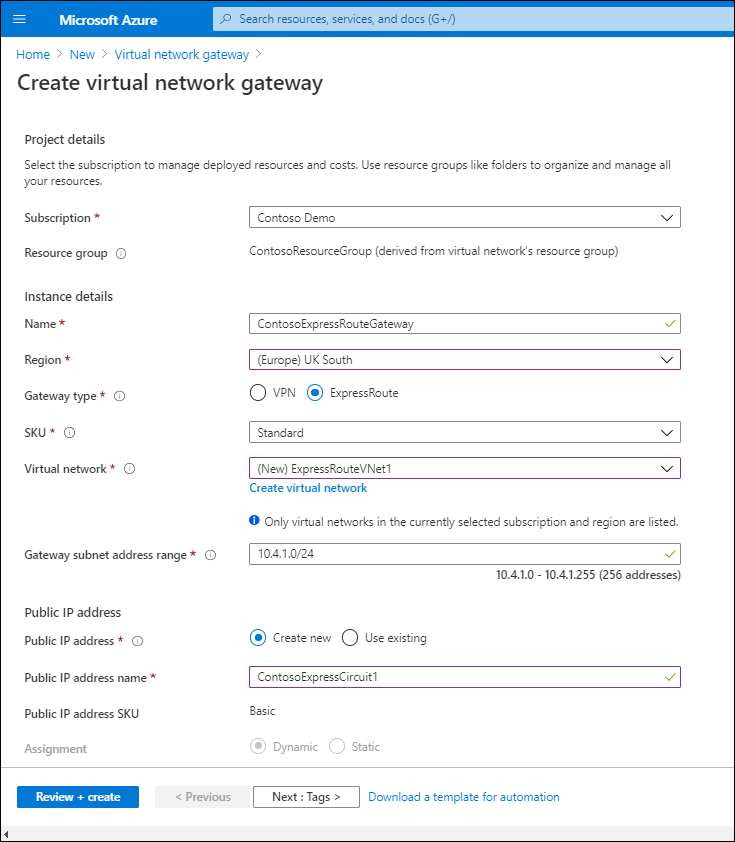

The Contoso IT security team is concerned about implementing a VPN connection from their datacenters to the Microsoft Cloud. While investigating VPN Gateway options, you discovered that ExpressRoute is one potential solution. With ExpressRoute, connections don't pass through the internet, thereby reducing the possible security threats for data in transit between the corporate infrastructure at Contoso, and Azure resources in Microsoft datacenters.

## What is ExpressRoute?

ExpressRoute provides a way of connecting your organization to Azure Resources. When implementing ExpressRoute, you can implement the following connection options:

- An any-to-any VPN connection. Enables you to integrate your WAN with Azure. Azure integrates with your WAN connection to provide a seamless connection. With any-to-any connections, all WAN providers offer Layer 3 connectivity.
- A P2P Ethernet connection. Provides both Layer 2 and Layer 3 connectivity between your on-premises site and Azure. You connect your datacenters or offices with Azure by using the P2P links.
- CloudExchange co-location. Typically offers both Layer 2 and Layer 3 connections between your organization's infrastructure, which resides in a co-location facility such as an internet service provider (ISP), and the Microsoft Cloud.

> [!NOTE] 
> ExpressRoute connectivity is not via the internet, which means connections have lower latency, are high speed, and more secure.

The following graphic displays a typical scenario for dual ExpressRoute connections.

ExpressRoute is one of three solutions that you can use to connect your on-premises network to Azure. The other two, S2S and P2S, are described in the following table.

|Alternative solution|Description|
|----|----|
|S2S VPN|Enables you to connect your on-premises network to Azure through an IPsec/IKE tunnel to create a hybrid network. To enable an S2S connection, you configure an on-premises VPN device with a public IP address. Then you connect that device to an Azure VNet through an Azure VNet gateway.|
|P2S VPN|Enables you to establish a secure connection from individual computers to resources located in an on-premises network. This solution is useful for organizations that want to enable connections to Azure from remote locations such as users' homes. P2S connections are useful if you have only a few clients that must connect to a VNet.|

Azure ExpressRoute is more likely the appropriate service in the following scenarios:

- For organizations that are migrating enterprise on-premises systems to Azure
- For secure networks, where avoiding the internet is desirable
- For large datacenters with many users and systems accessing software as a service (SaaS) systems and products

Consider using ExpressRoute in the following situations:

- To implement low-latency connectivity to cloud-based services
- To access high-volume cloud-based systems that work with large volumes of data
- To connect to Microsoft cloud services, such as Office 365 and Microsoft Dynamics 365

### Benefits of ExpressRoute

ExpressRoute offers a number of benefits over other connectivity options, as described in the following table.

|Feature|Benefit|
|------------------------------------------------------------|------------------------------------------------------------|
|Layer 3 connectivity|These connections can be P2P, any-to-any network, or they can be virtual cross-connections through an exchange.|
|Built-in redundancy|Each connectivity provider uses redundant devices to help provide for high availability.|
|Connectivity to Microsoft cloud services|Supports connections to Office 365, Dynamics 365, and to Azure services such as Azure VMs, Azure Cosmos DB, and Azure Storage.|
|Across on-premises connectivity with ExpressRoute Global Reach| Enables you to connect your private datacenters through multiple ExpressRoute circuits, and enables your cross-datacenter traffic to travel through the Microsoft network.|
|Dynamic routing|Enables dynamic routing between your on-premises infrastructure and services running in the Microsoft Cloud. Uses Border Gateway Protocol (BGP), which exchanges routes between on-premises networks and resources running in Azure.|

## How it works

To implement ExpressRoute, you must work with an ExpressRoute partner. The partner provides an authorized and authenticated connection called the *edge service*. It's through this edge service that you're able to connect your organization to the Microsoft Cloud. The partner you select enables the connection to the Microsoft Cloud edge router, referred to as an *ExpressRoute endpoint*. Connections through the edge service to the ExpressRoute endpoint are known as *circuits*. Circuits are established over a private link, not through the internet.

### Prerequisites

Before you can implement an ExpressRoute circuit, your organization must meet a number of prerequisites, including:

- Working with either an ExpressRoute connectivity partner or cloud exchange provider. 

> [!NOTE]
> These organizations facilitate the provision of the circuit.

- Registering your Azure subscription with your ExpressRoute connectivity partner.
- Requesting an ExpressRoute circuit using an active Azure account.
- Optionally, having an active Office 365 subscription for connectivity to Office 365 services.

Because ExpressRoute works by peering your on-premises infrastructure with Microsoft-cloud networks, resources on your networks can communicate directly with resources hosted by Microsoft. However, to support these peerings, you must:

- Ensure that you have configured any required BGP sessions for routing domains.
- Implement a network address translation (NAT) service to translate the private IP addresses used on-premises to public IP addresses.
- Reserve several blocks of IP addresses in your network for routing traffic to the Microsoft Cloud.

> [!TIP] 
> You configure these reserved blocks as either a /29 subnet or two /30 subnets in your IP address space.

## Configure ExpressRoute

To facilitate a connection to Microsoft resources in Azure by using ExpressRoute, you must perform a number of high-level steps to complete the process of establishing an ExpressRoute connection. You must:

- Create a circuit.
- Create a peering configuration.
- Connect a VNet to an ExpressRoute circuit.

### Create a circuit

To create a circuit, sign in to the Azure portal, and then use the following procedure:

1. In the Azure portal, select **Create a resource**.
2. Select **Networking**, and then select **ExpressRoute**.
3. On the Create ExpressRoute blade, select the **Subscription**, **Resource group**, and **Region**, and then enter a name for your circuit.
4. Select **Next: Configuration >**.
5. On the **Configuration** tab, configure the following information:
   - Port type. Select **Provider**.
   - Select the **Provider**.
   - Select the **Peering location**.
   - Choose the **Bandwidth**.
   - Select the **SKU**.

   

6. Select **Review + create**, and then select **Create**.

It will take a few minutes to complete the provisioning of the circuit. After this completes, open the newly created resource. On the **Overview** page for your circuit, you should notice that that **Circuit status** is enabled but **Provider status** is **Not provisioned**. These values mean that the Microsoft side of the circuit is ready to accept connections, but that the  provider hasn't configured their side of the circuit yet.

### Create a peering configuration

The next step is to configure peerings. You can review peerings for the circuit on the **Overview** tab. You can create an Azure private peering, an Azure public peering, and a Microsoft peering. In this case, you'll need to create an Azure private peering and a Microsoft peering.

#### Configure private peering

You use private peering to connect your network to your VNets running in Azure. To configure private peering, you must provide the following information:

- Peer ASN. The autonomous system number (ASN) for your side of the peering.
- Primary subnet. This is an address range of the primary /30 subnet that you create in your network.
- Secondary subnet. This is the address range of your secondary /30 subnet.
- VLAN ID. This is the virtual local area network (VLAN) on which you want to enable peering.
- Shared key. This is an optional key that's used to encode messages passing over the circuit.

To modify the Azure private peering, on the **ExpressRoute circuit** blade, on the **Peerings** page, select **Azure private**, and then configure the required values.

#### Configure Microsoft peering

You use Microsoft peering to connect to Office 365 and its related services. To configure Microsoft peering, you provide the same details as for a private peering, but you must also provide the following information:

- Advertised public prefixes. A list of the address prefixes that you'll use over your BGP session.
- Customer ASN. An optional value.
- Routing registry name. Identifies the registry in which you register your customer ASN and public prefixes.

> [!NOTE] 
> You can only configure peering when the **Provider** status is set to **Provisioned**.

To modify the Microsoft peering, in the **ExpressRoute circuit** blade, on the **Peerings** page, select **Microsoft**, and then configure the required values.

### Connect a VNet to the circuit

After the provider status is provisioned, and after you have configured the peerings, you can connect a VNet to the circuit. To do this, use the following procedure:

1. In the Azure portal, select **Create a resource**.
2. Search for and select **Virtual network gateway**.
3. On the **Virtual network gateway** blade, select **Create**.
4. On the **Create virtual network gateway** blade, create the gateway by specifying the appropriate properties: **Subscription**, **Name**, and **Region**.
5. For **Gateway type**, select **ExpressRoute**.

   

6. Select the **SKU**, and then select the **Virtual network** to which you want to connect.
7. Configure the **Gateway subnet address range** and the **Public IP address** settings.
8. Select **Review + create**, and then select **Create**.

Finally, you can connect a peering to a VNet gateway as follows:

1. On the **ExpressRoute circuit** page for your circuit, select **Connections**.
2. On the **Connections** page, select **Add**.
3. On the **Add connection** page, provide your connection with a name, and then select your VNet gateway.

After the operation has finished, your on-premises network will be connected through the VNet gateway to your VNet in Azure. The connection will be made across the ExpressRoute connection.

> [!NOTE] 
> You can only perform this final step when the **Provider** status is set to **Provisioned**.

## Additional reading

You can learn more by reviewing the following documents: 

- [Azure ExpressRoute for Office 365](https://aka.ms/azure-expressroute?azure-portal=true)
- [ExpressRoute routing requirements](https://aka.ms/expressroute-requirements?azure-portal=true)
