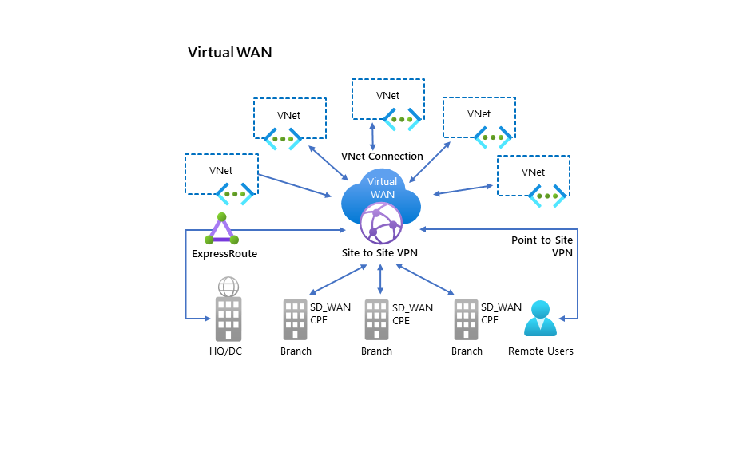
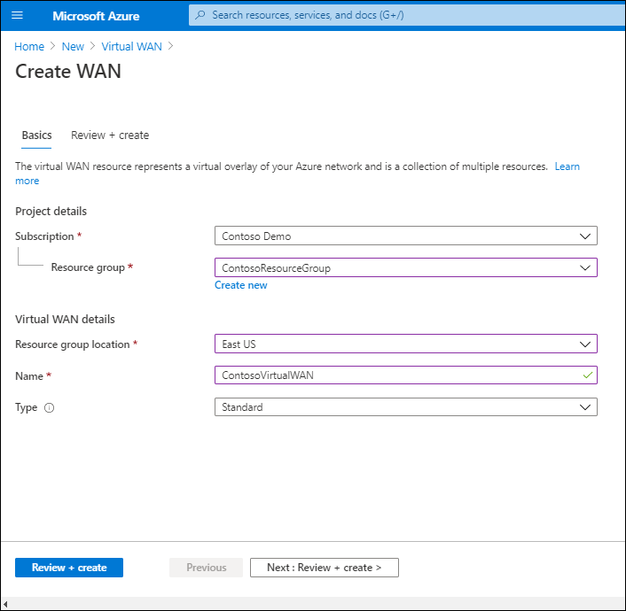
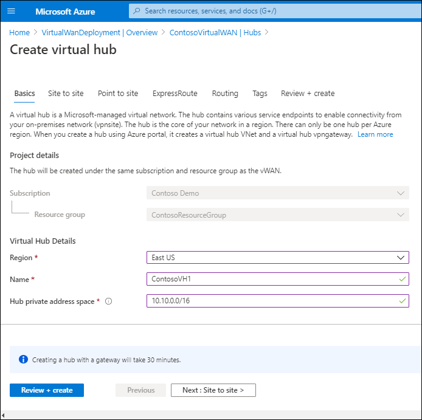

The Contoso IT team has various choices about how best to implement networking services in a hybrid environment. Azure Virtual WAN is a service that consolidates many of these networking services, and provides a consistent operational interface to network security, routing, and infrastructure.

## What is Azure Virtual WAN?

Azure Virtual WAN is a networking service. It brings various networking, security, and routing functionalities together into a single operational interface. You can implement Azure Virtual WAN to support the following functionalities:

- Branch connectivity
- S2S VPN connectivity
- P2S VPN (remote user) connectivity
- Private (ExpressRoute) connectivity
- Intra-cloud connectivity (transitive connectivity for VNets)
- VPN ExpressRoute inter-connectivity
- Routing
- Azure Firewall
- Encryption for private connectivity

You can think of the Azure Virtual WAN architecture as being similar to a wheel, with a hub (Azure regions) and spokes (the functionalities previously listed).

There are two available Azure Virtual WAN types, as described in the following table.

|Virtual WAN type|Hub type|Available configurations|
|----------------|--------|------------------------------------------------------------|
|Basic|Basic|S2S VPN only|
|Standard|Standard|ExpressRoute, P2S VPN, S2S VPN, and VNet-to-VNet through the virtual hub|

## Configure a Virtual WAN

The following table describes the components that you must configure to implement Virtual WAN.

|Component|Description|
|---------|-----------|
|Virtual WAN|A virtual WAN represents a virtual map of your Azure network, and is a collection of multiple resources containing links to the virtual hubs within the virtual WAN.|
|Virtual Hub|A virtual hub is a Microsoft-managed VNet that contains various service endpoints to enable connectivity.|
|Hub virtual network connection|You use the Hub VNet connection to connect the hub to your VNet.|
|(Preview) Hub-to-Hub connection|All hubs are all interconnected in a virtual WAN.|
|Hub route table|You create a virtual hub route and apply the route to the virtual hub route table.|
|Site|Site represents your on-premises VPN device and its settings, and is used only for site-to-site connections.|

To configure create an S2S connection with Azure Virtual WAN, you must complete the following high-level steps:

1. Create a virtual WAN.
1. Create a hub.
1. Create a site.
1. Connect a site to a hub.
1. Connect a VPN site to a hub.
1. Connect a VNet to a hub.
1. Download a configuration file.
1. Review your virtual WAN.

While some of these steps are detailed in the following sections, you can also find additional information on how to implement this solution at [Tutorial: Create a Site-to-Site connection using Azure Virtual WAN](https://aka.ms/virtual-wan-site-to-site-portal?azure-portal=true). You'll also find more information about how to interpret the required settings for each of the steps in the following sections.

### Create a Virtual WAN

To create a Virtual WAN, in the Azure portal, use the following procedure:

1. Select **Add a resource**.
2. Search for and select **Virtual WAN**.
3. On the **Virtual WAN** page, select **Create**.
4. on the **Create WAN** blade, select the **Subscription**, **Resource group**, and **Location** details.
5. Enter a **Name**, and then select the **Type**.
6. Select **Review + create**, and then select **Create**.

   

### Create a hub

To create a hub:

1. Connect to the Virtual WAN you just created.
2. Under **Connectivity**, select **Hubs**.
3. On the toolbar, select **+ New Hub**.

   

4. Configure the settings described in the following table.

   |Tab|Settings|
   |-------------|------------------------------------------------------------|
   |**Basics**|Select the virtual hub's **Region**, enter a  **Name**, and configure the **Hub private address space**.|
   |**Site to site**|If you want to enable S2S, select **Yes**, and then select both **ASN** and **Gateway scale units**.|
   |**Point to site**|If you want to enable P2S, select **Yes**, select **Gateway scale units**, and then select a **Point to site configuration**. Also enter the **Client address pool**.|
   |**ExpressRoute**|If you want to enable ExpressRoute, select **Yes**, and then select **Gateway scale units**.|
   |**Routing**|If you plan to use routing, then enter the **If destination prefix is** and **Send to next hop address** information.|

5. Select **Review + create**, and then select **Create**.

### Create a site

Use the following procedure to create a site.

1. From the **Virtual WAN** page, under **Connectivity**, select **VPN sites**.
2. On the toolbar, select **+ Create site**.
3. On the **Create a VPN site** blade, configure the settings described in the following table.

   |Tab|Settings|
   |------|------------------------------------------------------------|
   |**Basics**|Select the site's **Region**, enter a  **Name**, and then enter a **Device vendor**. Enable or disable **Border gateway protocol**, and then enter the **Private address space**.|
   |**Links**|Add the required links to the **Links** tab. Specify **Link name**, **Provider name**, **Speed**, **IP address**, **BGP address**, and **ASN**.|

4. Select **Review + create**, and then select **Create**.

### Connect a VPN site to a hub

Use the following procedure to connect your VPN site to the hub.

1. In the Azure portal, select the site you just created, and select **Connect VPN sites**.
2. Enter a pre-shared key.
3. Select the appropriate option for **Propagate Default Route**. (The **Enable** option allows the virtual hub to propagate a learned default route to this connection.)
4. Select **Connect**.

### Connect a VNet to a hub

Use the following procedure to create the connection between the hub and a VNet.

1. On the page for your virtual WAN, select **Virtual network connections**.
2. On the **Virtual network connection** page, select **+Add connection**.
3. On the **Add connection** page, complete the following fields, and then select **OK**:
    - Connection name
    - Hubs
    - Subscription
    - Virtual network

