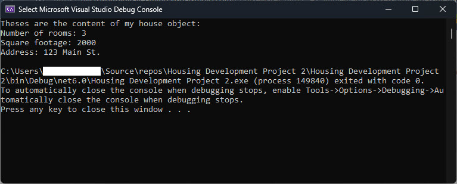

When you define a property in a class in C#, the accessors allow you to `get` the property value, `set` the property value, or both. The following bullets describe the three property types that you can define when creating a property.

## Property types

Type of Property Accessors Example properties in a House class:

- Read-write: `get` and `set` a property
- Read-only: `get` a property
- Write-only: set a property

## Property examples in our House class

This is a list of the property accessors we'll use in the House class:

- Read-write: get and set a property to get and set the house style name.
- Read-only: get a property to get the house square footage.
- Write-only: set a property to set the house square footage.

The following example shows how to define three properties in the House class. All of the properties are public, and encapsulate access to private variables in the class.

- The `HouseStyleName` property gets and sets the house style name.
- The `HouseSquareFootage` property is a read-only property that gets the square footage of the house.
- The `NumberOfRooms` property is a write-only property that sets the maximum allowable number of rooms in the house. This property is write-only because the object accessing the house object only needs to be able to set the property, but doesn't need to retrieve the value.

```csharp
public class House
{
   private string _styleName;
   private int _sqrFootage;
   private int _numberOfRooms;

   public string HouseStyleName
   {
       get { return _styleName; }
       set { _styleName = value; }
   }

   public int HouseSquareFootage
   {
       get { return _sqrFootage; }
   }

   public int HouseNumberOfRooms
   {
       set { _numberOfRooms = value; }
   }
}
```

## Try it out - Create a class with properties

Complete the following steps to create the `House` class and define properties for it.

### Create the project

1. Open Visual Studio Community.

1. Create a new project by selecting **Create a new project** on the start page.

1. Select **Console App (.NET Core)** from the list of templates, and then select **Next**.

1. Name your project **Housing Development 2**, specify a file location, and then select **Next**.

1. To create your project, select **Create**.

### Add a class

1. In the Solution Explorer, right-click on your project.

1. On the context menu that appears, select **Add**, and then select **Class**.

1. Name your class **House**, and then select **Add**.

1. To create a class called `House` that contains the private variables for the house's attributes, enter the following code:
   ```csharp      namespace Housing_Development_Project_2      {          internal class House          {              private int numberOfRooms;              private int squareFootage;              private string address;          }      }      ```

### Add your properties

1. To create public properties for each of the private variables, enter the following code:
   ```csharp      namespace Housing_Development_Project_2      {          internal class House          {              private int numberOfRooms;              private int squareFootage;              private string address;

           public int NumberOfRooms               {                   get { return numberOfRooms; }                  set { numberOfRooms = value; }              }

           public int SquareFootage               {                   get { return squareFootage; }                  set { squareFootage = value; }              }

           public string Address               {                   get { return address; }                  set { address = value; }              }          }      }      ```      The public properties provide access to the private variable values from outside of the class.

### Use your properties

1. To create `myHouse` object and assign property values, update your Program.cs file as follows:
   ```csharp
   House myHouse = new House();
   myHouse.NumberOfRooms = 3;
   myHouse.SquareFootage = 2000;
   myHouse.Address = "123 Main St.";
   ```
   Be sure to delete placeholder content.

1. To display the `myHouse` property values using `Console.WriteLine()` statements, update your code as follows:
   ```csharp      House myHouse = new House();      myHouse.NumberOfRooms = 3;      myHouse.SquareFootage = 2000;      myHouse.Address = "123 Main St.";

   Console.WriteLine("Theses are the content of my house object:");      Console.WriteLine("Number of rooms: " + myHouse.NumberOfRooms);      Console.WriteLine("Square footage: " + myHouse.SquareFootage);      Console.WriteLine("Address: " + myHouse.Address);      ```      Accessor methods ensure that data is only accessed and modified through public properties, not directly. These accessor methods are an example of encapsulation in C#.

1. To verify that you implemented your class correctly, run your code and review the output. 
   

If your output doesn't match the intended results, review your code to ensure it matches the examples.