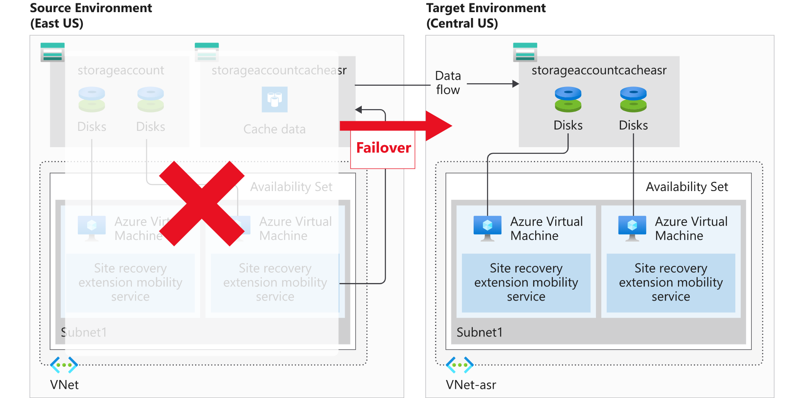

Contoso must adopt a business continuity and disaster recovery strategy that keeps their data safe and their apps and workloads online even when planned and unplanned outages occur. Contoso can use Azure Site Recovery to help ensure business continuity by keeping business apps and workloads running during outages.

Azure Site Recovery replicates workloads running on physical servers and VMs from a primary site to a secondary location. If an outage occurs at the Contoso primary site, workloads fail over to a secondary location and users can access apps from there. After the primary location is running again, an administrator can fail back workloads to the primary location.

Azure Site Recovery can manage replication for:

- Azure VMs replicating between Azure regions.
- On-premises VMs, Azure Stack VMs, and physical servers.

## What is Azure Site Recovery?

By using Azure Site Recovery, you can replicate your VMs between Azure regions. It's also possible to use Azure Site Recovery to migrate on-premises VMs and physical servers from your on-premises infrastructure to Azure. Suppose Contoso suffered an outage in their New York offices, perhaps due to flooding. They could use Azure Site Recovery to mitigate such outages by performing failover to Azure.

It's the site recovery features in Azure Site Recovery that enable you to manage around future outages. Azure Site Recovery is designed to replicate your workloads from a designated primary site or region, to a secondary site or region that you have chosen. In the following graphic, the primary region is in East US, while the secondary region is Central US. 

Azure Site Recovery manages the replication of:

- Azure VMs between regions.
- On-premises VMs to Azure and back again.

> [!TIP]
> Because Azure Site Recovery is a built-in component of Azure, it can run seamless tests, known as *disaster recovery drills*, without affecting your production workloads. This means that you can verify that your disaster recovery plans will be effective should they be needed.

Azure site recovery provides the features described in the following table.

|Feature|Description|
|-------------------------------------|------------------------------------------------------------|
|Azure virtual machine protection|Azure Site Recovery enable you to automatically protect your VMs in Azure. Azure Site Recovery mirrors the source VM configuration to a secondary Azure region, and creates any required or associated resource groups, storage accounts, VNets, and availability sets. The resources that Azure Site Recovery creates are appended with a Azure Site Recovery suffix.|
|Snapshots and recovery points|Azure Site Recovery has replication policies that you can customize. These policies enable you to define the retention history of recovery points and the frequency of snapshots. You create a recovery point from a snapshot of a VM's disk. There are two types of snapshots available: Crash-consistent and App-consistent. *Crash-consistent* recovery represents the data on-disk at the time the snapshot is taken. *App-consistent* recovery captures the same data as crash-consistent, but also includes all in-memory data and in-process transactions. By including the in-memory data, Azure Site Recovery can restore a VM and any running apps without any data loss. All recovery points are kept for 24 hours by default, but you can extend this to 72 hours.|
|Replication to a secondary region|When you enable replication for an Azure VM, the Azure Site Recovery mobility service is installed. This extension registers the VM with Azure Site Recovery. Continuous VM replication then begins, with any writes to the disk being immediately transferred to a local storage account. Azure Site Recovery uses this account, replicating the cache to a storage account in the destination environment. Azure Site Recovery copies data stored in the cache and syncs it with either the target storage account or replicated managed disks. After the data is processed, crash-consistent recovery points are created. If app-consistent recovery points are enabled, they'll be generated on a schedule as set in the Azure Site Recovery replication policy.|
|Disaster recovery (DR) drills|Azure Site Recovery enables you to perform disaster recovery drills after you have completed all the prerequisite configuration tasks. By running a drill, you can validate the replication strategy for your environment without losing data, experiencing downtime, or compromising your production environment.|
|Flexible failover and failback|You can quickly start Azure Site Recovery failover and failback by using the Azure portal. When running a failover, you select a recovery point, then let Azure Site Recovery manage the failover. Failback is simply a reverse of this process. When a failover is successfully committed, it's available to failback.|

## Failover and failback using Azure Site Recovery

Azure Site Recovery enables your organization to have the flexibility of either manually failing over to a secondary Azure region, or falling back to a source VM. The simplest way to manage this process is manually from the Azure portal.

A failover happens when a decision is made to execute a DR plan for your organization. The existing production environment, protected by Azure Site Recovery, is switched to a different region. The target environment becomes the production environment and becomes the environment your organization's production services run on.  

> [!NOTE]
> After the target region is active, the source environment should no longer be used. This is enforced by leaving the source VMs stopped.

There's another advantage to shutting down the source VMs. Using a shutdown VM results in minimal data loss because Azure Site Recovery waits until all the data is written to disk before triggering the failover.

### What is reprotection, and why is it important?

When a VM is failed over, the replication performed by Azure Site Recovery is no longer occurring; instead, you must re-enable the protection to start protecting the failed-over VM. As you already have the infrastructure in a different region, you can start replication back to the source region. Reprotection enables Azure Site Recovery to start replicating your new target environment back to the source environment where it started.

The flexibility of failing over single VMs or failover using a recovery plan, can be used to re-protect your failed over infrastructure. You can re-protect each VM individually, or you can re-protect multiple VMs using a recovery plan.

> [!NOTE]
> Re-protecting takes up to two hours, depending on the size and type of VM. Unlike the other Site Recovery processes that you can monitor by monitoring the progress, you must monitor reprotection at the VM level.

### What is failback?

Failback is the reverse of a failover. It's when a completed failover to a secondary region has been committed and has now become the production environment. Reprotection has completed for the failed over environment, and the source environment is now its replica.

> [!NOTE]
> In a failback scenario, Azure Site Recovery will fail over back to the source VMs.

## Types of failover

Site Recovery provides different failover options:

- Test failover. You use this option to run a drill that validates your BCDR strategy, without any data loss or downtime. It creates a copy of the VM in Azure, with no impact on ongoing replication or on your production environment: To validate your BCDR strategy:
  1. Run a test failover on a single VM, or on multiple VMs in a recovery plan.
  2. Select a recovery point to use for the test failover.
  3. Select an Azure network in which the Azure VM will be located when it's created after failover. The network is only used for the test failover.
  4. Verify that the test failover worked as expected. After the test, Site Recovery automatically cleans up VMs created in Azure during the drill.
- Planned failover-Hyper-V. Usually used for planned maintenance, in a planned failover-Hyper-V strategy, source VMs are shut down and the latest data is synchronized prior to initiating the failover. Planned failover causes some downtime, but no data is lost during planned failover.
  1. Plan a downtime maintenance window and notify users.
  2. Take user-facing apps offline.
  3. Initiate a planned failover with the latest recovery point. (The failover won't run if the machine isn't shut down, or if errors are encountered.)
  4. After the failover, check that the replica Azure VM is active in Azure.
  5. Commit the failover to finish up. The commit action deletes all available recovery points.
- Failover-Hyper-V. You usually run this failover option if there's an unplanned outage or if the primary site isn't available.  Optionally, you can shut down the VM and synchronize final changes before initiating the failover. This method results in minimal data loss for apps.  
  1. Initiate your BCDR plan.
  2. Initiate a failover. Before triggering the failover, specify whether Site Recovery should shut down the VM and synchronize/replicate the latest changes.
  3. You can fail over to a number of recovery point options:
      - If you don't enable the option to shut down the VM, or if Site Recovery can't shut it down, the latest recovery point is used.
      - The failover runs even if the machine can't be shut down.
  4. After failover, verify that the replica Azure VM is active in Azure. If required, you can select a different recovery point from the retention window of 24 hours.
  5. Commit the failover to finish up. The commit action deletes all available recovery points.
- Failover-VMware. This failover option is usually run if there's an unplanned outage, or if the primary site isn't available. Optionally, you can specify that Site Recovery should try to trigger a shutdown of the VM, and to synchronize and replicate final changes before initiating the failover. Using this method results in minimal data loss for apps.
  1. Initiate your BCDR plan.
  2. Initiate a failover from Site Recovery:
     - Specify whether Site Recovery should try to trigger VM shutdown and synchronize before running the failover. (The failover runs even if the machines can't be shut down.)
  3. After the failover, verify that the replica Azure VM is active in Azure.
     - If necessary, you can select a different recovery point from the retention window of 72 hours.
  4. Commit the failover to finish up. The commit action deletes all recovery points.
     For Windows VMs, Site Recovery disables the VMware tools during failover.
