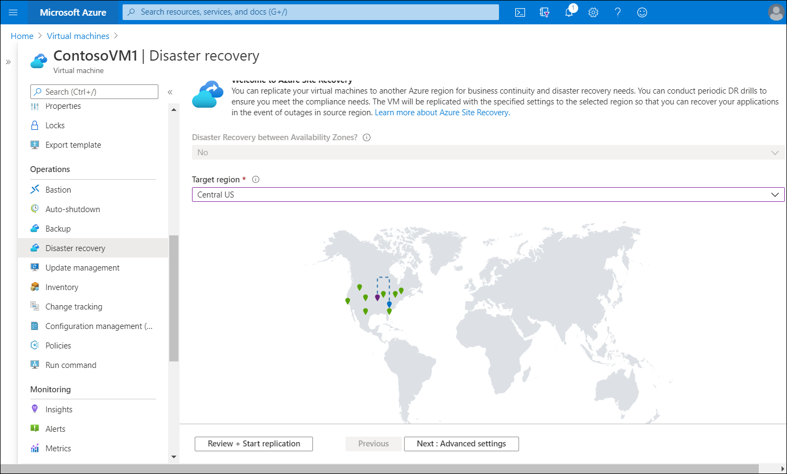

Contoso can use the Azure Site Recovery to help protect access to their critical resources in Azure. After IT staff complete the disaster recovery setup, Contoso's Azure VMs continuously replicate to a secondary region. If an outage occurs, IT staff at Contoso can fail over VMs to the secondary region, and users can access those resources from the new region. After any problems are resolved and everything is running normally again, IT support staff can fail back the VMs, enabling users to continue working in the primary region.

## Prepare Azure Site Recovery

Contoso staff now want to implement their BCDR plan. Let's assume they're using the East US Azure region for their existing solution, and IT staff have decided to use the Central US region for replication. The following diagram depicts this environment. 

The following section details the steps involved in implementing Contoso's BCDR plan using Azure Site Recovery.

### Disaster recovery preparation with Azure Site Recovery

Azure Site Recovery manages Contoso's DR process for their Azure VMs and on-premises machines. However, there are several components they must configure to enable it. Contoso must:

1. Add a Recovery Services vault.
2. Organize target resources.
3. Configure outbound network connectivity.
4. Configure permissions.
5. Enable replication on existing VMs.

### What is a Recovery Services vault?

A *Recovery Services vault* enables Azure Site Recovery to complete disaster recovery replication. Recovery Services vaults store data backups, VM configuration settings, and workloads.

> [!NOTE]
> To meet Azure Site Recovery requirements, you must provision a Recovery Services vault.

### What are target resources?

When you enable VM replication, Azure Site Recovery gives you the option of creating target resources. These resources are described in the following table.

|Target resource|Default setting|
|---|---|
|**Target subscription**|This is the same as the source subscription.|
|**Target resource group**|This is the resource group to which VMs belong after failover. It can be in any Azure region except the source region. Azure Site Recovery creates a new resource group in the target region, which has the suffix "asr".|
|**Target VNet**|This is the VNet in which replicated VMs are located after failover. A network mapping is created between source and target VNets. Azure Site Recovery creates a new VNet and subnet with the suffix "asr".|
|**Target storage account**|This is the storage account to which data is replicated. Azure Site Recovery creates a new storage account in the target region to mirror the source storage account.|
|**Replica managed disks**|If the VM uses a managed disk, this is the managed disks to which data is replicated. Azure Site Recovery creates replica managed disks in the storage region to mirror the source.|
|**Target availability sets**|This is the availability set in which replicating VMs are located after failover. For VMs that are located in an availability set in the source location, Azure Site Recovery creates an availability set in the target region with the suffix "asr". If an availability set exists, it's used and a new one isn't created.|
|**Target availability zones**|If the target region supports availability zones, Site Recovery assigns the same zone number as that used in the source region.|

### Configure outbound connectivity

Azure Site Recovery requires outbound connectivity on the VMs that Contoso wants to replicate. The required network connectivity is set up for Contoso automatically when using VMs that they create in Azure. However, when Contoso migrate on-premises VMs to Azure, they might need to update their network connectivity.

Azure Site Recovery doesn't support controlling network connectivity via an authentication proxy. If your organization is using a URL-based firewall proxy to restrict outbound connectivity, you'll need to add access to several URLs, as described in the following table.

|URL|Details|
|-----------------------------------------|------------------------------------------------------------|
|`*.blob.core.windows.net`|Enables data to be written from the VM to the cache storage account in the source region.|
|`login.microsoftonline.com`|Provides authorization and authentication to Azure Site Recovery service URLs.|
|`*.hypervrecoverymanager.windowsazure.com`|Enables the VM to communicate with the Azure Site Recovery service.|
|`*.servicebus.windows.net`|Enables the VM to write Azure Site Recovery monitoring and diagnostics data.|
|`*.vault.azure.net`|Enables access to enable replication for ADE-enabled VMs via Azure portal.|
|`*.automation.ext.azure.com`|Enables enabling auto-upgrade of mobility agent for a replicated item via Azure portal.|

### Configure permissions

Azure Site Recovery uses Role-Based Access Control (RBAC) in Azure by default. RBAC enables fine-grained access control and enables you to use several built-in Azure Site Recovery roles, as described in the following table.

|Role|Description|
|----|-----------|
|Azure Site Recovery Contributor|A contributor has full permissions for Azure Site Recovery operations in a recovery services vault. This role is suitable for disaster recovery admins.|
|Azure Site Recovery Operator|An operator has permissions to run and administer Azure Site Recovery failover and failback operations. This role is suitable for disaster recovery operators.|
|Azure Site Recovery Reader|A reader has permissions to review Azure Site Recovery operations. This role is suitable for IT monitoring executives.|

To enable replication on a VM, a user must have permission to create a VM in both the VNet and resource group.

## Enable replication for the Azure virtual machine

The following steps enable VM replication to a secondary location:

1. In the Azure portal, select **Virtual machines**, and then select the VM to replicate.
2. On the selected VM's blade, within **Operations**, select **Disaster recovery**.
3. From **Basics**, select **Target region**, and then select the target region.

   

4. To review the replication settings, select **Review + Start replication**. If you need to change any defaults, select **Next: Advanced settings**. 
5. To start the job that enables VM replication, select **Start replication**.

### Verify settings

After the replication job finishes, you can check the replication status, modify replication settings, and test the deployment using the following steps:

1. On the Azure portal menu, select **Virtual machines**, and then select the VM that you replicated.
2. In **Operations**, select **Disaster recovery**.
3. To view the replication details from **Overview**, select **Essentials**. More details are available in the **Health and status**, **Failover readiness**, and the **Infrastructure view** map.

## Try it

If you want to perform some of the tasks described in the preceding units, use the following links to access documented exercises in the Learn portal.

- [Exercise - Set up disaster recovery with Azure Site Recovery](https://aka.ms/exercise-site-recovery-setup?azure-portal=true)

- [Exercise - Run a disaster recovery drill](https://aka.ms/exercise-run-disaster-recovery-drill?azure-portal=true)

- [Exercise - Failover and failback using Azure Site Recovery](https://aka.ms/exercise-failover-and-failback?azure-portal=true)

To complete these exercises, [get a free trial Azure subscription](https://azure.microsoft.com/free/?azure-portal=true). After completing the exercises, remove any resource groups that you created.
