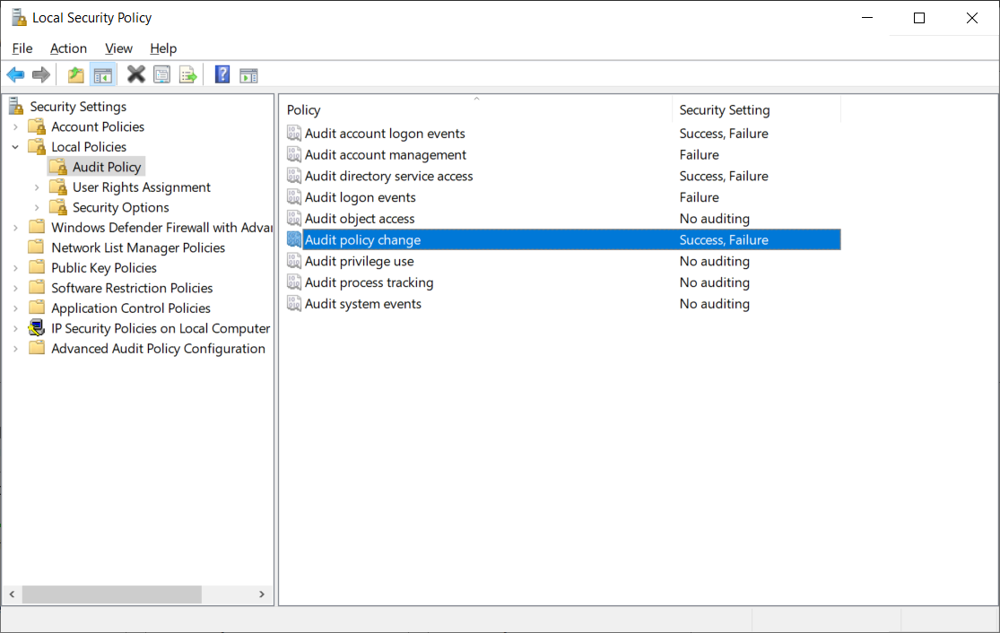
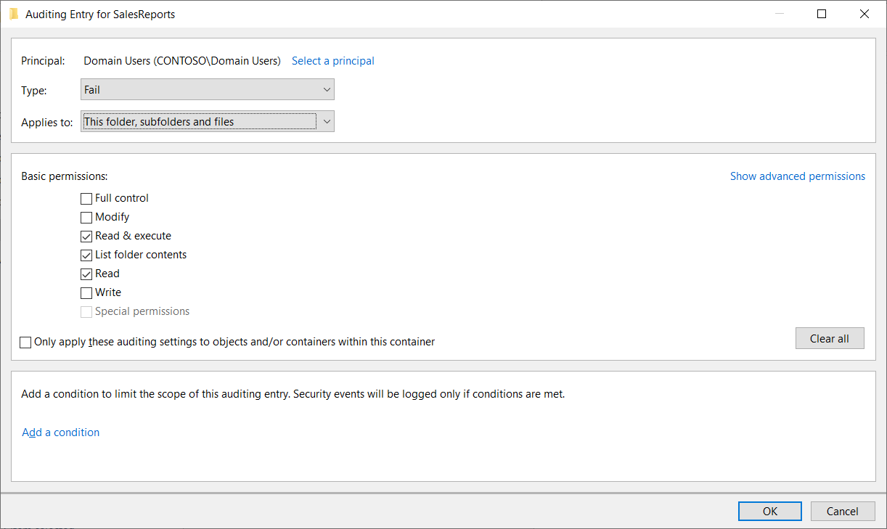

Auditing logs report a variety of activities in your enterprise to the Windows security log. You then can monitor these auditing logs to identify issues that warrant further investigation. Auditing successful activities also can be useful because doing so provides documentation of changes. Auditing can also log failed attempts by malicious hackers or unauthorized users to access enterprise resources. When configuring auditing, you specify audit settings, enable an audit policy, and then monitor events in the security logs.

Windows Server provides two categories of auditing:

- Basic auditing. Nine values are provided that enable you to audit the fundamental security events.

- Advanced auditing. Ten categories of events, which contain more detailed policy settings. There are over 60 configurable policy settings available.

## What are the basic auditing categories?

The following table describes the basic auditing categories.

| Audit policy setting| Description|
| :--- | :--- |
| Audit account logon events| Creates an event when a user or computer attempts to use a Windows Server Active Directory account to authenticate. For example, when a user logs on to any computer in the domain, an account logon event is generated.|
| Audit logon events| Creates an event when a user logs on interactively (locally) to a computer or over the network (remotely). For example, if a workstation and a server are configured to audit logon events, the workstation audits a user logging on directly to that workstation. When the user connects to a shared folder on the server, the server logs that remote log in. When a user logs on, the domain controller records a logon event because logon scripts and policies are retrieved from the domain controller.|
| Audit account management| Audits events, including the creation, deletion, or modification of user, group, or computer accounts and the resetting of user passwords.|
| Audit directory service access| Audits events that are specified in the system access control list (SACL), which you can see in an Active Directory object’s Properties Advanced Security Settings dialog box. In addition to defining the audit policy with this setting, you must also configure auditing for the specific object or objects by using the SACL of the object or objects. This policy is similar to the Audit Object Access policy that you use to audit files and folders, but this policy applies to Active Directory objects.|
| Audit policy change| Audits changes to user rights assignment policies, audit policies, or trust policies.|
| Audit privilege use| Audits the use of a permission or user right. See the explanatory text for this policy in the Group Policy Management Editor.|
| Audit system events| Audits system restarts, shutdowns, or changes that affect the system or security logs.|
| Audit process tracking| Audits events such as program activations and process exits. See the explanatory text for this policy in the Group Policy Management Editor.|
| Audit object access| Audits access to objects such as files, folders, registry keys, and printers that have their own SACLs. In addition to enabling this audit policy, you must configure the auditing entries in the objects’ SACLs.|

## Configure basic auditing

You can review and configure these basic auditing categories by using the Local Security Policy console, as displayed in the following screenshot. Here, the administrator has selected the Audit Policy node in the Local Security Policy console, and configured a number of Success and Failure audit settings.

> [!TIP]
> You can also use Group Policy, which makes it easier to configure settings for multiple computers.

Alternatively, in the Group Policy Management console:

1. Locate and select the appropriate Group Policy Object (GPO), and open the GPO for editing.

1. In the Group Policy Management Editor, under the **Computer Configuration** node, expand Policies\Windows Settings\Security Settings\Local Policies, and then select **Audit Policy**.

1. In the Group Policy Management Editor, open any policy setting.

1. Select the **Define these policy settings** check box, and then select whether to enable the auditing of success events, failure events, or both. Then select **OK**.

It can be tempting to enable all auditing values across all the available settings. However, this can generate a large audit trail that you must analyze. So, think about being more focused and only enable what's useful for you.

For example, if you audit failed account logon events, you can expose attempts by a malicious hacker to access the domain by repeatedly trying to sign in as a domain user without knowing the account’s password. Auditing successful account logon events is not especially useful as it probably indicates a legitimate logon event.

> [!TIP]
> Auditing failed account management events can reveal a malicious hacker who is attempting to manipulate the membership of a security-sensitive group.

One of your most important tasks is to balance and align the audit policy with your corporate policies and with what is realistic for your organization. For example, your corporate policy might state that all failed logon and successful changes to Active Directory users and groups must be audited. That's easy to achieve in Active Directory Domain Services (AD DS). But you should decide how you will use that information before implementing audit policies.

> [!TIP]
> Verbose auditing logs are useless if you do not know how to effectively manage those logs or do not have the tools to do so. 

To implement auditing, you must have a well-configured audit policy and the tools with which to manage audited events.

## Specify auditing settings on a file or folder

Many organizations choose to audit file access. Windows Server supports granular auditing based on user or group accounts and the specific actions that those accounts perform.

To configure file or folder auditing, you must complete three steps:

1. Define the **Audit object access** settings, and choose **Success**, **Failure**, or both.

    > [!NOTE]
    > Enabling Success auditing can generate a large volume of logging data which might be of limited use. After all, it tells you that someone successfully accessed a file or folder. It's usually more interesting to know when someone fails.

1. Locate the folder you want to track. Right-click the folder and then select **Properties**.

1. On the **Security** tab, select **Advanced**.

1. Select the **Auditing** tab on the **Advanced Security Settings** page.

1. Select **Add**, choose the security principals whose activity you want to audit on the folder, and then choose the activities you want to track.

1. In the **Type** list, choose **All**, **Success**, or **Fail**.

1. Then choose the permissions you want to track, and finally, select **OK** twice.

In the following screenshot, the administrator has selected the audit settings for a folder called SalesReports. They have selected to audit Fail access for Domain Users.

### Typical usage

You can audit successes for the following purposes:

- To log resource access for reporting and billing.

- To monitor access suggesting that users are performing actions greater than what you had planned, indicating that permissions are too generous.

- To identify access that is out of character for a particular account, which might be a sign that a malicious hacker has breached a user account.

You can audit failed events for the following purposes:

- To monitor attempts to access a resource by unauthorized users.

- To identify failed attempts to access a file or folder to which a user does require access. This indicates that the permissions are not sufficient to meet a business requirement.

> [!WARNING]
> Audit logs can grow large quite rapidly. Therefore, configure the bare minimum required to achieve your organization’s security objective.

### Evaluate events in the security log

After you enable the Audit Object Access policy setting and use object SACLs to specify the access you want to audit, Windows Server starts to log access according to the audit entries. You can view the resulting events in the server’s security event log. To do this, in Administrative Tools, open the Event Viewer console, and then expand Windows Logs\Security, as displayed in the following screenshot. The administrator has selected the Security log and has highlighted an event with the ID of 4663; this relates to an attempt to access a file object.

