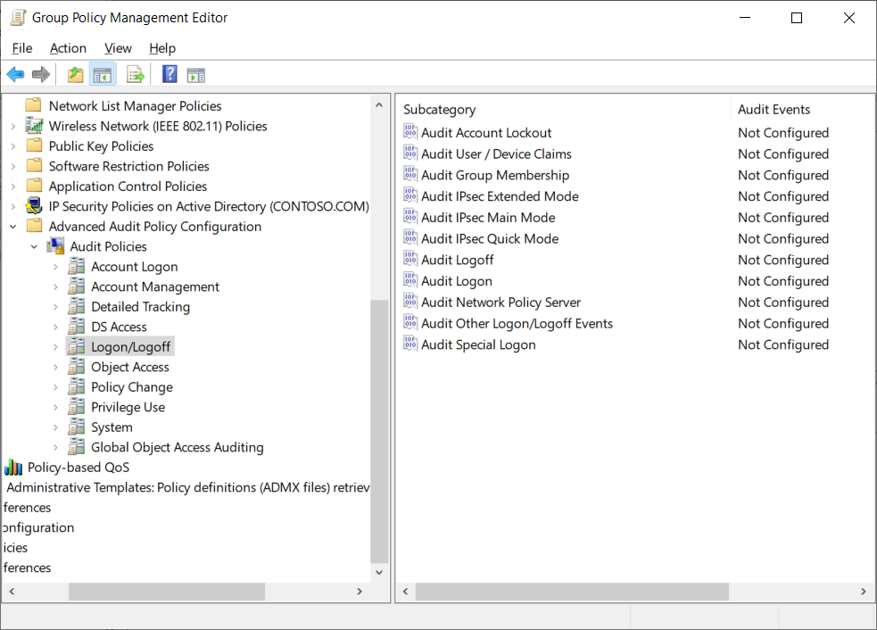

In addition to, or rather instead of, the basic auditing categories described in the last unit, you can implement advanced auditing categories in Windows Server Group Policy. These advanced categories enable you to gather more detailed information about activities in your environment.

For example, in the basic auditing category, you can use Audit logon events. This provides simple success or fail audit logging. However, in advanced categories, you can select the Logon/Logoff category. This provides for 11 policy settings. The following screenshot displays these advanced categories in the Group Policy Management Editor. The administrator has selected the Logon/Logoff category, and 11 subcategories are displayed.

> [!WARNING]
> Basic audit policy settings are not compatible with advanced audit policy settings that you apply with Group Policy. When you apply advanced audit policy settings with Group Policy, Windows clears the current computer's audit policy settings before it applies the resulting advanced audit policy settings.

These security auditing enhancements can help your organization’s audit compliance with important business-related and security-related rules by tracking precisely defined activities, such as:

- A group administrator modifying settings or data on servers that contain financial information.

- An employee within a defined group accessing an important file.

- The correct SACL being applied to every file, folder, or registry key on a computer or file share, as a verifiable safeguard against undetected access.

## What are the advanced auditing categories?

The following table describes the basic auditing categories.

| Advanced audit policy category| Description|
| :--- | :--- |
| Account Logon| These settings enable auditing the validation of credentials and other Kerberos-specific authentication and ticket operation events. The validation of credentials in a domain environment occurs on domain controllers, which means that the auditing entries are logged on domain controllers.|
| Account Management| You can enable auditing for events that are related to the modification of user accounts, computer accounts, and groups with these settings. This group of auditing settings also logs password change events.|
| Detailed Tracking| These settings control the auditing of encryption events, Windows process creation and termination events, and remote procedure call (RPC) events.|
| DS Access| These audit settings involve access to AD DS, including general access, changes, and replication.|
| Logon/Logoff| This group of settings audits standard logon and logoff events. They also audit other account-specific activity, such as Internet Protocol security (IPsec), Network Policy Server, and other uncategorized logon and logoff events. This is a little different than a related setting, named Account Logon. For Logon/Logoff auditing, these audit events capture events at the destination server. Thus, events are logged to the event log on the destination server. However, the events are not related to the validation of credentials.|
| Object Access| These settings enable auditing for any access to AD DS, the registry, applications, and file storage. One of the available subcategories of Object Access is Audit Removable Storage. By auditing removable storage, an administrator can track each time a user accesses or attempts to access data on a removable storage device.|
| Policy Change| When you configure these settings, internal changes to audit policy settings are audited.|
| Privilege Use| When you configure these settings, Windows Server 2012 audits attempts at privilege use within the Windows environment.|
| System| These settings are used for auditing changes to the state of the security subsystem.|
| Global Object Access Auditing| These settings are for controlling the SACL settings for all objects on one or more computers. When settings in this group are configured and applied with Group Policy, the configuration of the policy setting determines SACL membership, and the SACLs are configured directly on the server itself. You can configure SACLs for file system and registry access under Global Object Access Auditing.|

> [!IMPORTANT]
> Don't use both the basic audit policy settings and the advanced policy settings. Using both advanced and basic audit policy settings can cause unexpected results in audit reporting.

## Use AuditPol

In addition to using Group Policy, you can use a built-in command-line tool to manage the advanced audit policy settings. The tool is named AuditPol (Auditpol.exe), which offers the following functionality:

- Configuring auditing on individual computers. AuditPol manages auditing settings on individual computers, especially computers that are not joined to an Active Directory domain and thus are not available for targeting by using Group Policy. AuditPol is especially useful in perimeter networks, where it is common to find standalone computers that are not domain joined.

- Getting the current auditing settings. By running the `auditpol /get /category:*` command, you can quickly see the current auditing settings across all of the advanced auditing categories.

- Update the current auditing settings. By running the `auditpol /set /user:Contoso\User1 /subcategory:"Logon" /success:enable /failure:enable /include` command, for example, you can audit successful and unsuccessful sign-in access by Contoso\User1.

- Backing up and restoring settings across computers. AuditPol has a switch to back up all of the auditing settings and another switch to restore all of the backup settings. This allows administrators to configure auditing settings once, back up the settings, and then use the restore switch to implement the settings on other computers.

## Use expression-based audit policies

Dynamic Access Control greatly enhances the way that you can grant access to resources by providing real-time control of access based on predefined expressions. It offers the functionality to apply access control to resources based on:

- The classification of the resource.

- The device that is being used for access.

- The user and specific Active Directory attributes.

Expression-based auditing leverages these capabilities, enabling you to perform auditing based on the result of dynamic access control expressions. The following table describes the capabilities this provides.

| Capability| Description|
| :--- | :--- |
| Auditing files and folders based on their classification| If a file or folder is classified as Confidential, it can be audited automatically. As new files and folders are classified, they are audited automatically based on the auditing configuration.|
| Auditing files and folders based on a specific user and a specific action| Auditing can be very granular and allow for targeted auditing based on specific requirements.|
| Adding contextual information into audit events| Adding information to the events allows for easier filtering and monitoring of events.|

## Demonstration: Configure advanced auditing

In this demonstration, you'll learn how to:

- Create a folder and enable auditing.

- Create a GPO for advanced auditing.

- Verify audit entries.

### Create a folder and enable auditing

1. On a server in your domain, create a folder called **C:\Marketing** and share it.

1. Right-click the **Marketing** folder, and select **Security**.

1. Ensure the Domain Users group has full control on the folder.

1. On the Security tab, select Advanced and then select Auditing.

1. Select **Add**, and then choose **Select a principal**.

1. In the **Name** box, type **Authenticated Users**, and then select **OK**.

1. Leave the default settings for the **Applies to** option.

1. Click the check box next to **Modify**, and then select **OK**.

1. On the **Advanced Security Settings for Marketing**, select **OK**.

1. Select **Close**, and then share the folder.

### Create a GPO for advanced auditing

1. On your domain controller, from Server Manager, open **Active Directory Users and Computers**.

1. Create a new organizational unit (OU) in Contoso.com named **File Servers**.

1. Move a server computer from the Computers container to the **File Servers** OU.

1. On your domain controller, open **Group Policy Management**.

1. Create a new GPO named **File Audit**, and then link it to the **File Servers** OU.

1. Edit the **File Audit** GPO, and then under **Computer Configuration**, browse to the **Advanced Audit Policy Configuration\Audit Policies\Object Access** node.

1. Configure both the **Audit Detailed File Share** and **Audit Removable Storage** settings to record **Success** and **Failure** events.

1. Restart the domain controller, and then sign in.

### Verify audit entries

1. On a client machine, sign in as a user with permissions on the Marketing share.

1. In File Explorer, map a network drive to the share Marketing folder.

1. Create and edit a file.

1. Modify the file contents.

1. Sign out and switch to your domain controller.

1. Open **Event Viewer**, and then view the audit success events in the **Security** log.

1. Double-click one of the log entries that has a Source of Microsoft Windows security auditing and a Task Category of Detailed File Share.

1. Select the **Details** tab, and then note the access that was performed.

