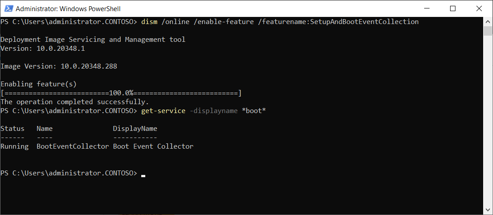

You can use Setup and Boot Event Collection to review startup and setup events from a number of source computers on a designated collector computer. After data is collected, you can analyze it using Event Viewer, Wevutil.exe, or Windows PowerShell.

## What can you monitor?

You can monitor the following events:

- Loading of kernel modules and drivers

- Enumeration of devices and initialization of their drivers

- Verification and mounting of file systems

- Starting of executable files

- Starting and completions of system updates

- The points when the system:

  - Becomes available for logon

  - Establishes connection with a domain controller

  - Completion of service starts

  - Availability of network shares

## Install the collector service

You can install the collector service by using the following command at an elevated Command Prompt: `dism /online /enable-feature /featurename:SetupAndBootEventCollection`.

Verify correct installation by running the following Windows PowerShell command at an elevated prompt: `get-service -displayname *boot*`.

The Boot Event Collector service should display as Running, as displayed in the following screenshot.

## Configure the collector service

After you've installed the collector, you must configure it. This involves two steps:

- On the target computers (the ones you'll collect events from), you must enable the KDNET/EVENT-NET transport and enable the forwarding of events.

- On the collector computer, specify from which computers you'll accept events and define a save location for those events.

Follow the instructions in this document for details: [Collect events with Setup and Boot Event Collection](/windows-server/administration/get-started-with-setup-and-boot-event-collection).

After you completed configuration, you must restart the target computer(s). After the targets are restarted, they connect to the collector, and events are collected.

## Review logs

After events have begun to be collected, you can review them. You can find the log for the collector service itself under: `Microsoft-Windows-BootEvent-Collector/Admin`.

You can use Event Viewer for a graphical interface for the events. Use the following procedure:

1. Create a new view.

1. Expand **Applications and Services** Logs, then expand **Microsoft** and then **Windows**.

1. Find **BootEvent-Collector**, expand it, and find **Admin**.

You can also review use Windows PowerShell: `Get-WinEvent -LogName Microsoft-Windows-BootEvent-Collector/Admin`.

And from a command prompt: `wevtutil qe Microsoft-Windows-BootEvent-Collector/Admin`.

