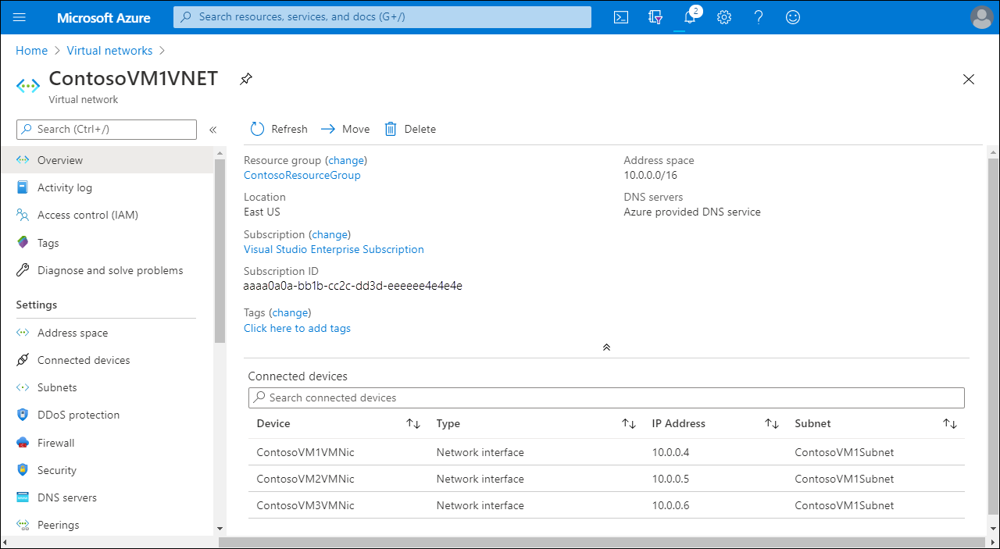
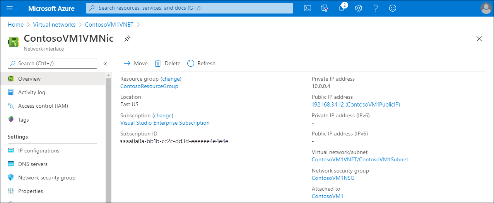

 

As lead system engineer bringing Microsoft Azure networking services to Contoso, you need to know how Azure VNets link Azure resources together. You also need to learn about Azure VM network interfaces.  

## Azure VNets

Azure networking services provide connectivity to resources in Azure, which could either be between services in Azure or between Azure and an on-premises environment. There are multiple Azure networking components that deliver and help protect applications and enhance the security of your network.

When you deploy computers in your on-premises environment, you typically connect them to a network, enabling them to communicate directly with each other. Azure VNets serve the same basic purpose. By placing a VM on the same VNet as other VMs, you effectively provide direct IP connectivity among them within the same private IP address space. You can also connect different VNets together. In addition, it is possible to connect VNets in Azure to your on-premises networks, effectively making Azure an extension of your own datacenter.

An Azure VNet constitutes a logical boundary defined by a private IP address space of your choice. You divide this IP address space into one or more subnets, just as you would in an on-premises network.

> [!NOTE]
> Most VNets use a private IP address space, according to Request for Comments (RFC) 1918. The RFC defines three IP address spaces for private use: 10.0.0.0/8, 172.16.0.0/12, and 192.168.0.0/16.

However, in Azure, any additional network management tasks are more straightforward. For example, some networking features, such as routing between subnets on the same VNet, are automatically available. Similarly, by default, every VM can access the internet, which includes support for outbound connections and DNS name resolution.

> [!NOTE]
> You can alter the default routing and name resolution functionality within Azure VNets. You can also control network connectivity by selectively blocking communication on the subnet or Azure VM network interface level.

## Azure VM network interface

A *network interface* is the interconnection between a VM and a VNet. A VM must have at least one network interface (connected to a VNet), but they can also have more than one, depending on the size of the VM you create. You can create a VM with multiple network interfaces and add or remove network interfaces through the lifecycle of a VM. Multiple network interfaces allow a VM to connect to different subnets in the same VNet, and send or receive traffic over the most appropriate interface. VMs with any number of network interfaces can exist in the same availability set, up to the number supported by the VM size. In the following example, a VNet has three connected network interfaces.

Each network interface that's attached to a VM must:

- Exist in the same location and subscription as the VM.
- Be connected to a VNet that exists in the same Azure location and subscription as the VM.

> [!NOTE]
> You can change the subnet a VM connects to after you create the VM, but you cannot change the VNet.

You can assign two types of IP addresses to a network interface in Azure as described in the following table.

|Address type|Description|
|----|----|
|Public IP addresses|Used for inbound and outbound network communication without network address translation (NAT) with the internet and other Azure resources not connected to a VNet. Assigning a public IP address to a network interface is optional. Public IP addresses have a nominal charge, and there's a maximum number that you can use per subscription.|
|Private IP addresses|Used for communication within a VNet, your on-premises network, and the internet with NAT. Each VM must have at least one private IP address to a VM.|

The following screenshot displays both the private IPv4 address (10.0.0.4) and the public IPv4 address (52.146.34.12) of a network interface.

You can assign public IP addresses to VMs or internet-facing load balancers. Azure assigns private IP addresses to VMs and internal load balancers automatically.

Azure uses two methods to allocate an IP address to a resource:

- Dynamic. This is the default allocation method, where an IP address is not allocated when it's created. Instead, the IP address is allocated when you create a VM or start a stopped VM. The IP address is released when you stop or delete the VM.
- Static. This method assigns an IP address immediately, and ensures the IP address for the VM remains the same. It's released only when you delete the VM or change its allocation method to dynamic. You must explicitly set the allocation method to static.

## Additional reading

To learn more, review the following documents:

- [Virtual networks and virtual machines in Azure](https://aka.ms/network-overview?azure-portal=true)
- [Outbound connections in Azure](https://aka.ms/load-balancer-outbound-connections?azure-portal=true)
