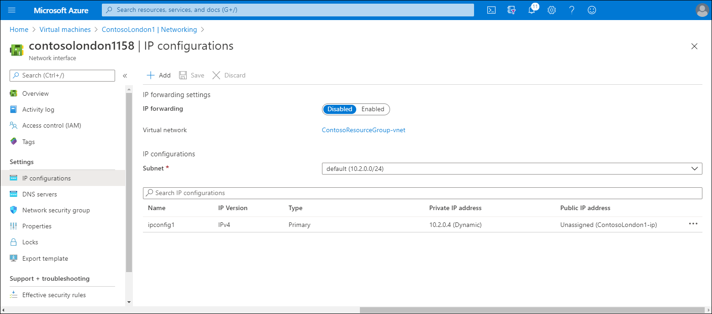
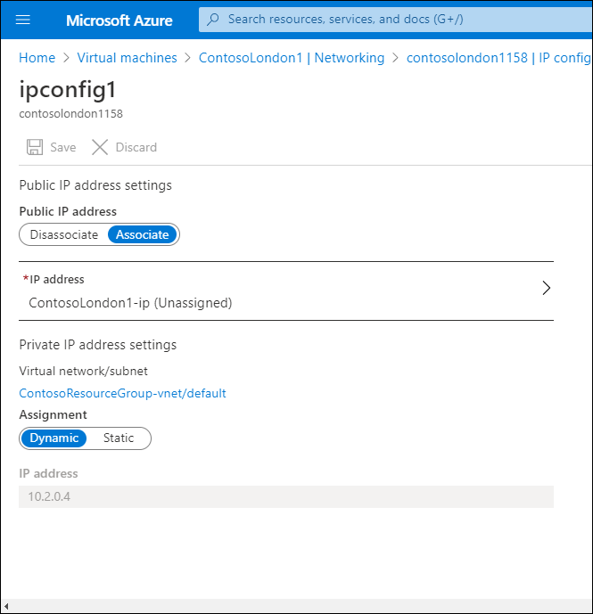
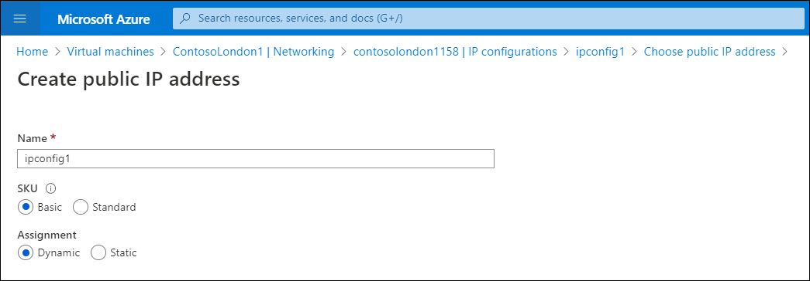

As the lead system engineer at Contoso, you establish a pilot to examine virtual networking in Azure, including the interaction between public and private address spaces. To implement this pilot, you must find out how to assign both private and public IP addresses during the creation of Azure resources.

## Assign an IP configuration during VM creation

When you create a VM in Azure, it automatically connects to an Azure VNet. Azure also configures the VM onto a private IPv4 subnet and assigns the VM a public IPv4 address. You can reconfigure the VNet, subnet, and public IP settings during VM creation, or later.

> [!NOTE]
> You can also choose to create an additional VNet, subnet, or public IP at this point.

If you want to reconfigure the VM's network settings from the Azure portal, from the **Virtual machines** page, select the appropriate VM, and then under **Settings**, select **Networking**. You can review (and in most instances, configure) the following settings:

- IP configuration (NIC Private IP and link to NIC Public IP)
- Network Interface
- VNet/subnet
- NIC Public IP
- NIC Private IP
- Inbound port rules
- Outbound port rules
- Application security groups
- Load balancing

> [!NOTE]
> If the VM is not running, you can also attach and detach network interfaces.

You can also review the Effective security rules and Topology. From the Topology, you can review the overall map of your VNet, and select the appropriate object for reconfiguration.

## Manage VM IP addresses

After you have created your VM or other resource, you can reconfigure the private IP address settings at any time. Use the following procedure to review or edit the private IP configuration for a VM:

1. In the Azure portal, navigate to **Virtual machines**, and then select the appropriate VM.
2. On the **Overview** page for your selected VM, select **Networking**.
3. Select the appropriate network interface.
4. Select **IP configurations**.

   

5. Under the IP configurations table, select the listed entry.

   

6. If you want to remove the public IP address from the resource, under **Public IP address settings**, select **Disassociate**.
7. If you want to change the public IP address configuration, under **Public IP address settings**, select **IP address**.
8. On the **Choose public IP address** page, select **Create new**.

   

9. Enter a new name, choose the SKU and Assignment methods, and then select **OK**.
10. Under **Private IP address settings**, you can change the assignment from **Dynamic** to **Static**. If you switch from **Dynamic**, the Static address defaults to the same IP address that was dynamically assigned, although you can change it.
11. Make any changes, and then select **Save**.
