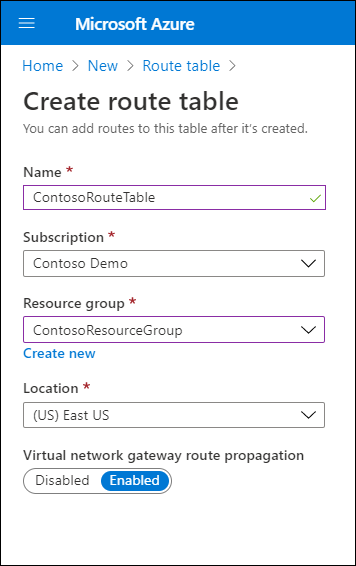
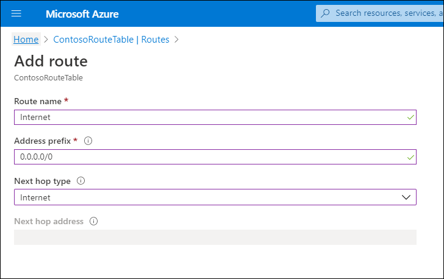

As a network systems engineer at Contoso, you're particularly interested in the flow of network traffic in and around your Azure resources, to and from the internet, and within your on-premises infrastructure. You decide to investigate Azure routing and how you can implement routing to address Contoso's requirements. You learn that for each subnet within an Azure VNet, Azure creates a route table and populates it with system default routes. By adding to the default routes, you can create your own custom routes.  

## System routes

You cannot create system routes, nor override existing system routes. However, you can change the routing behavior by defining custom routes.

> [!NOTE]
> Azure routes traffic from a subnet based on the routes in that subnet's route table.

### Default

When you create a route, you must define its address prefix and its next hop. When traffic leaving a subnet is sent to an IP address within the address prefix of a defined route, the route that contains the prefix is the route Azure uses. If multiple routes contain the same address prefix, Azure selects a route based on the following order:

1. Use a user-defined route first.
2. Use a Border Gateway Protocol (BGP) route next.
3. If no other alternatives exist, use a system route.

When you create a VNet, Azure automatically creates a number of default routes, as described in the following table.

|Source|Address prefixes|Next hop type|
|----|----|----|
|Default|Unique to the virtual network|Virtual network|
|Default|0.0.0.0/0|Internet|
|Default|10.0.0.0/8|None|
|Default|192.168.0.0/16|None|
|Default|100.64.0.0/10|None|

The following table describes how Azure interprets the Next hop type.

|Next hop type|How Azure determines routes|
|----|-------|
|Virtual network|Routes traffic between address ranges within the address space of a VNet. Azure creates a route with an address prefix that corresponds to each address range defined within the address space of a VNet. If the VNet address space has multiple address ranges defined, Azure creates an individual route for each address range. Azure automatically routes traffic between subnets using the routes created for each address range.|
|Internet|Routes traffic specified by the address prefix to the internet. The system default route specifies the 0.0.0.0/0 address prefix. Azure routes traffic to the internet for any address not specified by an address range within a VNet except for traffic to other Azure services. If the destination address is for one of Azure's services, Azure routes the traffic directly to the service over Azure's backbone network, rather than routing the traffic to the internet.|
|None|Traffic that's routed to the None next hop type is not routed outside the subnet, but is dropped.|

> [!TIP]
> You can use a custom route to override Azure's default system route for the 0.0.0.0/0 address prefix.

> [!TIP]
> You don't need to define gateways for Azure to route traffic between subnets.

### Optional defaults

Azure creates additional default rules if you add specific Azure capabilities. You must enable these capabilities for Azure to create these optional default rules. The following table describes the rules.

|Source|Prefix|Next hop type|Subnet within VNet to which Azure adds the route|
|----|---------|----|---------|
|Default|Unique to the VNet, for example: 10.2.0.0/16|VNet peering|All|
|Virtual network gateway|Prefixes advertised from on-premises with BGP, or configured in the local network gateway|Virtual network gateway|All|
|Default|Multiple|VirtualNetworkServiceEndpoint|Only the subnet for which a service endpoint is enabled|

The following table describes how Azure interprets the Next hop type.

|Next hop type|How Azure routes|
|----|-------|
|VNet peering|When you create a VNet peering between two VNets, Azure adds a route for each address range within the address space of each VNet a peering is created for.|
|Virtual network gateway|When you add a VNet gateway to a virtual network, Azure adds one or more routes with VNet gateway listed as the next hop type. The source is also VNet gateway, because the gateway adds the routes to the subnet. If your on-premises network gateway exchanges Border Gateway Protocol (BGP) routes with an Azure virtual network gateway, a route is added for each route propagated from the on-premises network gateway.|
|VirtualNetworkServiceEndpoint|When you enable a service endpoint to certain services, Azure adds the public IP addresses for the services to the route table. Service endpoints are enabled for individual subnets within a VNet, so the route is only added to the route table of a subnet for which a service endpoint is enabled.|

> [!NOTE]
> The public IP addresses of Azure services change periodically. When the addresses change, Azure automatically manages the addresses in the route table.

## Custom routes

You can create either user-defined custom routes in Azure, or you can generate custom routes by exchanging BGP routes with your on-premises network infrastructure and an Azure VNet gateway.

### User-defined

You can create user-defined custom routes in Azure to override Azure's default system routes. In Azure, you create a route table, then associate the route table to zero or more virtual network subnets. Each subnet can have zero or one route table associated to it. If you create a route table and associate it with a subnet, the routes within the table are combined with, or override the default routes Azure adds to a subnet by default.

The following table defines the next hop types you can use select when creating a custom route.

|Next hop type|Explanation|
|----|-------|
|Virtual appliance|Choose when the traffic is destined for a network application, such as a firewall. When you create a route with the virtual appliance hop type, you also specify a next hop IP address. The IP address can be the private IP address of a network interface attached to a VM, or the private IP address of an Azure internal load balancer.|
|Virtual network gateway|Choose when you want traffic destined for specific address prefixes to be routed to a VNet gateway.|
|None|Choose when you want to drop network traffic to a defined prefix.|
|VNet |Choose whether you want to override the default routing within a VNet.|
|Internet|Choose when you want to explicitly route traffic destined to an address prefix to the internet, or whether you want traffic destined for Azure services with public IP addresses kept within the Azure backbone network.|

## Additional reading

To learn more, review the following documents:

- [Virtual network traffic routing](https://aka.ms/routing-example?azure-portal=true)
- [What is routing preference?](https://aka.ms/routing-preference-overview?azure-portal=true)
- [What is Azure Virtual Network?](https://aka.ms/virtual-networks-overview?azure-portal=true)
