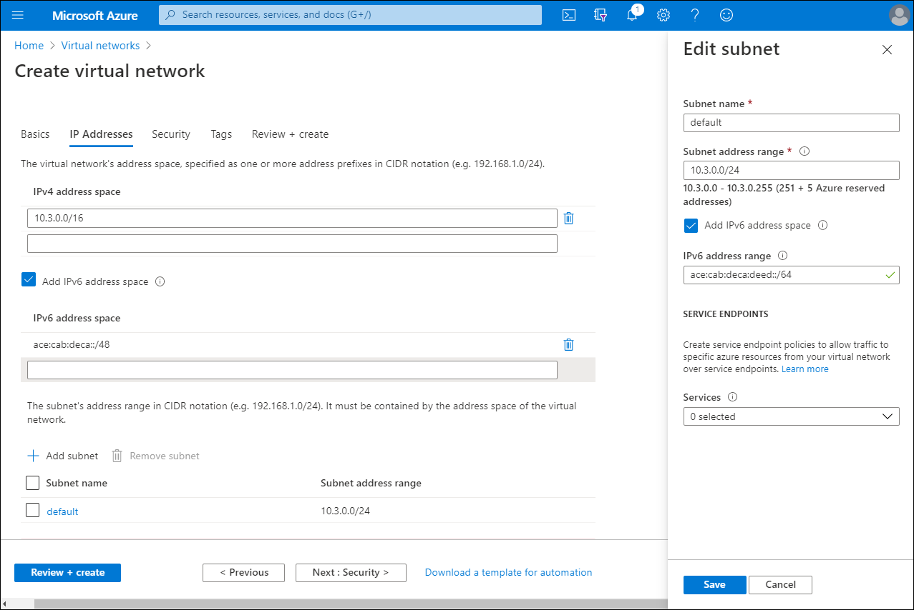

Contoso hosts a number of applications in their on-premises portfolio that use IPv6. You know that Windows Server and Windows 10 devices both support dual-stack IPv6 and IPv4. You need to investigate Azure's support for IPv6 so that the application workloads can be migrated to Azure.

## What is IPv6 for Azure VNet?

You can use IPv6 for Azure VNet to host applications in Azure that require both IPv6 and IPv4 connectivity within a virtual network and to and from the internet. Given the ever decreasing pool of available public IPv4 addresses, it's inevitable that many applications and services will need to support IPv6. Azure's dual stack IPv4/IPv6 connectivity enables your hosted apps to communicate in both the IPv4 and IPv6 internet. The following diagram depicts the use of this dual-stack approach.

## Create a dual-stack VNet

You can create a dual-stack VNet when you create the VNet in the Azure portal. Use the following procedure:

1. In the Azure portal, select **Virtual networks**, and then select **Add**.
2. Enter the basic information on the **Basics** page, and then select **Next: IP Addresses**.
3. On the **IP Addresses** page, select the **Add IPv6 address** space check box.

   

4. Select the subnet that displays, and on the **Edit subnet** blade, select the **Add IPv6 address space** check box.
5. Enter an IPv6 address, and then select **Save**.
6. Select **Review + Create**, and then select **Create**.

To add an IPv6 address space to an existing VNet, in the Azure portal, navigate to your virtual networks list. Then use the following procedure:

1. Select the appropriate VNet, and then select **Address space**.
2. Add the IPv6 address space, and then select **Save**.
3. Select **Subnets**, select **+ Subnet**, and then enter a new subnet name.
4. Select the **Add IPv6 address space** check box, enter an IPv6 address space for the subnet, and then select **OK**.
