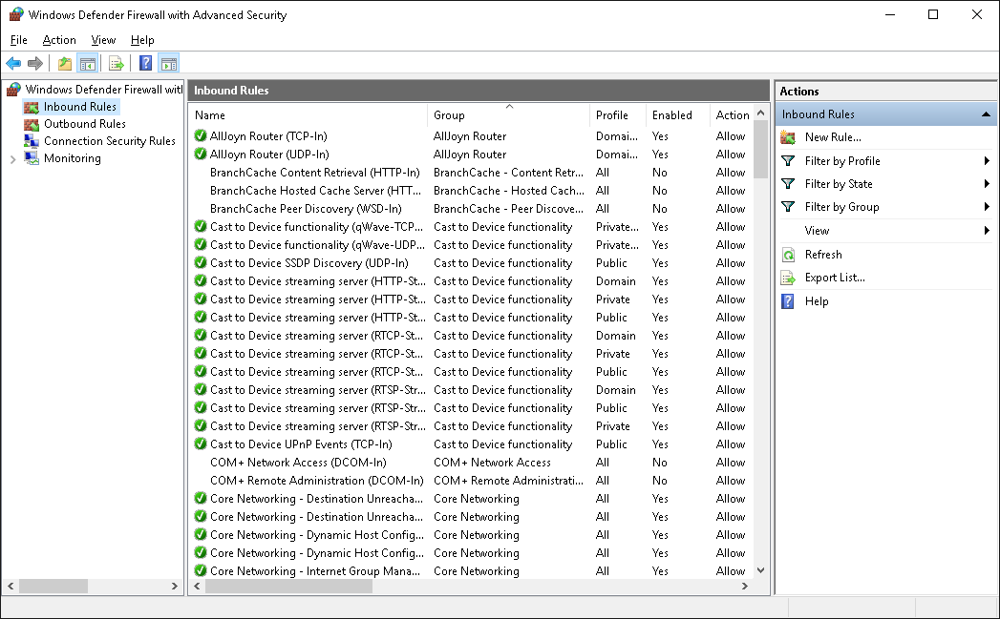
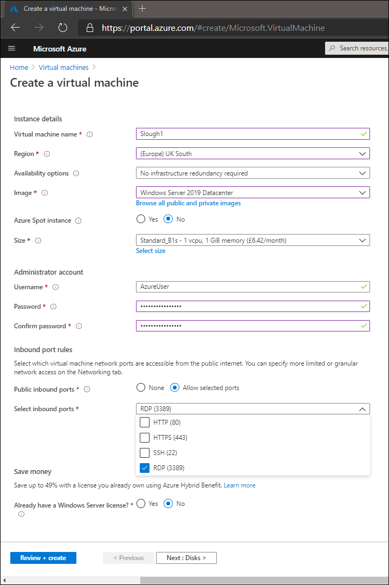

The network administrator at Contoso is concerned about conflicting firewall settings between Microsoft Azure Firewall and Windows Defender Firewall with Windows Server IaaS VMs. You investigate how to set-up these two systems to work together.  

## What is Windows Defender Firewall with Advanced Security?

Windows Defender Firewall with Advanced Security is a host-based firewall for enhancing the security of Windows Server. Windows Defender Firewall with Advanced Security is more than just a simple firewall, because it includes features such as firewall profiles and connection security rules.

> [!NOTE] 
> In your on-premises environment, you can either manually configure Windows Defender Firewall with Advanced Security on each server, or use Group Policy to centrally configure the firewall rules.

## Configuring Windows Defender Firewall rules

Rules comprise a collection of criteria that define which traffic you will allow, block, or secure with the firewall. You can configure various kinds of rules, as described in the following table.

|Rule type|Description|
|----|----|
|Inbound|Inbound rules explicitly allow or block traffic that matches the criteria in the rules. For example, you can configure a rule to allow HTTP traffic from the internal network through the firewall, but block the same traffic if it's coming from the internet. When Windows Server is first installed, all unsolicited inbound traffic is blocked by default. To allow unsolicited inbound traffic, you must create an inbound rule that describes the traffic you intend to allow. For Windows Server roles and features, you don't have to create the rules. For example, enabling Microsoft Internet Information Services (IIS) automatically adjusts Windows Defender Firewall to allow the appropriate traffic. You can change the default action to allow or to block all connections regardless of any rules. Allowing all connections removes the protection the firewall is providing.|
|Outbound|Windows Defender Firewall allows all outbound traffic unless a rule blocks it. Outbound rules explicitly allow or deny traffic originating from the computer that matches the criteria in the rules. For example, you can configure a rule to explicitly block outbound traffic to a computer through the firewall, but allow the same traffic for other computers. This rule can specify an IP address, an IP address range, or a wildcard (*).|
|Connection security|Firewall rules and connection security rules are complementary, and both contribute to a defense-in-depth strategy to help protect your server computer. Connection security rules help to secure traffic by using Internet Protocol security (IPsec) while the traffic crosses the network. Use connection security rules to specify that connections between two computers must be authenticated or encrypted. Connection security rules specify how and when authentication occurs. However, they do not allow connections. To allow a connection, create an inbound or outbound rule. After a connection security rule is created, you can specify that inbound and outbound rules apply only to specific users or computers.|

### Inbound and outbound rule types

In Windows Defender Firewall with Advanced Security, you can create four kinds of inbound and outbound rules, as described in the following table.

|Inbound and outbound rule type|Description|
|----|----|
|Program rules|These rules can control connections for a program regardless of the port numbers it uses. Use this kind of firewall rule to allow a connection based on the program that is trying to connect. These rules are useful when you're not sure of the port or other required settings because you only specify the path of the program executable file (.exe file).|
|Port rules|These rules can control connections for a TCP or UDP port regardless of the application. Use this kind of firewall rule to allow a connection based on the TCP or UDP port number over which the computer is trying to connect. You specify the protocol and individual or multiple local ports.|
|Predefined rules|These rules can control connections for a Windows component—for example, File and Print Sharing or AD DS. Use this kind of firewall rule to allow a connection by selecting one of the services from the list. These kinds of Windows components typically add their own entries to this list automatically during setup or configuration. You can enable and disable a rule or rules as a group.|
|Custom rules|These rules can be combinations of the other rule types, such as port rules and program rules.|

## Administering Windows Defender Firewall

You can manage Windows Defender Firewall with Advanced Security using the interface displayed in the following screenshot, or else by using Windows PowerShell.



### Using Windows PowerShell to administer firewall settings

There are many Windows PowerShell cmdlets that you can use to administer Windows Firewall.

For example, to create a firewall rule to allow use of the application that uses the application.exe executable, at the Windows PowerShell command prompt, enter the following command, and then select Enter:

```powershell
New-NetFirewallRule -DisplayName “Allow Inbound Application” -Direction Inbound -Program %SystemRoot%\System32\application.exe -RemoteAddress LocalSubnet -Action Allow
```

To modify an existing rule, at the Windows PowerShell command prompt, enter the following command, and then select Enter:

```powershell
Set-NetFirewallRule –DisplayName “Allow Web 80” -RemoteAddress 192.168.0.2
```

To delete an existing rule, at the Windows PowerShell command prompt, enter the following command, and then select Enter:

```powershell
Remove-NetFirewallRule –DisplayName “Allow Web 80”
```

To review more Windows PowerShell cmdlets, visit the [NetSecurity](https://aka.ms/netsecurity?azure-portal=true) page.

## Creating firewall rules when creating a VM in Azure

When you create IaaS VMs running Windows Server in Azure, you must be careful to configure the firewall correctly. It's feasible to configure Windows Defender Firewall with Advanced Security to block or  allow a port that is being allowed, or blocked, by Azure Firewall. When you first create a VM in Azure, you must define the Inbound port rules. These mismatched settings can create service unavailability and confusion.


