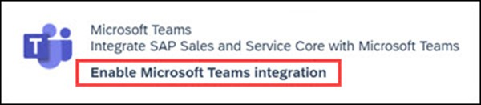
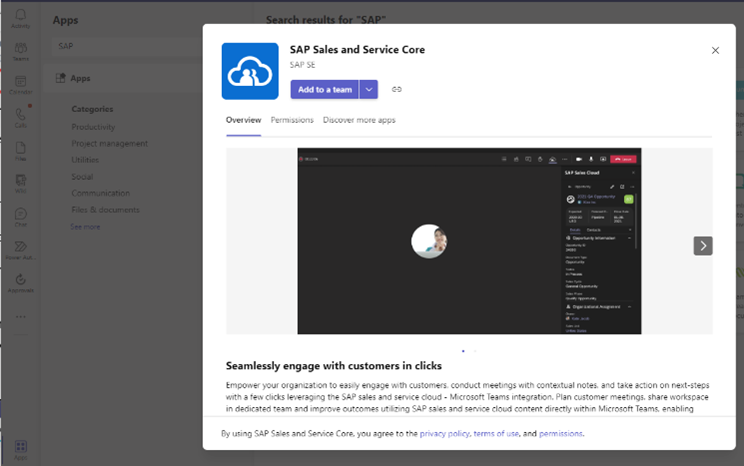
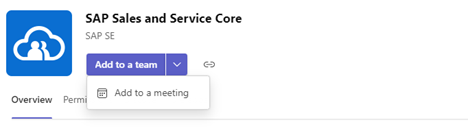
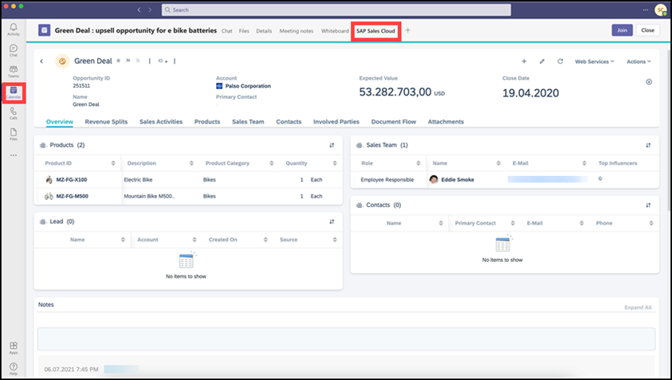
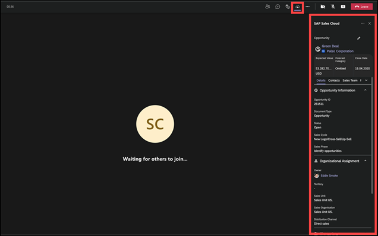
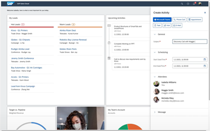

Jenn, like other salespeople at Contoso, relies on Microsoft Teams to conduct meetings with colleagues and customers. Jenn wants to improve productivity by minimizing the time spent switching between SAP systems and her other apps.

As the Contoso admin for both Microsoft and SAP solutions, Andy knows that Microsoft and SAP worked together to integrate Teams across several SAP solutions:

- S/4HANA digital assistant – Access Teams capabilities inside your SAP S/4HANA system.
- Work Zones – Access and share business information and apps while you chat with colleagues in Teams.
- Qualtrics – Run Qualtrics Experience Management (XM) within Teams
- Analytics Cloud – Share analytics findings in Teams.
- Business By Design – Manage business collaboratively with the Teams add-on.
- Sales Cloud – Conduct meetings and save notes using the user interface of your choice.

This module focuses on the Teams integration with SAP Sales Cloud.

## Enable SAP-Teams integration for an organization

Andy can enable the SAP-Teams integration with the following steps:

1. Sign into SAP Sales Cloud as an administrator and navigate to Activity Management.
1. Select the boxes next to the following scoping questions:
    - Do you want to enable Microsoft Teams integration?
    - Optional: Do you want to enable appointment for Microsoft Teams collaboration by default?
    - Optional: Do you want to add reference object as part of Microsoft Teams meeting request?

Andy also wants to make sure that Contoso end users can access the app for SAP Sales Cloud in the organization’s Teams app store. Multiple apps for SAP are available, including SAP Ruum and SAP Business by Design. Andy wants to add the SAP Sales and Service Core app. This activity requires a few more steps.

### Sign in to Microsoft Teams admin center

1. From the home page, expand the navigation menu and go to **Teams apps**, **Manage apps**.
1. Search for and select the **SAP Sales and Service Core** app from the list.
1. Select **Allow**. A new window opens. Select **Allow again**.

### Grant consent for Microsoft Teams integration

1. Navigate to **Administrator**, **General Settings**.
1. Under **Microsoft Teams**, select **Enable Microsoft Teams integration**, which will redirect to the Teams authentication page.
1. Sign in with your Microsoft 365 username and password. A new window opens for consent.

    

1. Select **Accept**.

### Add SAP application to Teams

Once the organization’s Teams admin provides consent, Teams users will be able to add the SAP Sales and Service Core app to their Teams instance. Andy notifies Jenn, who finds the app in the organization’s app store.

Jenn adds the app to a team channel. Anytime she wants, she can also add the app to a one-time or recurring meeting.

### Choose how to use Teams with SAP

By enabling the Microsoft Teams-SAP Sales Cloud integration, Andy empowers coworkers with productivity and collaboration options. Sellers can choose how and where they want to work:

1. Work in a Teams tab and access SAP data. With her new Teams app, Jenn can work inside Teams and find account information from SAP Sales Cloud on a Teams tab. She can also automatically save sales appointments to SAP Sales Cloud without switching apps.

    

1. Work in a Teams meeting and access SAP Sales Cloud account information in the side panel.

    

1. Work in the SAP Sales Cloud interface and access Teams capabilities.

    

The options help Jenn improve efficiency across a typical sales cycle and collaborate quickly with people inside and outside of Contoso to resolve issues. Here are some of the activities that are available:

- Record Teams meetings to share with colleagues in Teams and SAP Sales Cloud.
- Save Teams meeting recording, notes, and activities in the SAP Sales Cloud customer interaction timeline.
- Update and view SAP Sales Cloud history and notes in real time from within the Teams interface.
- Input notes in a Teams meeting that are automatically propagated to SAP Sales Cloud.
