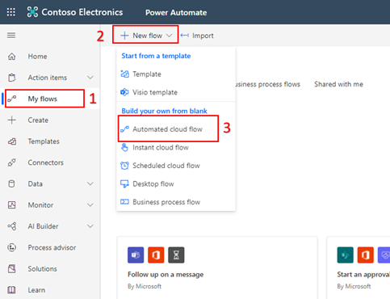
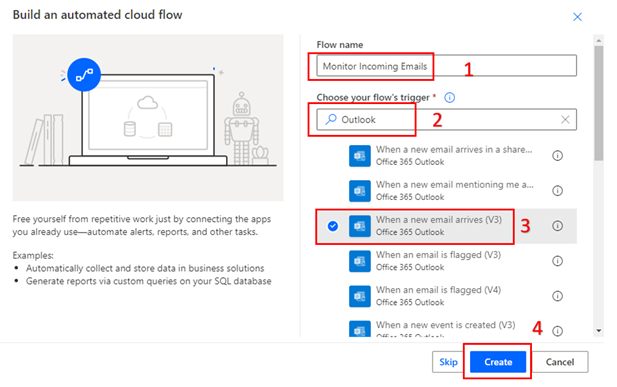
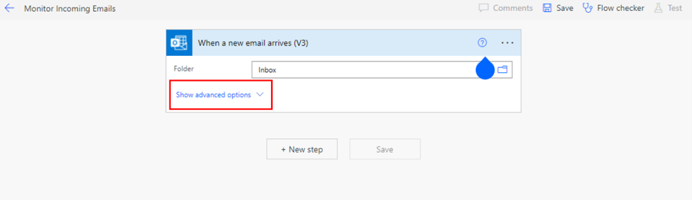
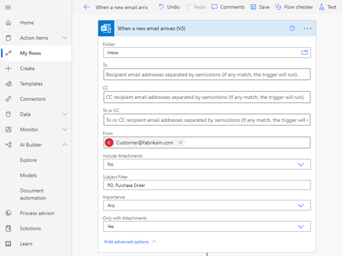
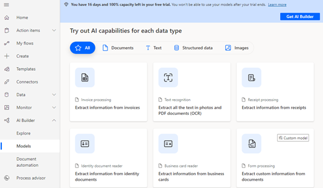

Jenn now works within Teams and SAP without switching apps. As a next step, Jenn wants to automate the tedious portions of the sales process to speed orders from key customers like Fabrikam.

All Fabrikam orders must be approved by the Fabrikam procurement officer to minimize fraud. Jenn believes it’s possible to replace the error-prone process that helps track PO approvals. Jenn asks Andy how to rapidly identify customer emails with purchase order attachments, confirm customer approval, and input the order to SAP.

Andy considers how to enable a solution using Microsoft technologies that integrate with SAP Sales Cloud. Andy offers to help Jenn automate multiple activities into a coherent series of functions with Microsoft Power Automate and AI Builder.

## Understand Power Automate

Power Automate is an online workflow service that’s also available in a desktop version. Power Automate is part of Power Platform, a low-code Microsoft platform. Power Automate can automate actions across the most common apps and services. You can automate workflows between your favorite applications and services, sync files, get notifications, collect data, and much more. For example, you can automate these tasks:

- Instantly respond to high-priority notifications or emails.
- Capture, track, and follow up with new sales leads.
- Copy all email attachments to your OneDrive for Business account.
- Collect data about your business and share that information with your team.
- Automate approval workflows.

Admins often use Power Automate to build workflows. But just as often, business people use Power Automate to automate manual activity. Admins like Andy can empower business users to solve everyday challenges using documentation available in the [Power Platform Admin Center](https://admin.powerplatform.microsoft.com/home).

One common use is to enable notifications. For example, you can use Power Automate to build a flow that delivers an email or a push notification to your phone whenever you receive an important customer email.

Jenn wants something more specific and more automated: to identify incoming purchase orders from a key customer and automate customer approvals.

## Identify emails for action

Andy works with Jenn to create a Power Automate flow that notifies Jenn of specific emails from key account Fabrikam, following these steps:

Sign in to [Power Automate](https://flow.microsoft.com/) by using your organizational account.

### Build a cloud flow

Follow these three steps, which are mapped with numbers in the following screen capture.

1. Select **My flows**.
2. Select **New flow**.
3. Then select **Automated cloud flow**.

Then, follow these four steps, which are mapped with numbers in the following screen capture.

1. Provide a name for your flow.
2. Under **Choose your flow's trigger**, enter **Outlook**.
3. Select the **When a new email arrives (V3)** trigger.
4. Select **Create**.

### Configure the trigger to identify urgent emails

1. Wait for a box to display that represents the first operation in the flow, “When a new email arrives.” Expand Show advanced options.

    

2. Add details to three fields:

    - **From** - Add the email address of the person or multiple people whose email you want to monitor.
    - **Subject Filter** - Add keywords or phrases that will help identify if it's an important email. In this case, Jenn wants to identify emails with these phrases in the subject line: purchase order, purchase order request, PO, and Purchase Order. Customers know to include PO or purchase order in the Subject line of any email with purchase order details.
    - **Only with Attachments** – Select **Yes**. Fabrikam purchase orders always arrive as an email attachment.

    

## Specify an action based on prioritized emails

With a Power Automate flow, Jenn has identified urgent emails for action. Jenn continues to build the flow by adding more operations.

Jenn wants the PO details from urgent emails automatically transferred to a format Jenn can share with Fabrikam.

To extract PO details from a PDF attachment, Jenn and Andy use Power Automate and the AI Builder to create a custom AI model to use in the flow.

### Create a custom model to extract data from emails

1. Expand **AI Builder**, select **Models**, then select **Extract custom information from documents**.
2. Follow the guidance that appears in the pop-up window to set up and train the model. When finished, save and close. Finally, publish your model to make it available to your flow.

    

## Summary

To extract key information from an email attachment, build a Power Automate flow that includes a trigger and custom AI Builder model.
