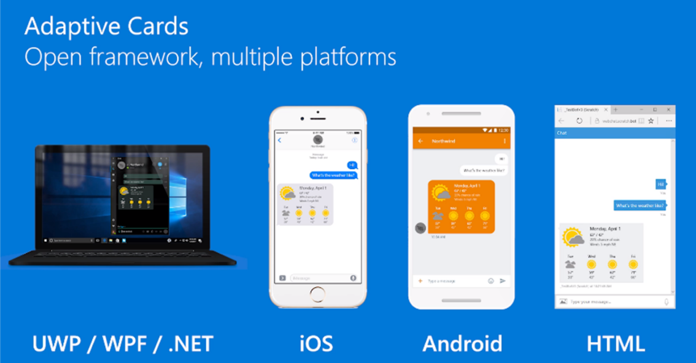
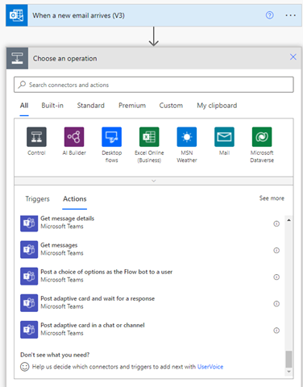
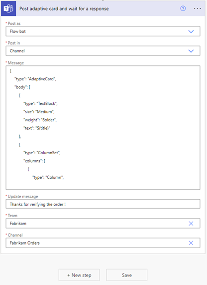

Jenn is part way through her automation flow and has built a Power Automate flow to extract purchase order details from email attachments. 

To confirm POs, Jenn must share each new purchase order request manually to gain Fabrikam approval. The process often requires multiple phone calls, email confirmations. Fabrikam orders are sometimes lost or delayed.

Jenn wants to automate approvals. Adaptive Cards, a Microsoft technology, makes it easy to deliver snippets of UI across multiple platforms and include actions such as an approve button.

The next step in the automation flow is to insert the extracted details into an Adaptive Card. The Adaptive Card will contain order details, plus an approval mechanism for Fabrikam.

## Understand Adaptive Cards

Adaptive Cards are platform-agnostic snippets of UI, authored in JSON, that apps and services can openly exchange. Adaptive Cards can be rendered natively in a host application such as Outlook, Microsoft Teams, Microsoft Windows, and even custom applications. When delivered to a specific app, the JSON is transformed into native UI that automatically adapts to its surroundings. Use Adaptive cards to simplify approvals, create functional modules inside of an app, or display information in an app. Developers typically create cards for organizations to adjust and repurpose.  

 
## Explore designing an Adaptive Card

The [Adaptive Card Designer](https://adaptivecards.io/designe) tool offers an interactive design-time experience to modify the JSON in new and sample Adaptive Cards. Building the JSON to insert extracted data requires expertise with JSON and Adaptive Cards. You may need a developer for this process, which this module covers only at a high level.

Andy finds an Adaptive Card sample with an approval mechanism to modify for Jenn’s purpose.

Andy adds a placeholder to contain the extracted order details. Then, Andy copies the JSON to for use in Jenn’s Power Automate flow.

## Complete the automation with Adaptive Cards

Now that Andy has customized an Adaptive Card, the team is ready to continue to build out the flow in Power Automate. 

### Add an operation to post Adaptive Card to Teams for approval 

1. Open the cloud flow in Power Automate.
2. Select the **Post adaptive card and wait for a response** operation that is preconfigured to wait for a response from the approver. The operation expands.

    

3. Select **Flow bot** option from the **Post as** field and **Channel** from the **Post in** field. You can choose to post to a user or a channel in Teams.
4. Copy the Adaptive Card JSON into the area labeled **Message**. The JSON includes all the fields the flow will insert into the Adaptive Card. 

    > [!NOTE]
    > Due to the complexity of building the JSON, the JSON in the screen capture  below is for example only and not for production.

5. Add an **Update message** that displays when the purchase order is approved. 
6. Select the correct **Team** and **Channel** from drop-down options.

    

## Summary

You can automate activities – such as embedding purchase order details from email attachments into Adaptive Cards and sharing on Teams – by adding operations in a Power Automate flow.
