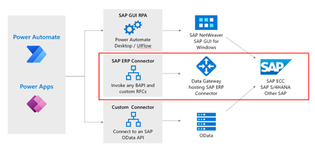

With the new Contoso Power Automate flow, purchase order details are now automatically pulled into Adaptive Cards and posted in the channel Jenn shares with Jenn’s Fabrikam contact. As each card appears in the channel, the Fabrikam officer can review and approve the order.

Jenn suggests the Fabrikam procurement officer opt into notifications of all channel activity. Th notifications help speed the approvals Jenn needs.

## Submit approvals to SAP systems

After approval, Jenn wants the Power Automate flow to automatically submit the order details into the SAP ERP system. As Jenn knows, order details in the ERP system are automatically  available within SAP Sales Cloud. 

Jenn works with Andy to add an operation in the Power Automate flow. Andy has experience using the SAP ERP Connector from Microsoft   to write data to SAP ERP.

The SAP ERP connector for Power Automate and Power Apps enables Andy to invoke RFC and BAPI functions using the on-premises data gateway into the SAP ERP system. Alternately, instead of using the RFC/BAPI interface, organizations can use the SAP GUI RPA or create custom connectors to connect to an SAP ODATA API. 

The SAP ERP connector from Microsoft authenticates with the SAP system, but it also supports Windows authentication. The connector contains other details required to connect to the SAP system, including the server details and security configuration information. 

In this module’s scenario, all purchase orders confirmed by Fabrikam in the Teams channel are submitted to SAP systems. A single Power Automate flow includes all the operations required, starting with Outlook emails, extracting data into Adaptive Cards, sharing in Teams, and finally saving new POs in SAP.
