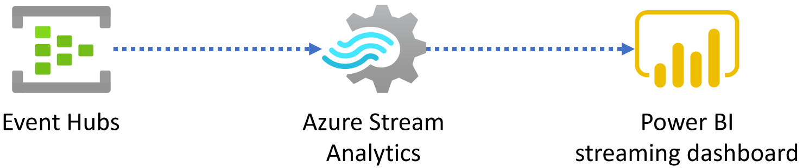
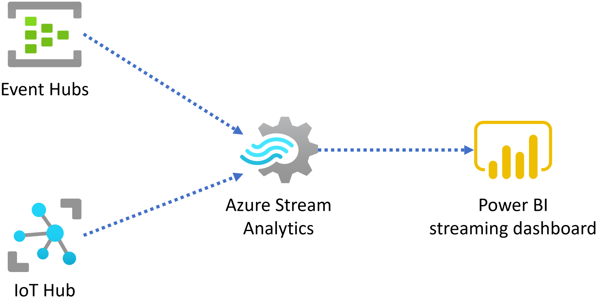

[Azure Stream Analytics](https://docs.microsoft.com/azure/stream-analytics/stream-analytics-introduction) is the recommended service for stream analytics on Azure. Stream Analytics provides you with the ability to ingest, process, and analyze streaming data from Azure Event Hubs (including [Azure Event Hubs from Apache Kafka](https://docs.microsoft.com/azure/event-hubs/event-hubs-for-kafka-ecosystem-overview)) and Azure IoT Hub. You can also configure static data ingestion from Azure Blob Storage. This integration allows you to quickly create hot-path analytics pipelines to generate powerful insights to drive real-time actions. Azure Stream Analytics is meant for a wide range of scenarios that include, but aren't limited to:

- Dashboards for data visualization
- [Real-time alerts](https://docs.microsoft.com/azure/stream-analytics/stream-analytics-set-up-alerts) from temporal and spatial patterns or anomalies
- Extract, Transform, Load (ETL)
- [Event Sourcing pattern](https://docs.microsoft.com/azure/architecture/patterns/event-sourcing)
- [IoT Edge](https://docs.microsoft.com/azure/stream-analytics/stream-analytics-edge)

Contoso collects vehicle telemetry and wants to use Event Hubs to ingest and store the data in its raw form. They want to perform several aggregations on the telemetry data in near-real-time. In the end, they would like to visualize the aggregated data on a dashboard that automatically updates with new data as it arrives. They want the dashboard to contain various visualizations of detected anomalies, like engines overheating, abnormal oil pressure, and aggressive driving. They are interested in utilizing a mapping component to show irregularities related to locations, as well as various charts and graphs depicting this information. The CIO asked you to assist them in setting up a near-real-time analytics pipeline built on Event Hubs, Azure Stream Analytics, and Power BI.

The fastest way to get streaming analytics running in Azure is to add an [Azure Stream Analytics](https://docs.microsoft.com/azure/stream-analytics/stream-analytics-introduction) job to your application. Your Stream Analytics job would ingest the streaming data from one of the supported inputs and run real-time analytics queries against the streams. The built-in integration with Azure Event Hubs and IoT Hub provides a rapid mechanism to create these streaming analytics pipelines. Stream Analytics also supports various inputs and outputs. It also provides the capability to use Azure Machine Learning functions to make it a robust tool for analyzing data streams. The primary benefits of processing streaming data with Azure Stream Analytics include:

- The ability to **preview and visualize incoming data** directly in the Azure portal.
- Using the Azure portal to **write and test your transformation queries** using the SQL-like [Stream Analytics Query Language](https://docs.microsoft.com/stream-analytics-query/built-in-functions-azure-stream-analytics) (SAQL). You can use the built-in functions of SAQL to find interesting patterns from the incoming stream of data.
- Rapid **deployment of your queries into production** by creating and starting an Azure Stream Analytics job.

With Azure Stream Analytics, you can quickly stand up real-time dashboards and alerts. An example of a simple solution, as depicted in the diagram below, includes ingesting streaming data from Event Hubs or IoT Hub. The streaming data can then be transformed using Stream Analytics windowing queries. The aggregated data are then sent to a Power BI dashboard with a streaming data set.

The rich out-of-the-box functionality of Azure Stream Analytics allows you to immediately take advantage of the following features without any additional setup:

- Built-in temporal operators, such as windowed aggregates, temporal joins, and temporal analytic functions
- Native Azure input and output adapters
- Support for slow-changing reference data (also known as lookup tables), including joining with geospatial reference data for geofencing
- Integrated solutions, such as Anomaly Detection
- Multiple time windows in the same query
- Ability to compose multiple temporal operators in arbitrary sequences

## Operational aspects

Azure Stream Analytics is a PaaS job service, so it is fully managed and highly reliable. You do not have to spend time managing clusters or worrying about downtime. Job-level billing ensures low startup costs (three Streaming Units, by default). And, jobs are scalable up to 192 Streaming Units to provide the performance necessary to run even the most demanding jobs effectively. It's much more cost-effective to run a few Stream Analytics jobs than run and maintain a Spark cluster.

[Streaming Units](https://docs.microsoft.com/azure/stream-analytics/stream-analytics-streaming-unit-consumption) (SUs) represents the computing resources designated to execute Stream Analytics jobs. Increasing the number of SUs means more CPU and memory resources are allocated to the job. Azure Stream Analytics jobs perform all processing in memory to achieve the low latency required for efficient stream processing. Handling compute capacity in this manner allows you to focus on writing queries and leaves hardware management to Microsoft.
