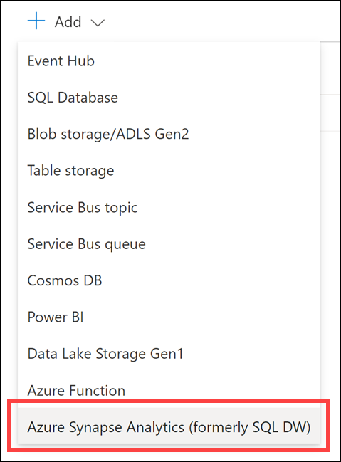
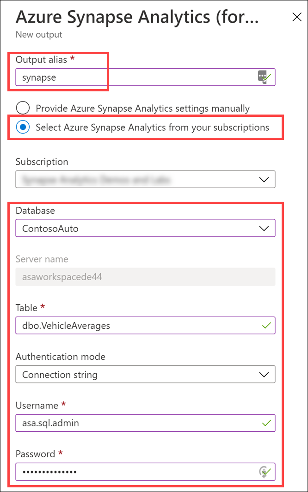

In this exercise, you configure an Azure Stream Analytics output for Power BI and a second output for [Azure Synapse Analytics](/azure/synapse-analytics/overview-what-is). [Power BI](/power-bi/fundamentals/power-bi-overview) provides a platform for visualizing and analyzing aggregated data in a near-real-time analytics pipeline built on Azure Event Hubs, Azure Stream Analytics, and Power BI.

1. From your Stream Analytics job's blade in the [Azure portal](https://portal.azure.com/), select **Outputs** in the left-hand navigation menu.

    

2. On the Outputs blade, select **+ Add** in the top toolbar, then select **Power BI** to create a new Power BI output.

    

3. In the **New Output** blade, select the **Authorize** button to authorize a connection from Stream Analytics to your Power BI account.

    

4. When prompted, sign in to your Power BI account, which is the same username and password you were provided with and used to log in to the Azure portal.

    

5. After successfully signing in to your Power BI account, the New Output blade will update to show you are currently authorized.

    

6. In the **New Output** blade, configure the following:

    - **Output alias:** Enter "powerBIAlerts".
    - **Authentication mode:** Select "User token".
    - **Group workspace:** Select "My Workspace" (if you do not see this option, select the "User token" authentication mode first).
    - **Dataset name:** Enter "ContosoAutoVehicleAnomalies".
    - **Table name:** Enter "Alerts".

        

7. Select **Save** on the bottom of the form when you have finished entering the values.

## Create an Azure Synapse Analytics output

1. Select **+ Add** in the top toolbar a second time and select **Azure Synapse Analytics (formerly SQL DW)** to create a new Synapse Analytics output.

    

2. In the **New Output** blade, configure the following:

    - **Output alias:** Enter "synapse".
    - **Select Azure Synapse Analytics from your subscriptions:** Selected.
    - **Subscription:** Select the subscription you are using for this lab.
    - **Database:** Select "ContosoAuto". Make sure your correct Synapse workspace name appears under "Server name".
    - **Table:** Enter `dbo.VehicleAverages`
    - **Authentication mode:** Select "Connection string".
    - **Username:** Enter `asa.sql.admin`
    - **Password:** Enter the SQL admin password value you entered when deploying the lab environment.

        

3. Select **Save** on the bottom of the form when you have finished entering the values.
