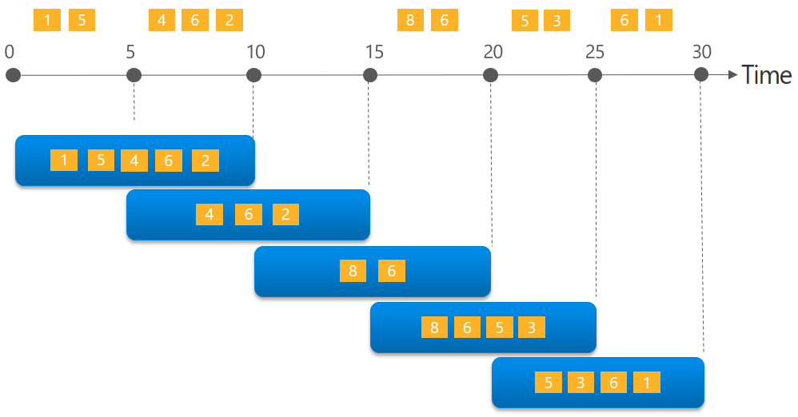
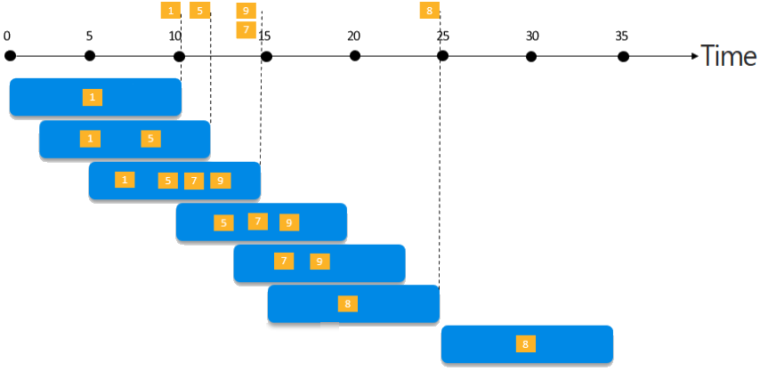
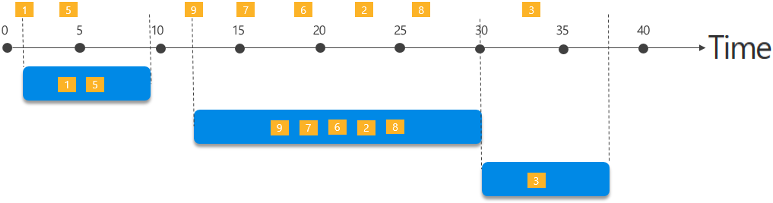

Windowing functions are operations performed against the data contained within a temporal or time-boxed window. A window contains event data along a timeline. Using windowing provides a way to aggregate events over various time intervals depending on specific window definitions.

In applications that process real-time events, time-boxed computations or aggregations, such as counting the number of times an event happens during a particular period, are a frequently used pattern. The ability to easily query time segments is a fundamental necessity for event-processing systems. Azure Stream Analytics includes native support for [five kinds of temporal windowing functions](https://docs.microsoft.com/stream-analytics-query/windowing-azure-stream-analytics). These functions enable you to develop powerful, real-time analytics solutions using a straightforward, declarative [SQL-like language](https://docs.microsoft.com/stream-analytics-query/stream-analytics-query-language-reference) with embedded support for temporal logic.

The supported windowing functions are [Tumbling](https://docs.microsoft.com/stream-analytics-query/tumbling-window-azure-stream-analytics), [Hopping](https://docs.microsoft.com/stream-analytics-query/hopping-window-azure-stream-analytics), [Sliding](https://docs.microsoft.com/stream-analytics-query/sliding-window-azure-stream-analytics), [Session](https://docs.microsoft.com/stream-analytics-query/session-window-azure-stream-analytics), and [Snapshot](https://docs.microsoft.com/stream-analytics-query/snapshot-window-azure-stream-analytics).

## Tumbling

**Tumbling** window functions segment a data stream into a contiguous series of fixed-size, non-overlapping time segments and operate against them. Events cannot belong to more than one tumbling window.


The Tumbling window example, represented by the query below, counts the number of times each event occurs during a 10-minute window. Windowing functions are applied in Stream Analytics jobs using the [GROUP BY](https://docs.microsoft.com/stream-analytics-query/group-by-azure-stream-analytics) clause of the query syntax. The `GROUP BY` clause in the query below contains the `TumblingWindow()` function, which specifies a 10-minute window size.

```sql
SELECT EventName, COUNT(*) AS Count
FROM EventStream TIMESTAMP BY EventTimestamp
GROUP BY EventName, TumblingWindow(minute, 10)
```

Azure Stream Analytics windows open at the window start time and close at the window end time. In the example above, if the 10-minute window occurs from 12:00 AM to 12:10 AM, the window will include all events with a timestamp greater than 12:00 AM and up to 12:10 AM inclusive. By default, windows are inclusive of the end of the window and exclusive of the beginning. However, you can use the `Offset` parameter to change this behavior. The window's output will be a single event based on the aggregate function used with a timestamp equal to the window end time. All windowing functions output their results at the end of the specified window.

## Hopping

**Hopping** window functions model scheduled overlapping windows, jumping forward in time by a fixed period. It is perhaps easiest to think of them as Tumbling windows that can overlap and be emitted more frequently than the window size. In fact, tumbling windows are simply a hopping window whose `hop` is equal to its `size`. When using Hopping windows, events can belong to more than one window result set.



To create a hopping window, you must specify three parameters. The first parameter indicates the time unit, such as second, minute, or hour. The following parameter sets the window size, which designates how long each window lasts. The final required parameter is the hop size, which specifies how much each window moves forward relative to the previous one. An optional fourth parameter denoting the offset size may also be used.

The query below demonstrates using a `HoppingWindow()` where the `timeunit` is set to `second`. The `windowsize` is 10 seconds, and the `hopsize` is 5 seconds. This query outputs an event every five seconds containing the count of events that occurred over the last 10 seconds.

```sql
-- Count the number of times each event occurs every 10 seconds
SELECT EventName, COUNT(*) AS Count
FROM EventStream TIMESTAMP BY EventTimestamp
GROUP BY EventName, HoppingWindow(second, 10, 5)
```

## Sliding

**Sliding** windows generate events for points in time when the content of the window actually changed. To limit the number of windows it needs to consider, Azure Stream Analytics outputs events for only those points in time when an event entered or exited the window. As such, every window contains a minimum of one event. Events in Sliding windows can belong to more than one sliding window, similar to Hopping windows.



The query below uses the `SlidingWindow()` function to find events that have happened more than three times in the last ten minutes.

```sql
SELECT
    DateAdd(minute,-5,System.Timestamp()) AS WinStartTime,
    System.Timestamp() AS WinEndTime,
    EventName,
    COUNT(*) AS Count
FROM EventStream TIMESTAMP BY EventTimestamp
GROUP BY EventName, SlidingWindow(minute, 10)
HAVING COUNT(*) > 3
```

## Session

**Session** window functions cluster together events that arrive at similar times, filtering out periods of time where there is no data. It has three primary parameters: timeout, maximum duration, and partitioning key (optional).



The occurrence of the first event starts a session window. Suppose another event occurs within the specified timeout from the last ingested event. In that case, the window will be extended to incorporate the new event. However, if no other events occur within the specified timeout period, the window will be closed at the timeout. If events keep happening within the specified timeout, the session window will extend until the maximum duration is reached.

The following query measures user session length by creating a `SessionWindow` over clickstream data with a `timeoutsize` of 5 minutes and a `maximumdurationsize` of 60 minutes.

```sql
-- Output the count of events that occur within 2 minutes of each other with a maximum duration of 60 minutes.
SELECT
    Username,
    MIN(ClickTime) AS WindowStart,
    System.Timestamp() AS WindowEnd,
    DATEDIFF(s, MIN(ClickTime), System.Timestamp()) AS DurationInSeconds
FROM Clickstream TIMESTAMP BY ClickTime
GROUP BY Username, SessionWindow(minute, 2, 60) OVER (PARTITION BY Username)
```

The query above also defines a partitioning key of `Username`. Partition keys result in the events being grouped by the key, and the session window is applied to each group independently. This grouping is useful for cases where you need different session windows for disparate users or devices. The partitioning defined in the query above means each `Username` is tracked in an independent session window. For each window, this query will generate output that contains the `Username`, the start time of the window (`WindowStart`), the end of the window (`WindowEnd`), and the total duration of the user session (`DurationInSeconds`).

## Snapshot

**Snapshot** windows groups events by identical timestamp values. Unlike other windowing types, a specific window function (such as [SessionWindow()](https://docs.microsoft.com/stream-analytics-query/session-window-azure-stream-analytics), is not required. You can employ a snapshot window by adding `System.Timestamp()` to your query's `GROUP BY` clause.


For example, the following query outputs the count of events with the same name that occur at precisely the same time.

```sql
SELECT EventName, COUNT(*) AS Count
FROM EventStream TIMESTAMP BY EventTimestamp
GROUP BY EventName, System.Timestamp()
```

`System.Timestamp()` is considered in the `GROUP BY` clause as a snapshot window definition because it groups events into a window based on the equality of timestamps.
