In this exercise, you use [Power BI](/power-bi/fundamentals/power-bi-overview) to create a report displaying captured vehicle anomaly data and pin it to a live dashboard for near-real-time updates. Power BI provides a platform for visualizing and analyzing aggregated data in a near-real-time analytics pipeline built on Azure Event Hubs, Azure Stream Analytics, and Power BI.

1. Open a web browser, navigate to <https://powerbi.microsoft.com/>, and select **Sign in** on the upper right.

    

2. Enter your Power BI credentials you used when creating the Power BI output for Stream Analytics.

3. After signing in, select **My Workspace** on the left-hand menu.

    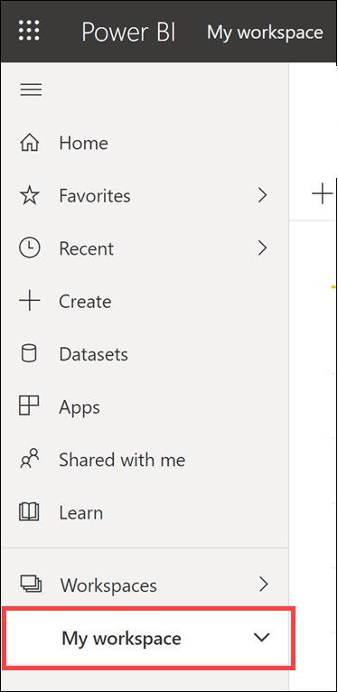

4. Select the **Datasets + dataflows** tab on top of the workspace. Locate the dataset named **ContosoAutoVehicleAnomalies**, then select the **Create Report** action button to the right of the name. If you do not see the dataset, you may need to wait a few minutes and refresh the page.

    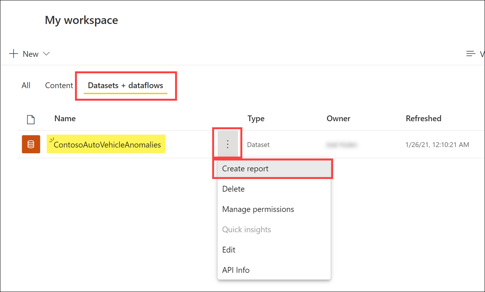

    > [!Note]
    > It can take several minutes for the dataset to appear. Periodically, you may need to refresh the page before you see the Datasets tab.

5. You should see a new blank report for VehicleAnomalies with the field list on the far right.

    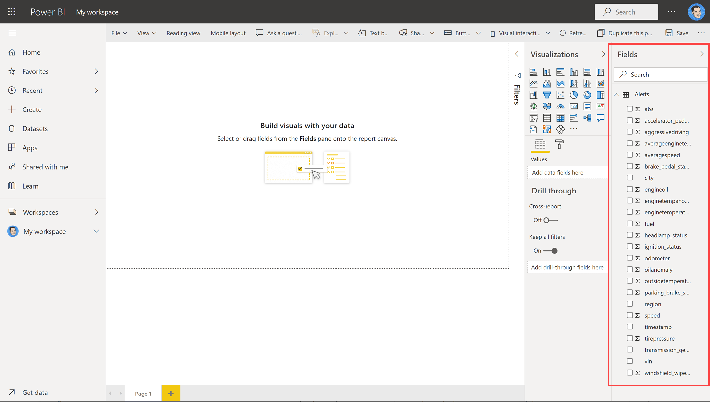

6. Select the **Map** visualization within the Visualizations section on the right.

    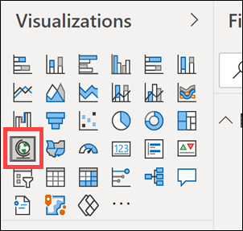

7. Drag the **city** field to **Location**, and **aggressivedriving** to **Size**. Adding these values to the visualization places points of different sizes over cities on the map, depending on how many aggressive driving records there are.

    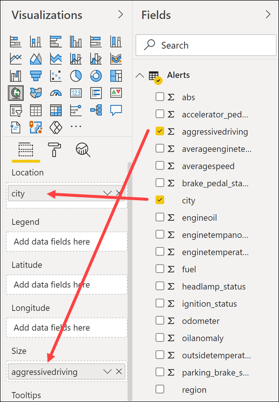

8. Your map should look similar to the following graphic:

    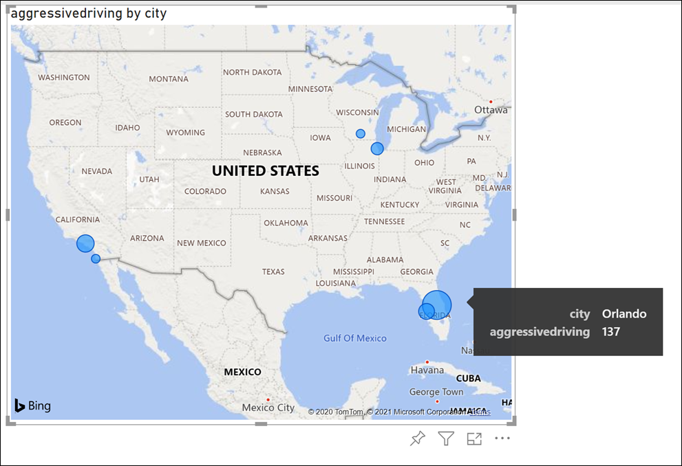

9. Select a blank area on the report to deselect the map. Now select the **Treemap** visualization.

    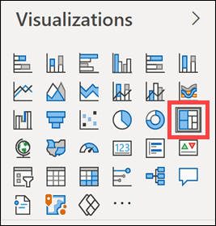

10. Drag the **enginetemperature** field to **Values**, then drag the **transmission_gear_position** field to **Group**. This will group the engine temperature values by the transmission gear position on the treemap so you can see which gears are associated with the hottest or coolest engine temperatures. The treemap sizes the groups according to the values, with the largest appearing on the upper left and the lowest on the lower right.

    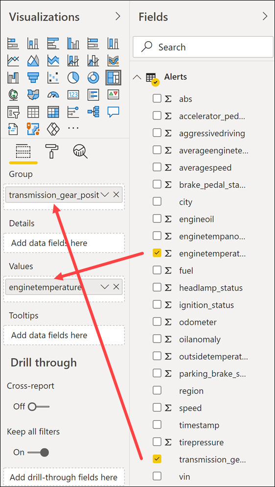

11. Select the down arrow next to the **enginetemperature** field under **Values**. Select **Average** from the menu to aggregate the values by average instead of the sum.

    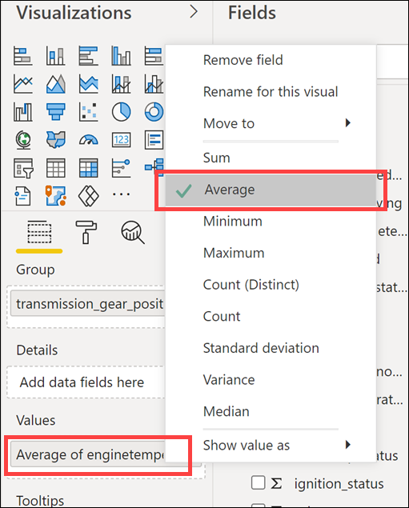

12. Your treemap should look similar to the following graphic:

    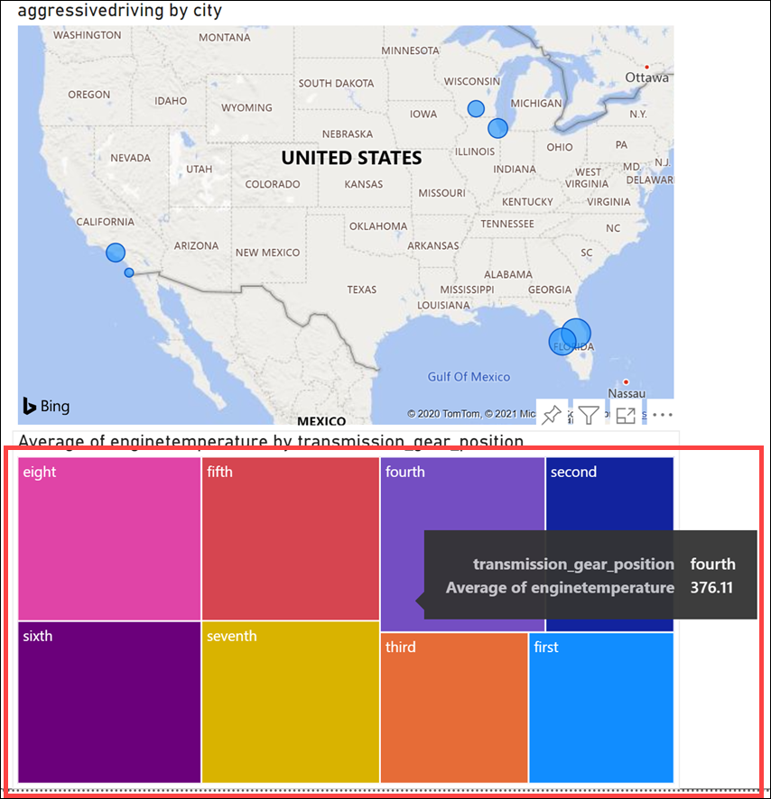

13. Select a blank area on the report to deselect the treemap. Now select the **Area chart** visualization.

    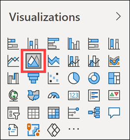

14. Drag the **region** field to **Legend**, the **speed** field to **Values**, and the **timestamp** field to **Axis**. This will display an area chart with different colors indicating the region and the speed at which drivers travel over time within that region.

    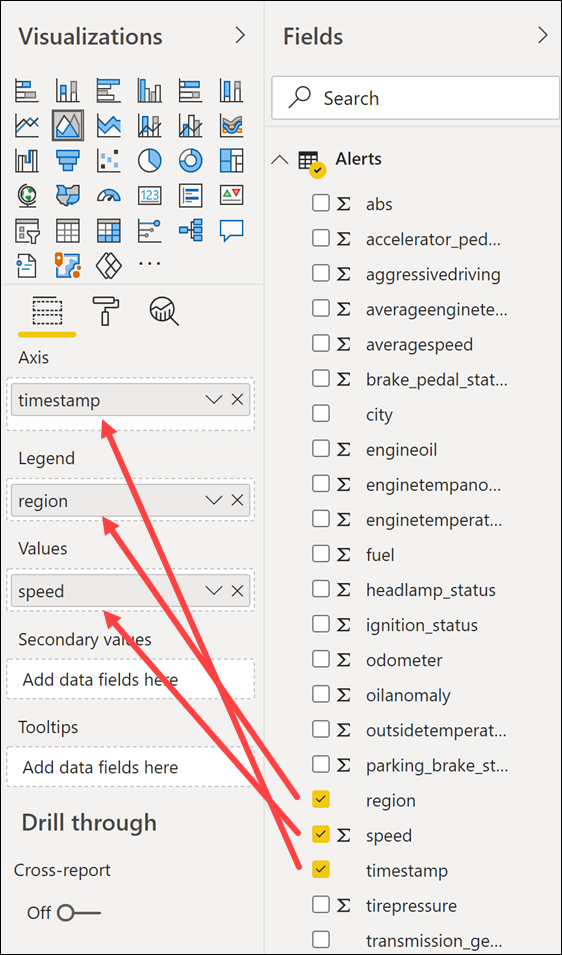

15. Select the down arrow next to the **speed** field under **Values**. Select **Average** from the menu to aggregate the values by average instead of the sum.

    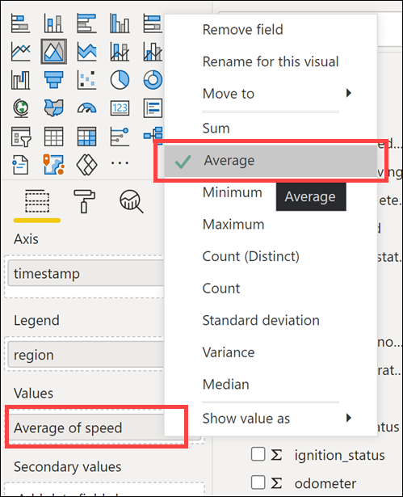

16. Your area chart should look similar to the following graphic:

    

17. Select a blank area on the report to deselect the area chart. Now select the **Multi-row card** visualization.

    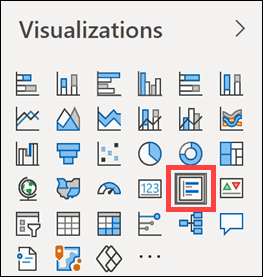

18. Drag the **aggressivedriving** field, **enginetempanomaly**, and **oilanomaly** fields to **Fields**.

    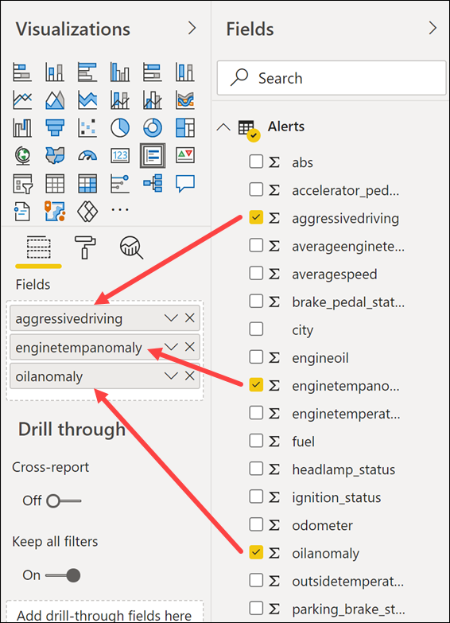

19. Select the **Format** tab in the multi-row card settings, then expand **Data labels**. Set the **Text size** to 30. Expand **Category labels** and set the **Text size** to 12.

    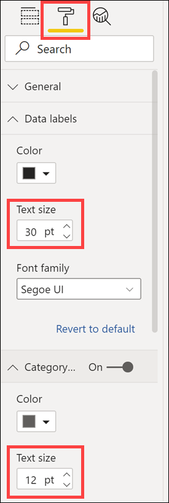

20. Your multi-row card should look similar to the following graphic:

    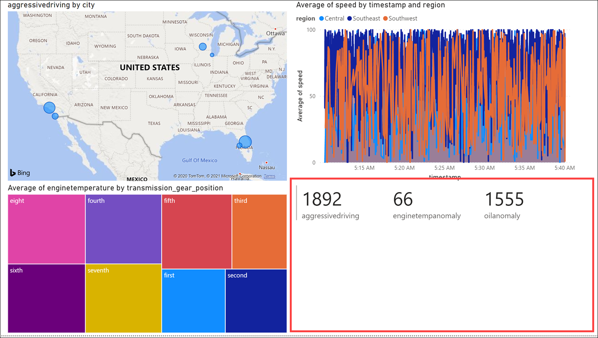

21. Select **Save** on the upper right of the page.

    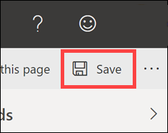

22. Enter a name, such as "Contoso Auto Vehicle Anomalies," then select **Save**.

    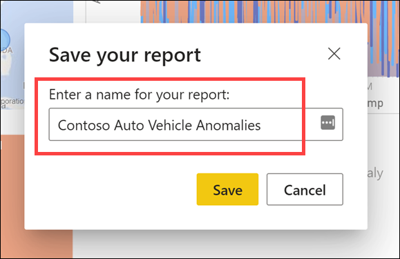

23. Now, let's add this report to a dashboard. Select **Pin to a dashboard** at the top of the report. You may have to select the ellipses (...) icon to see the option.

    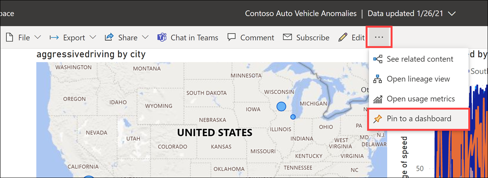

24. Select **New dashboard**, then enter a name, such as "Contoso Auto Vehicle Anomalies Dashboard." Select **Pin live**. When prompted, select the option to view the dashboard. Otherwise, you can find the dashboard under My Workspace on the left-hand menu.

    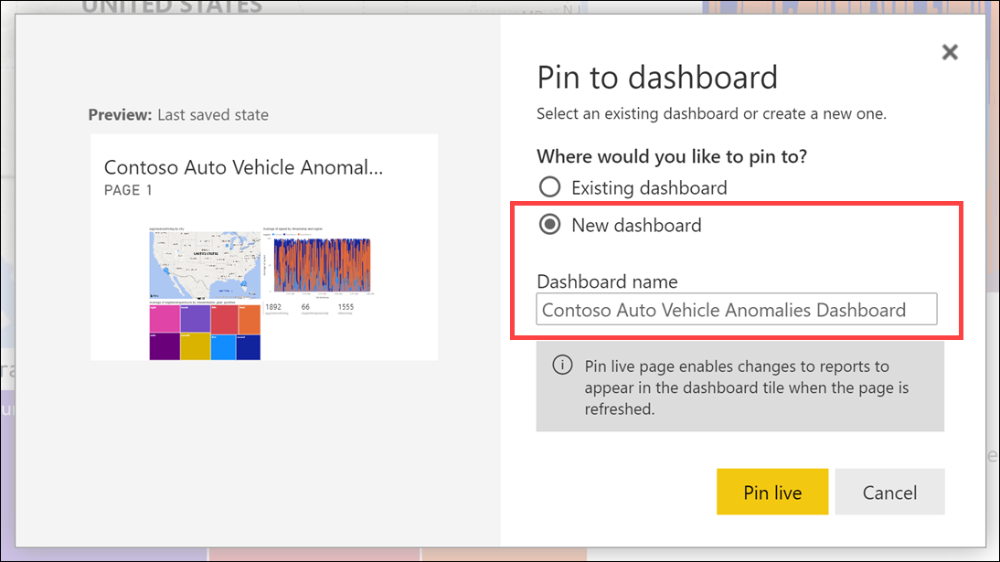

25. The live dashboard will automatically refresh and update while data is being captured. You can hover over any point on a chart to view information about the item. Select one of the regions in the legend above the average speed chart. All other charts will filter by that region automatically. Select the region again to clear the filter.

    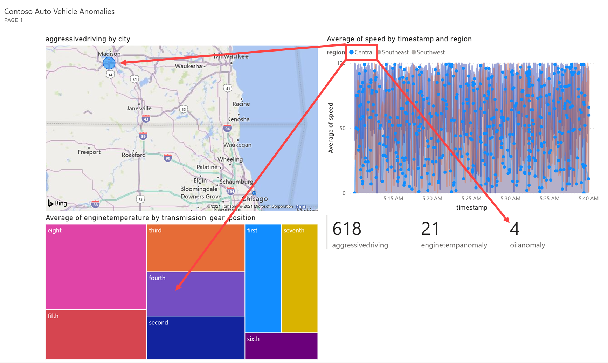
