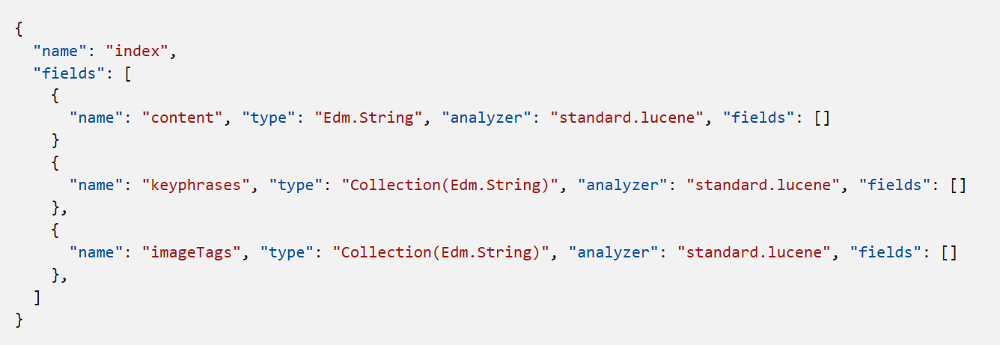

An Azure Cognitive Search index can be thought of as a container of searchable documents. Conceptually you can think of an index as a table and each row in the table represents a document. Tables have columns, and the columns can be thought of as equivalent to the fields in a document. Columns have data types, just as the fields do on the documents.

### Index schema
In Azure Cognitive Search, an index is a persistent collection of JSON documents and other content used to enable search functionality. The documents within an index can be thought of as rows in a table, each document is a single unit of searchable data in the index.

The index includes a definition of the structure of the data in these documents, called its schema. An example of an index schema with AI-extracted fields *keyphrases* and *imageTags* is below: 

### Index attributes

Azure Cognitive Search needs to know how you would like to search and display the fields in the documents. You specify that by assigning attributes, or behaviors, to these fields. For each field in the document, the index stores its name, the data type, and supported behaviors for the field such as, is the field searchable, can the field be sorted?

The most efficient indexes use only the behaviors that are needed. If you forget to set a required behavior on a field when designing, the only way to get that feature is to rebuild the index.

The following image depicts the fields when designing an index in Azure:

