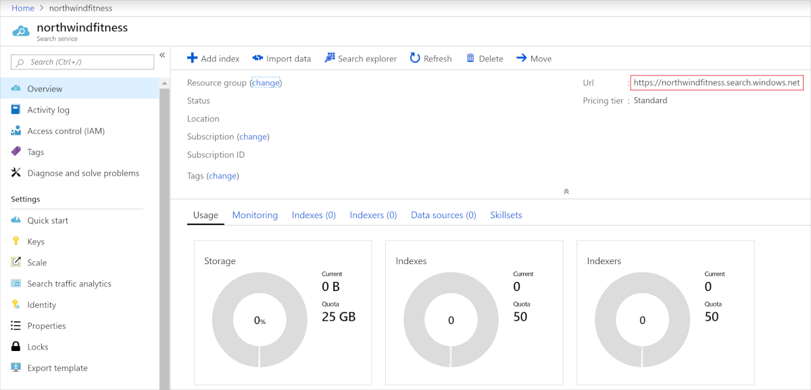
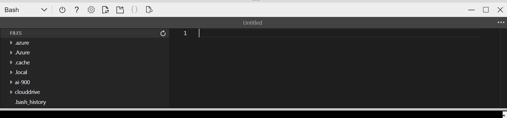
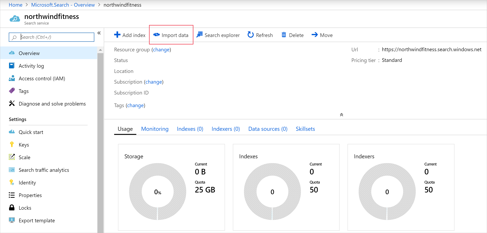
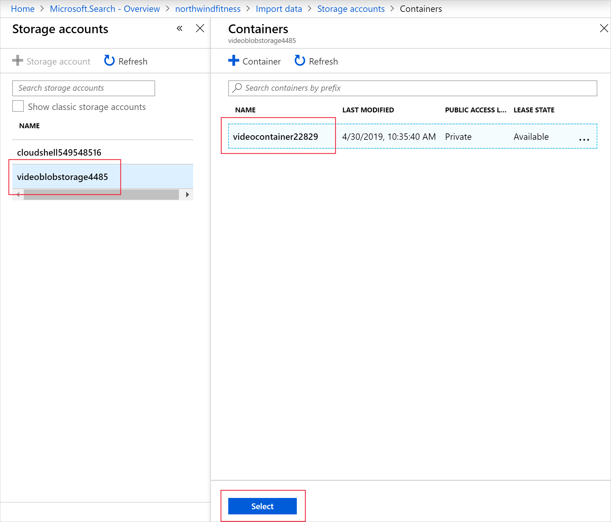
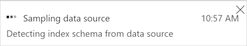
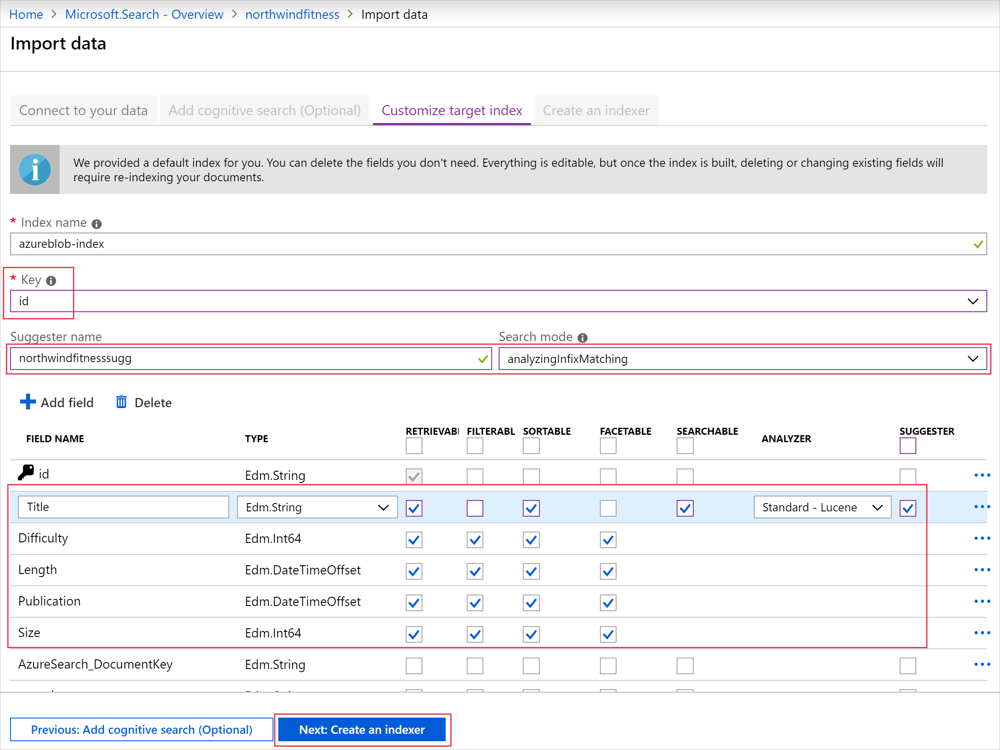
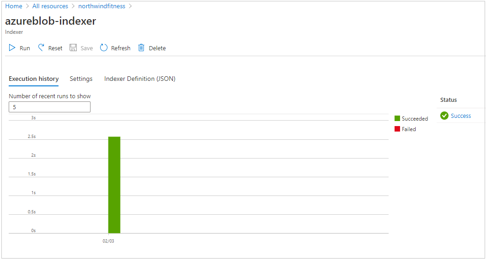

Let's imagine you are working with a fitness startup that publishes exercise videos. You are asked to help build a search engine for customers to navigate through the video catalog. You will implement Azure Cognitive Search to provide a better search experience for customers.

In this lab you will:  
- Create an Azure Cognitive Search resource 
- Load content into storage 
- Create an index in the Azure portal 
- Query your search index 

## Create an *Azure Cognitive Search* resource 

1. Sign into the [Azure portal](https://portal.azure.com/learn.docs.microsoft.com?azure-portal=true). 

2. Click the **&#65291;Create a resource** button, search for *Azure Cognitive Search*, and create a **Azure Cognitive Search** resource with the following settings:
    - **Subscription**: *Your Azure subscription*.
    - **Resource group**: *Select or create a resource group with a unique name*.
    **Instance Details**
    - **URL**: *Enter a unique name, for example northwindfitness*
    - **Location**: *Choose any available region*:
    - **Pricing tier**: S0

5. Select **Review + create**, and after you see the response **Validation Success**, select **Create**.

6. After deployment completes, select **Go to resource**. On its overview page you have the ability to add indexes, import data, and search created indexes.


   

## Run Cloud Shell 

To use the capabilities of the Azure search service, we'll use Cloud Shell on Azure to load the JSON array. 

1. In the Azure portal, select the **[>_]** (*Cloud Shell*) button at the top of the page to the right of the search box. This selection opens a Cloud Shell pane at the bottom of the portal. 

    

2. The first time you open the Cloud Shell, you may be prompted to choose the type of shell you want to use (*Bash* or *PowerShell*). Select **Bash**. If you do not see this option, skip the step.  

3. If you are prompted to create storage for your Cloud Shell, ensure your subscription is specified and select **Create storage**. Then wait a minute or so for the storage to be created.  

           

    >[!NOTE]
    >The storage for your Cloud Shell is not related to the storage for your search documents. 

4. Make sure the the type of shell indicated on the top left of the Cloud Shell pane is switched to *Bash*. If it is *PowerShell*, switch to *Bash* by using the drop-down menu. 
    
     

## Review content  
Before you upload your content to storage, you want to take a look at its format. In this case, your database team has already exported your company's current video catalog into a JSON array. When you move this data from storage to the index, it will already be in the desired JSON document format. Recall that you could upload the raw video files to storage, but would need to export those files to JSON before populating your index. 

The content you are working with is in the following format:

```
[
    {
        "id": "cc74bc3d-95b4-457f-bf5e-59c577938034",
        "Title": "Squats and Stars",
        "Difficulty": "7",
        "Length": "00:02:40",
        "Publication": "2019-04-29 12:34:56",
        "Tags": ["cardio","floor","burn"],
        "Size": "346"
    },
    {
        "id": "f94089de-d9f2-42d6-945d-276ae928564d",
        "Title": "Full body workout",
        "Difficulty": "9",
        "Length": "00:15:30",
        "Publication": "2019-04-24 11:14:06",
        "Tags": ["cardio","floor","burn","free weights"],
        "Size": "1897"
    },
    {
        "id": "d3a9f34f-d8a1-421b-bdd3-adbf826",
        "Title": "Crunches and Curls",
        "Difficulty": "4",
        "Length": "00:4:12",
        "Publication": "2019-04-22 09:56:26",
        "Tags": ["cardio","floor","burn"],
        "Size": "532"
    }, ...
```

Notice how each video has a title string, a difficulty rating integer, length in minutes, a publication date and time, and a file size in megabytes.

## Load content into Azure blob storage

There are several ways to upload content to Azure. In this case, we will use a script to load the content into Azure blob storage. Another way to upload content is step-by-step in the Azure portal, which we do not cover here. 

1. In the command shell, enter the following command to download sample applications and save them to a folder called ai-900.

    ```
    git clone https://github.com/MicrosoftLearning/AI-900-AIFundamentals ai-900
    ```

7. The files are downloaded to a folder named **ai-900**. Now we want to see all of the files in your Cloud Shell storage and work with them. Type the following command into the shell: 

     ```
    code .
    ```

    Notice how this command opens up an editor like the one in the image below: 
 
    

3. In the **Files** pane on the left, expand **ai-900** and select **upload-content-to-storage.sh**. Edit the first line to add your resource group name. You can find your resource group name on the Overview page of your search service resource in the Azure portal.

    After pasting in your resource group name, the first line should look similar to this line:

    ```Bash
    export RESOURCE_GROUP_NAME="my-resource-group"
    ```
    Make sure to save the document. At the top right of the editor pane, use the **...** button to open the menu and select **Save** to save your changes. Then open the menu again and select **Close Editor**.

4. Copy the following commands and paste them into the Cloud Shell. Then press enter. The commands will go to the ai-900 folder, and use the script **upload-content-to-storage.sh** to create a storage account and container. It will also upload the JSON array of the video content to your storage blob. 

    ```bash
    cd ai-900
    chmod +x upload-content-for-search.sh
    ./upload-content-for-search.sh
    ```

## Create an Azure Cognitive Search index

The Azure portal provides the Import data wizard that enables you to automatically create an index and indexer for supported data sources. You'll use the wizard to create an index, and import your search documents from storage into the Azure Cognitive Search index. 

1. On the Azure portal menu or from the **Home** page, select **All resources**.

2. Select the Azure Cognitive Search resource you created to navigate to its overview page. 

3. On the **northwindfitness** search Overview page, select **Import data**.

   

4. On the **Import data** page, complete the following fields.

   | Setting                  | Value                                            |
   | ------------------------ | ------------------------------------------------ |
   | **Connect to your data** |                                                  |
   | **Data Source**          | From the dropdown, select **Azure Blob Storage** |
   | **Data source name**     | Enter *videocatalog*                             |
   | **Parsing mode**         | From the dropdown, select **JSON array**         |
   | **Connection string**    | Select **Choose an existing connection** link    |

   

5. On the **Storage accounts** page, select the video storage account.

   

6. Select the video storage account.

7. Select the video container, and then select **Select**.

8. At the bottom of the page, select **Next: Add cognitive skills (Optional)**.

   

   Azure Cognitive Search will read the contents of the JSON file, and create an index schema automatically.

9. On the **Add cognitive search (Optional)** tab, select **Skip to: Customize target index**.

    

10. The **Customize target index** tab enables you to change the index schema created by the Import data wizard. The fields are populated by the wizard after reading the file in blob storage. Use the following table to complete the named fields:

    | Field              | Value                                                |
    | ------------------ | ---------------------------------------------------- |
    | **Key**            | From the dropdown, select **id**                     |
    | **Suggester name** | **northwindfitness**                             |
    | **Search mode**    | From the dropdown, select **analyzingInfixMatching** |

    Change the attributes and data types of the fields to match the following table:

    | Field name      | Type               | Retrievable | Filterable | Sortable | Facetable | Searchable | Analyzer          | Suggester |
    | --------------- | ------------------ | ----------- | ---------- | -------- | --------- | ---------- | ----------------- | --------- |
    | **Title**       | Edm.String         | ✔           |            | ✔        |           | ✔          | Standard - Lucene | ✔         |
    | **Difficulty**  | Edm.Int64          | ✔           | ✔          | ✔        | ✔         |            |                   |           |
    | **Length**      | Edm.DateTimeOffset | ✔           | ✔          | ✔        | ✔         |            |                   |           |
    | **Publication** | Edm.DateTimeOffset | ✔           | ✔          | ✔        | ✔         |            |                   |           |
    | **Size**        | Edm.Int64          | ✔           | ✔          | ✔        | ✔         |            |                   |           |

    Select **Next: Create an indexer**.

11. On the **Create an indexer** tab, select **Submit** to begin building the indexer.

    When the process completes, the portal returns to the Search service overview page. 

12. Select the **Indexers** tab, and then select **azureblob-indexer**.

13. At the top of **azureblob-indexer** page, select **Run**, and then select **Yes**.

    

14. The indexer should import the video catalog, and show that 19 documents have been imported into the index.

## Query the index

Your web team has asked you to provide some example queries that the new search service can answer. You'll use the Search explorer to write and test queries. Search explorer is a tool built into the Azure portal that gives you an easy way to validate the quality of your search index. You can use Search explorer to write queries, review top results, and apply filters.


1. Scroll to the search service overview, and from the top menu bar, select **Search explorer**.

   

2. In the **Query string** field, enter `search=*&$count=true`, and then select **Search**.

   The search query above returns all the documents in the search index, including a count of all the documents.   

3. Enter `yoga` in the **Query string** field, and then select **Search**.

4. The search index should return a JSON document containing your search results. The matching documents are contained in the `value` array. Each item in the array is the data related to the video in the catalog.

   > [!NOTE] 
   >
   > See how the results are sorted by `@search.score`. This is the score assigned by the search engine to show how closely the results match the given query. `Yoga Beginners` is a better match because it begins with the search term.

   ```
   {
       "@odata.context": "https://northwindfitness.search.windows.net/indexes('azureblob-index')/$metadata#docs(*)",
       "value": [
           {
               "@search.score": 1.058217,
               "id": "OTQ1ZC1mOTQwODlkZS1kOWYyLTQyZDYtMjc2YWU5Mjg1NjRk0",
               "Title": "Yoga Beginners",
               "Difficulty": 9,
               "Length": "2019-04-30T00:15:30Z",
               "Publication": "2019-04-24T11:14:06Z",
               "Size": 1897
           },
           {
               "@search.score": 0.8784157,
               "id": "NDU3Zi1jYzc0YmMzZC05NWI0LWJmNWUtNTljNTc3OTM4MDM00",
               "Title": "Hatha Yoga",
               "Difficulty": 7,
               "Length": "2019-04-30T00:02:40Z",
               "Publication": "2019-04-29T12:34:56Z",
               "Size": 346
           },
           {
               "@search.score": 0.19178301,
               "id": "YmRkMy1kOGExLWQzYTlmMzRmLTQyMWItYWRiZjgyNmRiYzg00",
               "Title": "Hot Yoga",
               "Difficulty": 9,
               "Length": "2019-04-30T00:14:12Z",
               "Publication": "2019-04-22T09:56:26Z",
               "Size": 1532
           }
       ]
   }
   ```

## Optional query exercise 

1. Try to change the query to exclude results for Hatha Yoga. Enter `yoga -hatha`, and then select **Search**.

   > [!IMPORTANT] 
   >
   > Note that all the exercise classes are returned. This is because the default behavior for query expressions is to search on *any* of the terms. For this query, all titles that do not include hatha (the `-hatha` term) are considered a match. You can switch the `searchMode` on the query to use all the terms instead of any of them (`searchMode=all`).

2. Change the query to `yoga -hatha&searchMode=all`, and then select **Search**. Changing the query will ensure that both `yoga` and **NOT** `hatha` are in the title of the videos, returning:

   ```
   {
       "@odata.context": "https://northwindfitness.search.windows.net/indexes('azureblob-index')/$metadata#docs(*)",
       "value": [
           {
               "@search.score": 1.4197062,
               "id": "OTQ1ZC1mOTQwODlkZS1kOWYyLTQyZDYtMjc2YWU5Mjg1NjRk0",
               "Title": "Yoga Beginners",
               "Difficulty": 9,
               "Length": "2019-04-30T00:15:30Z",
               "Publication": "2019-04-24T11:14:06Z",
               "Size": 1897
           },
           {
               "@search.score": 1.0122644,
               "id": "YmRkMy1kOGExLWQzYTlmMzRmLTQyMWItYWRiZjgyNmRiYzg00",
               "Title": "Hot Yoga",
               "Difficulty": 9,
               "Length": "2019-04-30T00:14:12Z",
               "Publication": "2019-04-22T09:56:26Z",
               "Size": 1532
           }
       ]
   }
   ```

3. Using the `+` operator, can you change the previous query to return the same results above? Enter `yoga + -hatha` in the **Query string**, then select **Search**.

4. Search for all the videos that have boxing or cardio in the title. Enter `(boxing | boxercise) cardio` in the **Query string** field, and then select **Search**.

5. Using the suffix operator `*`, can you change the query to give the same results? Enter `box* cardio` in the **Query string** field, and then select **Search**.


