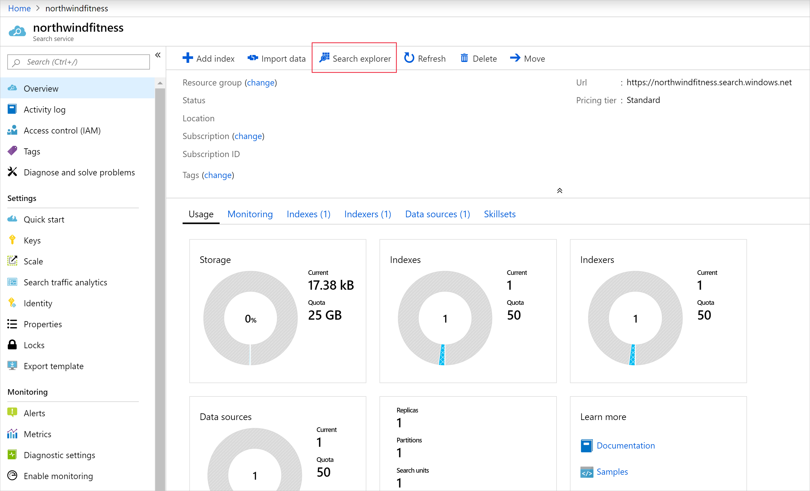
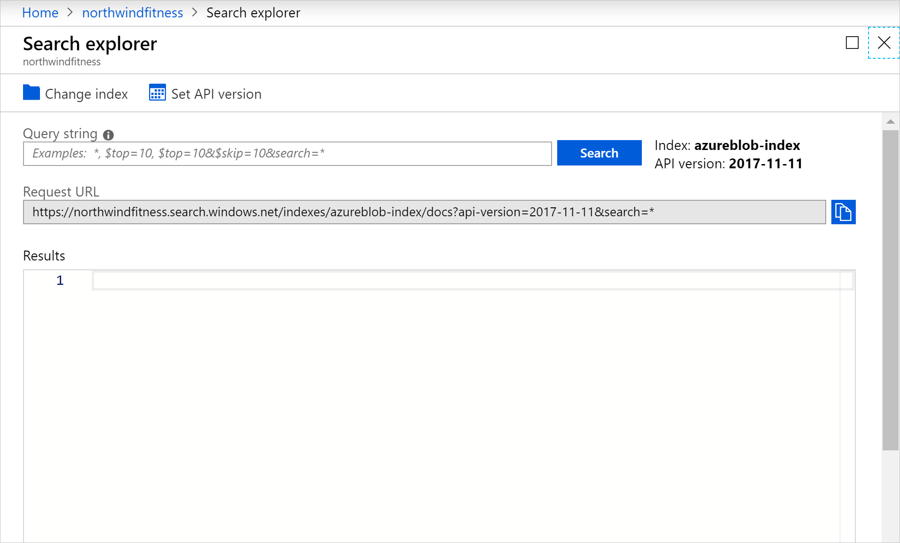

Search explorer is a tool built into the Azure portal that gives you an easy way to validate the quality of your search index.

Your web team has asked you to provide some example queries that the new search service can answer. You'll use the Search explorer to write and test queries.

In this unit, you'll use Search explorer to write queries, review top results, and apply filters.

## Query your data using the Search explorer in the Azure portal

1. If you aren't still signed into the Azure portal, sign in [Azure portal](https://portal.azure.com/learn.docs.microsoft.com?azure-portal=true) using the same account you activated the sandbox with.

1. On the Azure portal menu or from the **Home** page, select **All resources**.

1. Select the Azure Cognitive Search resource you created to navigate to its overview page.

    

1. On the search service overview page, select **Search explorer**.

    

Using the Search explorer, you'll build up complex search queries that you can pass to your web team.

## Simple search

1. Enter `yoga` in the **Query string** field, and then select **Search**.

1. The search index should return a JSON document containing your search results. The matching documents are contained in the `value` array. Each item in the array is the data related to the video in the catalog.

    > [!NOTE]
    > See how the results are sorted by `@search.score`. This is the score assigned by the search engine  to show how closely the results match the given query. `Yoga Beginners` is a better match because it begins with the search term.

    ```json
    {
        "@odata.context": "https://northwindfitness.search.windows.net/indexes('azureblob-index')/$metadata#docs(*)",
        "value": [
            {
                "@search.score": 1.058217,
                "id": "OTQ1ZC1mOTQwODlkZS1kOWYyLTQyZDYtMjc2YWU5Mjg1NjRk0",
                "Title": "Yoga Beginners",
                "Difficulty": 9,
                "Length": "2019-04-30T00:15:30Z",
                "Publication": "2019-04-24T11:14:06Z",
                "Size": 1897
            },
            {
                "@search.score": 0.8784157,
                "id": "NDU3Zi1jYzc0YmMzZC05NWI0LWJmNWUtNTljNTc3OTM4MDM00",
                "Title": "Hatha Yoga",
                "Difficulty": 7,
                "Length": "2019-04-30T00:02:40Z",
                "Publication": "2019-04-29T12:34:56Z",
                "Size": 346
            },
            {
                "@search.score": 0.19178301,
                "id": "YmRkMy1kOGExLWQzYTlmMzRmLTQyMWItYWRiZjgyNmRiYzg00",
                "Title": "Hot Yoga",
                "Difficulty": 9,
                "Length": "2019-04-30T00:14:12Z",
                "Publication": "2019-04-22T09:56:26Z",
                "Size": 1532
            }
        ]
    }
    ```

1. Try to change the query to exclude results for Hatha Yoga. Enter `yoga -hatha`, and then select **Search**.

    > [!IMPORTANT]
    > Note that all the exercise classes are returned. This is because the default behavior for query expressions is to search on *any* of the terms. For this query, all titles that do not include hatha (the `-hatha` term) are considered a match. You can switch the `searchMode` on the query to use all the terms instead of any of them (`searchMode=all`).

1. Change the query to `yoga -hatha&searchMode=all`, and then select **Search**. This will ensure that both yoga and **NOT** hatha are in the title of the videos, returning:

    ```json
    {
        "@odata.context": "https://northwindfitness.search.windows.net/indexes('azureblob-index')/$metadata#docs(*)",
        "value": [
            {
                "@search.score": 1.4197062,
                "id": "OTQ1ZC1mOTQwODlkZS1kOWYyLTQyZDYtMjc2YWU5Mjg1NjRk0",
                "Title": "Yoga Beginners",
                "Difficulty": 9,
                "Length": "2019-04-30T00:15:30Z",
                "Publication": "2019-04-24T11:14:06Z",
                "Size": 1897
            },
            {
                "@search.score": 1.0122644,
                "id": "YmRkMy1kOGExLWQzYTlmMzRmLTQyMWItYWRiZjgyNmRiYzg00",
                "Title": "Hot Yoga",
                "Difficulty": 9,
                "Length": "2019-04-30T00:14:12Z",
                "Publication": "2019-04-22T09:56:26Z",
                "Size": 1532
            }
        ]
    }
    ```

1. Using the `+` operator, can you change the previous query to return the same results above? Enter `yoga + -hatha` in the **Query string**, then select **Search**.

1. Search for all the videos that have boxing or cardio in the title. Enter `(boxing | boxercise) cardio` in the **Query string** field, and then select **Search**.

1. Using the suffix operator `*`, can you change the query to give the same results? Enter `box* cardio` in the **Query string** field, and then select **Search**.

## Top three results

1. Write a query to return the top three most difficult exercise videos. Enter `*&$top=3&$orderby=Difficulty desc` in the **Query string** field, and then select **Search**.

1. Can you enhance the above query to simulate paging through all the exercise videos, using five results per page, to return the third page? Enter `*&$top=5&$skip=10` in the **Query string** field, and then select **Search**.

## Filter a query

1. Imagine a use case where a customer only wants to view small videos on their mobile device. Use a filter to return the all the exercises that are less than 500mb. Enter `*&$filter=Size lt 500` in the **Query string** field, and then select **Search**.

## Faceting

1. The users need a way to quickly select videos of a specific difficulty. The web team would like to offer faceted browsing on the difficulty of exercises in a video. Enter `*&facet=Difficulty` in the **Query string** field, and then select **Search**.

1. This returns all the videos in the search results, but also includes a facets array:

    ```JSON
    "@search.facets": {
        "Difficulty": [
            {
                "count": 7,
                "value": 9
            },
            {
                "count": 3,
                "value": 7
            },
            {
                "count": 3,
                "value": 8
            },
            {
                "count": 3,
                "value": 10
            },
            {
                "count": 2,
                "value": 4
            }
        ]
    },
    ```
