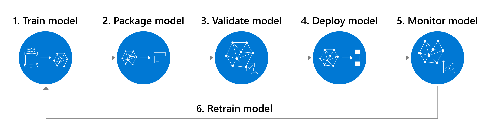

There's an increase in machine learning projects across organizations due to more data being available, the democratization of compute power, and the advancement in algorithms used to train models. 

However, one of the main obstacles when adopting and scaling machine learning projects is a lack of a clear strategy and organizational silos. 

## MLOps

**Machine learning operations** or **MLOps** aims to more efficiently scale from a proof of concept or pilot project to a machine learning workload in production.

Implementing MLOps helps you to make your machine learn workloads robust and reproducible. For example, you'll be able to monitor, retrain, and redeploy a model whenever needed while always keeping a model in production.

The purpose of MLOps is to make the machine learning lifecycle scalable:

1. Train model
2. Package model
3. Validate model
4. Deploy model
5. Monitor model
6. Retrain model

MLOps requires multiple roles and multiple tools. Data scientists often focus on all tasks related to training the model, also referred to as the **inner loop**. 

To package and deploy the model, data scientists may need the help of **machine learning engineers** who apply **DevOps practices** to scale the machine learning models. 

Taking a trained model and deploying it to production is often referred to as the **outer loop**. In the outer loop, the model is packaged, validated, deployed, and monitored. When you decide the model needs to be retrained, you go back to the inner loop to make changes to the model. 

## DevOps 

Using DevOps principles like **agile planning** can help your team organize your work and produce deliverables more quickly. With **source control**, you can facilitate the collaboration on projects. And with **automation** you can accelerate the machine learning lifecycle.

This module will introduce you to these DevOps principles and highlight two tools commonly used: **Azure DevOps** and **GitHub**.

## Learning objectives

In this module, you'll learn:

- Why DevOps is useful for machine learning projects.
- Which DevOps principles can be applied to machine learning projects.
- How to connect Azure DevOps and GitHub with Azure Machine Learning.