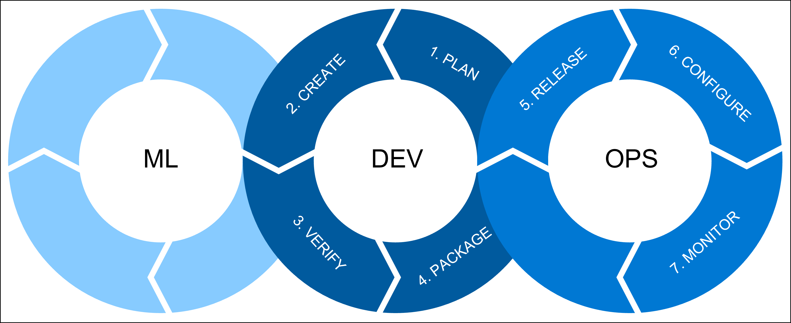

## DevOps and MLOps

DevOps is described as the *union of people, process, and products to enable continuous delivery of value to our end users*, by Donovan Brown in [What is DevOps?](https://www.donovanbrown.com/post/what-is-devops).

To understand how it is of use when working with machine learning models, let's explore some essential DevOps principles further.

DevOps is a combination of tools and practices guiding developers in creating robust and reproducible applications. The goal of using DevOps principles is to quickly deliver value to the end user. 

If you want to more easily deliver value by integrating machine learning models in data transformation pipelines or real-time applications, you'll benefit from implementing DevOps principles. Learning about DevOps will help you to organize and automate your work. 

Creating, deploying, and monitoring robust and reproducible models to deliver value to the end user is the goal of **machine learning operations** (**MLOps**).

There are three processes that we want to combine whenever we talk about machine learning operations (MLOps):

- **ML** includes all the machine learning workloads for which a data scientist is responsible. A data scientist will do:

    - Exploratory data analysis (EDA)
    - Feature engineering
    - Model training and tuning

- **DEV** refers to the software development, which includes:

    1. **Plan**: Define the model's requirements and performance metrics.
    2. **Create**: Create the model training and scoring scripts.
    3. **Verify**: Check for code and model quality.
    4. **Package**: Get ready for deployment by staging the solution.

- **OPS** refers to operations and includes:

    5. **Release**: Deploy the model to production.
    6. **Configure**: Standardize infrastructure configurations with **Infrastructure as Code** (**IaC**).
    7. **Monitor**: Track metrics and ensure the model and infrastructure are performing as expected.

Let's go over some DevOps principles that are essential for MLOps.

## DevOps principles

One of the core principles of DevOps is **automation**. By automating tasks, we aspire to get new models deployed to production faster. Through automating, you'll also create reproducible models that are reliable and consistent across environments. 

Especially when you want to improve your model regularly over time, automation allows you to do all necessary activities quickly to ensure the model in production is always the best performing model. 

A key concept to achieve automation is **CI/CD**, which stands for **continuous integration** and **continuous delivery**.

### Continuous integration

Continuous integration covers the *create* and *verify* activities. The goal is to create the code and to verify the quality of both the code and the model by automated testing.

With MLOps, continuous integration may include:

- Refactoring exploratory code in Jupyter notebooks into Python or R scripts.
- Linting to check for any programmatic or stylistic errors in the Python or R scripts. For example, check whether a line in your script contains fewer than 80 characters.
- Unit testing to check the performance of the content of the scripts. For example, check whether the model generates accurate predictions on a test dataset.

> [!TIP]
> Learn how to [convert machine learning experiments to production Python code](/azure/machine-learning/tutorial-convert-ml-experiment-to-production)

To perform linting and unit testing, you can use automation tools like **Azure Pipelines** in **Azure DevOps**, or **GitHub Actions**.

### Continuous delivery

After verifying the code quality of the Python or R scripts used to train the model, you'll want to bring the model to production. **Continuous delivery** involves the steps you need to take to deploy a model to production, preferably automating as much as possible.

To deploy a model to production, you'll first want to package it and deploy it to a *pre-production environment*. By staging the model in a pre-production environment, you can check whether everything works as expected. 

Once deploying the model to the staging phase is successful and without errors, you can approve for the model to be deployed to the *production environment*. 

To collaborate on the Python or R scripts to train the model and any necessary code to deploy the model to each environment, you'll use **source control**.

### Source control

**Source control** (or **version control**) is achieved most commonly by working with a Git-based repository. A repository refers to the location of where all relevant files to a software project can be stored. 

With machine learning projects, you're likely to have a repository for each project you have. The repository will include Jupyter notebooks, training scripts, scoring scripts, and pipeline definitions among other things.

> [!NOTE]
> Preferably, you're **not** storing training data in your repository. Instead, training data is stored in a database or data lake and Azure Machine Learning retrieves the data directly from the data source using [datastores](/azure/machine-learning/how-to-access-data).

Git-based repositories are available by using **Azure Repos** in Azure DevOps, or a **GitHub repository**.

By hosting all relevant code in a repository, you can easily collaborate on code and track any changes a team member makes. Each member can work on their own version of the code. You'll be able to see all past changes, and you can review changes before they're committed to the main repository.

To decide who works on which part of the project, it's recommended to use **agile planning**.

### Agile planning

As you want a model to quickly be deployed to production, agile planning is ideal for machine learning projects.

**Agile planning** means you isolate work into sprints. **Sprints** are short time-periods during which you want to achieve part of the project's goals. 

The aim is to plan sprints to quickly improve any of the code. Whether it's code used for data and model exploration or to deploy a model to production.

Training a machine learning model can be a never-ending process. For example, as a data scientist you may need to improve the model's performance because of data drift. Or you'll need to tweak the model to better align with new business requirements.

To avoid spending too much time on model training, agile planning can help to scope the project and help get everyone aligned by agreeing on shorter-term outcomes.

To plan your work, you may use a tool like **Azure Boards** in Azure DevOps, or **GitHub issues**.

### Infrastructure as code (IaC)

Applying DevOps principles to machine learning projects means you want to create robust reproducible solutions. In other words, everything that you do or create, you should be able to repeat and automate. 

To repeat and automate the infrastructure needed to train and deploy your model, your team will use **Infrastructure as Code** (**IaC**). When you train and deploy models on Azure, IaC means that you define all Azure resources needed in the process in code and the code is stored in a repository.

> [!TIP]
> Get more familiar with DevOps by exploring the Microsoft Learn modules on [the DevOps transformation journey](/training/paths/az-400-get-started-devops-transformation-journey/)