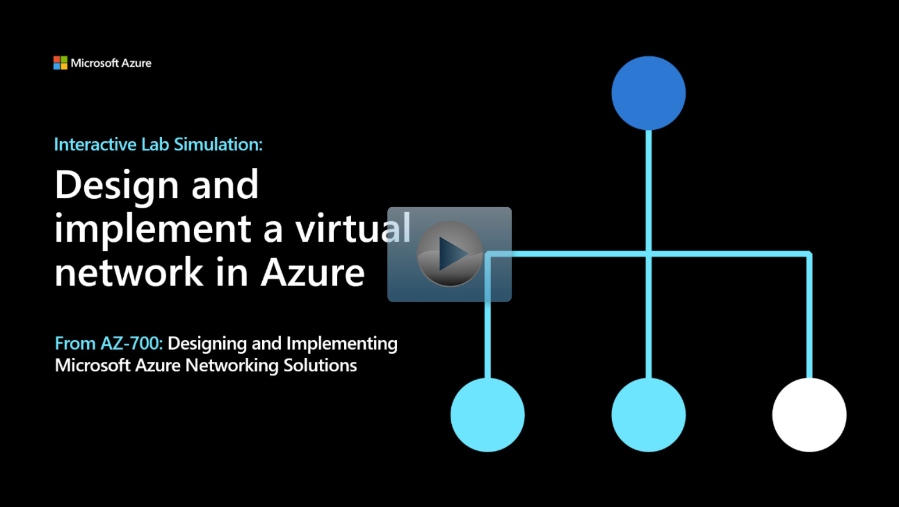

## Lab scenario

Contoso Ltd, a fictitious organization, is in the process of migrating infrastructure and applications to Azure. As network engineer, you plan and implement three virtual networks and subnets to support resources in those virtual networks.

## Architecture diagram

:::image type="content" source="../media/contoso-vnet.png" alt-text="Diagram of virtual network architecture.":::

## Objectives

+ **Task 1**: Create the **Contoso** resource group.
+ **Task 2**: Create the **CoreServicesVnet** virtual network and subnets.
+ **Task 3**: Create the **ManufacturingVnet** virtual network and subnets.
+ **Task 4**: Create the **ResearchVnet** virtual network and subnets.
+ **Task 5**: Verify the creation of the virtual networks and subnets.

> [!NOTE]
> Click on the thumbnail image to start the lab simulation. When you're done, be sure to return to this page so you can continue learning.

> [!NOTE]
> You may find slight differences between the interactive simulation and the hosted lab, but the core concepts and ideas being demonstrated are the same.

> [!NOTE]
> You can view the [Design and implement a Virtual Network in Azure](https://microsoftlearning.github.io/AZ-700-Designing-and-Implementing-Microsoft-Azure-Networking-Solutions/Instructions/Exercises/M01-Unit%204%20Design%20and%20implement%20a%20Virtual%20Network%20in%20Azure.html) instructions directly. 

