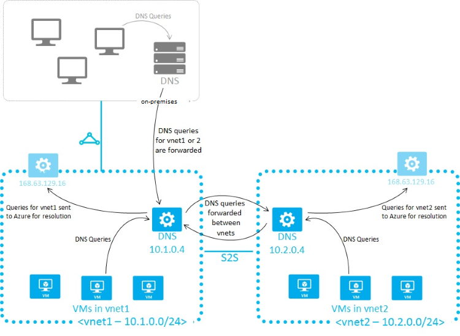
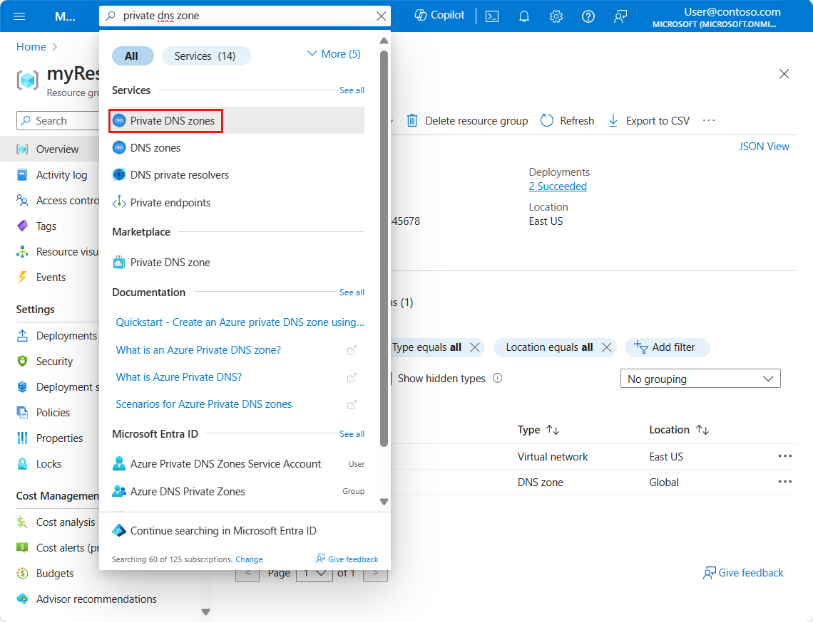

Depending on how you use Azure to host IaaS, PaaS, and hybrid solutions, you might need to allow the virtual machines (VMs), and other resources deployed in a virtual network to communicate with each other. Although you can enable communication by using IP addresses, it is much simpler to use names that can be easily remembered, and do not change. 

DNS is split into two areas: Public, and Private DNS for resources accessible from your own internal networks.

## Public DNS services

Public DNS services resolve names and IP addresses for resources and services accessible over the internet such as web servers. Azure DNS is a hosting service for DNS domain that provides name resolution by using Microsoft Azure infrastructure. DNS domains in Azure DNS are hosted on Azure's global network of DNS name servers. Azure DNS uses anycast networking. Each DNS query is answered by the closest available DNS server to provide fast performance and high availability for your domain.

In Azure DNS, you can create address records manually within relevant zones. The records most frequently used will be:

- Host records: A/AAAA (IPv4/IPv6) 

- Alias records: CNAME 

## Private DNS services

Private DNS services resolve names and IP addresses for resources and services 

When resources deployed in virtual networks need to resolve domain names to internal IP addresses, they can use one the three methods: 

- Azure DNS Private Zones 

- Azure-provided name resolution 

- Name resolution that uses your own DNS server

The type of name resolution you use depends on how your resources need to communicate with each other. 

Your name resolution needs might go beyond the features provided by Azure. For example, you might need to use Microsoft Windows Server Active Directory domains, resolve DNS names between virtual networks. To cover these scenarios, Azure provides the ability for you to use your own DNS servers.

DNS servers within a virtual network can forward DNS queries to the recursive resolvers in Azure. This enables you to resolve host names within that virtual network. For example, a domain controller (DC) running in Azure can respond to DNS queries for its domains and forward all other queries to Azure. Forwarding queries allows VMs to see both your on-premises resources (via the DC) and Azure-provided host names (via the forwarder). Access to the recursive resolvers in Azure is provided via the virtual IP 168.63.129.16.

DNS forwarding also enables DNS resolution between virtual networks and allows your on-premises machines to resolve Azure-provided host names. In order to resolve a VM's host name, the DNS server VM must reside in the same virtual network and be configured to forward host name queries to Azure. Because the DNS suffix is different in each virtual network, you can use conditional forwarding rules to send DNS queries to the correct virtual network for resolution. The following image shows two virtual networks and an on-premises network doing DNS resolution between virtual networks, by using this method.

### Azure provided DNS

Azure provides its own default internal DNS. It provides an internal DNS zone that always exists, supports automatic registration, requires no manual record creation, and is created when the VNet is created. And it's a free service. Azure provided name resolution provides only basic authoritative DNS capabilities. If you use this option, the DNS zone names and records will be automatically managed by Azure, and you will not be able to control the DNS zone names or the life cycle of DNS records. 

Internal DNS defines a namespace as follows: <yournamespace>.internal.cloudapp.net.

Any VM created in the VNet is registered in the internal DNS zone and gets a DNS domain name like myVM.internal.cloudapp.net. It's important to recognize that it's the Azure Resource name that is registered, not the name of the guest OS on the VM. 

**Limitations of Internal DNS**

- Can't resolve across different VNets.

- Registers resource names, not guest OS names.

- Does not allow manual record creation.

### Azure Private DNS Zones

Private DNS zones in Azure are available to internal resources only. They are global in scope, so you can access them from any region, any subscription, any VNet, and any tenant. If you have permission to read the zone, you can use it for name resolution. Private DNS zones are highly resilient, being replicated to regions all throughout the world. They are not available to resources on the internet. 

For scenarios which require more flexibility than Internal DNS allows, you can create your own private DNS zones. These zones enable you to:

- Configure a specific DNS name for a zone. 

- Create records manually when necessary. 

- Resolve names and IP addresses across different zones.

- Resolve names and IP addresses across different VNets.

### Create a private DNS zone by using the portal

You can create a private DNS zone using the Azure Portal, Azure PowerShell, or Azure CLI.

When the new DNS zone is deployed, you can manually create resource records, or use auto-registration, which will create resource records based on the Azure resource name.

Private DNS zones support the full range of records including pointers, MX, SOA, service, and text records.

### Link VNets to private DNS zones

In Azure, a VNet represents a group of 1 or more subnets, as defined by a CIDR range. Resources such as VMs are added to subnets. 

At the VNet level, default DNS configuration is part of the DHCP assignments made by Azure, specifying the special address 168.63.129.16 to use Azure DNS services.

If necessary, you can override the default configuration by configuring an alternate DNS server at the VM NIC.

Two ways to link VNets to a private zone:

- **Registration:** Each VNet can link to one private DNS zone for registration. However, up to 100 VNets can link to the same private DNS zone for registration. 

- **Resolution:** There may be many other private DNS zones for different namespaces. You can link a VNet to each of those zones for name resolution. Each VNet can link to up to 1000 private DNS Zones for name resolution. 

### Integrating on-premises DNS with Azure VNets

If you have an external DNS server, for example an on-premises server, you can use custom DNS configuration on your VNet to integrate the two. 

Your external DNS can run on any DNS server: BIND on UNIX, Active Directory Domain Services DNS, and so on. If you want to use and external DNS server and not the default Azure DNS service, you must configure the desired DNS servers.

Organizations often use an internal Azure private DNS zone for auto registration, and then use a custom configuration to forward queries external zones from an external DNS server.

Forwarding takes two forms:

- Forwarding - specifies another DNS server (SOA for a zone) to resolve the query if the initial server cannot.

- Conditional forwarding - specifies a DNS server for a named zone, so that all queries for that zone are routed to the specified DNS server. 

Note that if the DNS server is outside Azure, it doesn't have access to Azure DNS on 168.63.129.16. In this scenario, setup a DNS resolver inside your VNet, forward queries for to it, and then have it forward queries to 168.63.129.16 (Azure DNS). Essentially, you're using forwarding because 168.63.129.16 is not routable, and therefore not accessible to external clients.

## Check your knowledge

Choose the best response for each of the questions below. When you're done, select **Check your answers**.