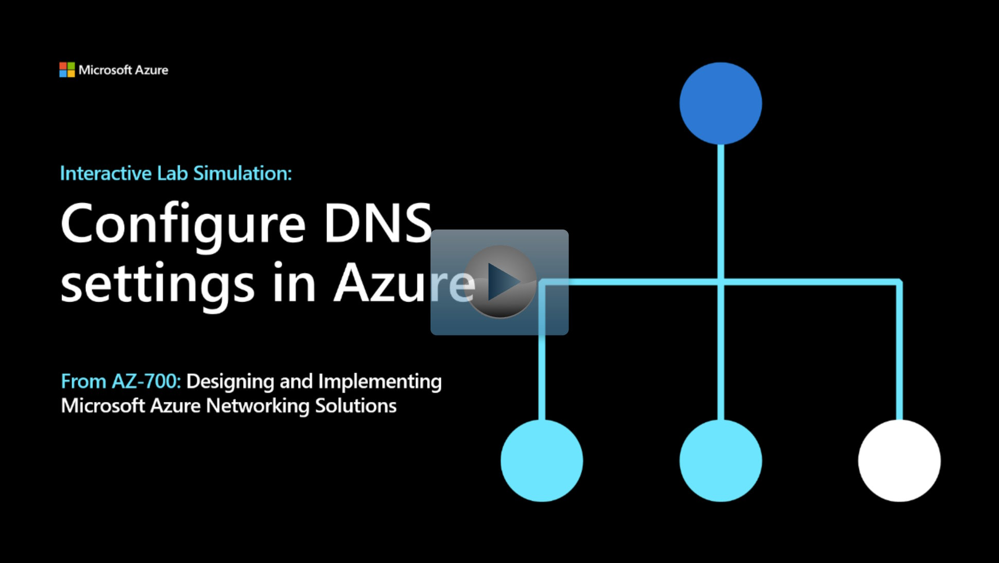

## Lab scenario

In this lab, you'll configure DNS name resolution for Contoso Ltd. You'll create a private DNS zone named contoso.com, link the VNets for registration and resolution, and then create two virtual machines and test the configuration.

## Architecture diagram

:::image type="content" source="../media/6-exercise-configure-domain-name-servers-configuration-azure.png" alt-text="Diagram of DNS architecture.":::

## Objectives

 -  **Task 1**: Create a private DNS Zone
 -  **Task 2**: Link subnet for auto registration
 -  **Task 3**: Create Virtual Machines to test the configuration
    - Use a template to create the virtual machines. You can review the [lab template](https://github.com/MicrosoftLearning/AZ-700-Designing-and-Implementing-Microsoft-Azure-Networking-Solutions/blob/master/Allfiles/Exercises/M01/azuredeploy.json).
    - Use Azure PowerShell to deploy the template. 
 -  **Task 4**: Verify records are present in the DNS zone

> [!NOTE]
> Select the thumbnail image to start the lab simulation. When you're done, be sure to return to this page so you can continue learning. 

> [!NOTE]
>You may find slight differences between the interactive simulation and the hosted lab, but the core concepts and ideas being demonstrated are the same.

