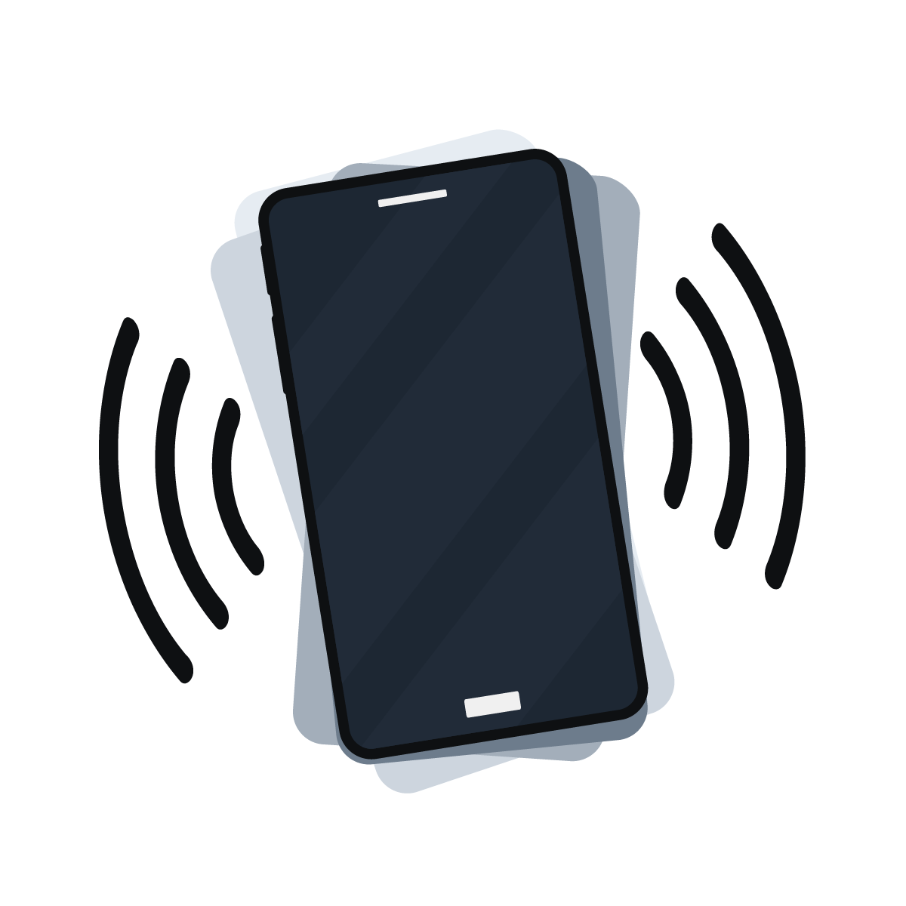

Like many modern devices, computers were largely designed around most people's abilities. People needed to see to use a monitor. They needed to use their hands to use a mouse and keyboard. They needed to be able to hear the sounds the computer made. Many times, designing for the majority of people makes sense at the start. But over time, opening up designs to as many people as possible is essential.

*Accessibility* is the term scientists use for how easy or difficult it is to use something. The term *access* is built in. As programmers think about accessibility, access for all should be the goal.

## Access for All

Making computers that everyone can use takes a lot of thought. Some computers are made specifically for people with unique needs. Sometimes, tools are made to help those with unique requirements use standard computers. Programmers need to build programs that work for both types of computers. In the past, as the industry was just forming, accessibility was an afterthought. Today, it's being written into the code.

Here are some examples of areas that computer scientists have had to think about to make computers more accessible.

### Vision

People with low vision may need to enlarge the text on the screen. Doing so may impact everything else that's being shown. Suppose the text on a button gets bigger, but the button doesn't. The text may go outside the button, making it hard to read. So the program needs to adjust everything when some parts are enlarged.

Color is another consideration. People with color vision deficiency can't rely on color alone to tell the difference between things on a screen. Programmers shouldn't rely on color alone to communicate important information.

How items contrast with each other can be a challenge for certain people. People with light sensitivity may not be able to see a light color on top of a white background. Ensuring items have good contrast can help make a computer more accessible.

Individuals that are visually impaired also rely on screen readers to access content on their computers. Screen readers read every item of text on the screen and help people get around. Items like images can't be read, so describing an image in text is important. Images should include *alt text*. This text can be added to an image so a screen reader can read it.

### Hearing

While people may tend to think of computing as mainly visual, modern devices use a lot of audio too. Programmers should never rely on audio only to communicate to the user. For example, most modern phones will have the option to vibrate and ring when a call comes in. This vibration option is called *haptics*.

Some devices enable haptics for other types of things too. Pressing a button on a keyboard may include a slight vibration. This gives people with hearing loss a connection to the keys they're pressing.

### Motor Skills

People with limited motor skills can have trouble using a mouse or keyboard. Modern computers have many tools to help. Using their voice to type (speech-to-text) can help a person avoid needing a keyboard. Tools like eye-tracking software and hardware can help those who are unable to use their arms or hands get around a screen.

## It's in the Code

Many of these tools are becoming more available. Still, it's up to programmers to take advantage of them. Thankfully, modern programming tools are making this easier. Some even have tests that can be run to help the programmer tell how accessible their program is and where it can improve.

Helping people with different requirements is a good enough reason to make programs and computers accessible. However, building accessibility into programs can help everyone. Many tools, like haptics, have a special benefit for specific people but may be useful for everyone.
