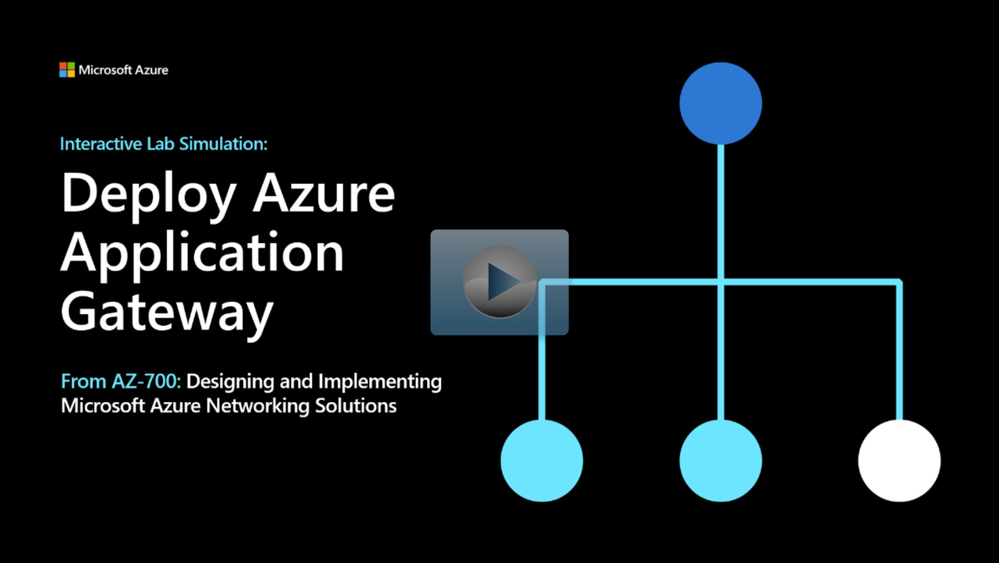

## Lab scenario

In this lab, you use the Azure portal to create an application gateway. Then you test it to make sure it works correctly.

## Architecture diagram

:::image type="content" source="../media/4-exercise-deploy-azure-application-gateway.png" alt-text="Diagram of application gateway architecture.":::

## Objectives

 -  **Task 1**: Create an application gateway
 -  **Task 2**: Add backend targets
    - Use a template to create the virtual machines. You can review the [lab template](https://github.com/MicrosoftLearning/AZ-700-Designing-and-Implementing-Microsoft-Azure-Networking-Solutions/blob/master/Allfiles/Exercises/M05/backend.json).
    - Use Azure PowerShell to deploy the template. 
 -  **Task 3**: Add backend servers to backend pool
 -  **Task 4**: Test the application gateway

> [!NOTE]
> Click on the thumbnail image to start the lab simulation. When you're done, be sure to return to this page so you can continue learning. 

> [!NOTE]
> You may find slight differences between the interactive simulation and the hosted lab, but the core concepts and ideas being demonstrated are the same.

