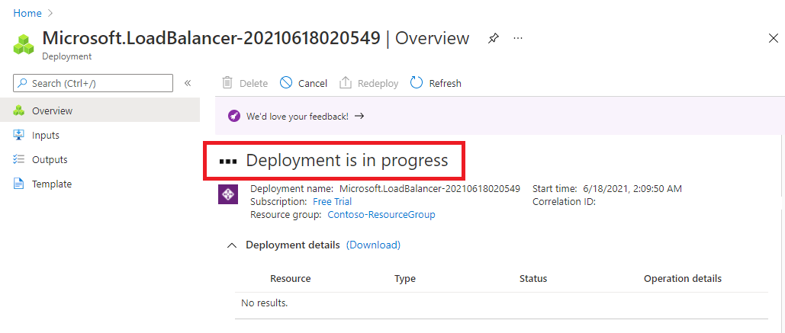
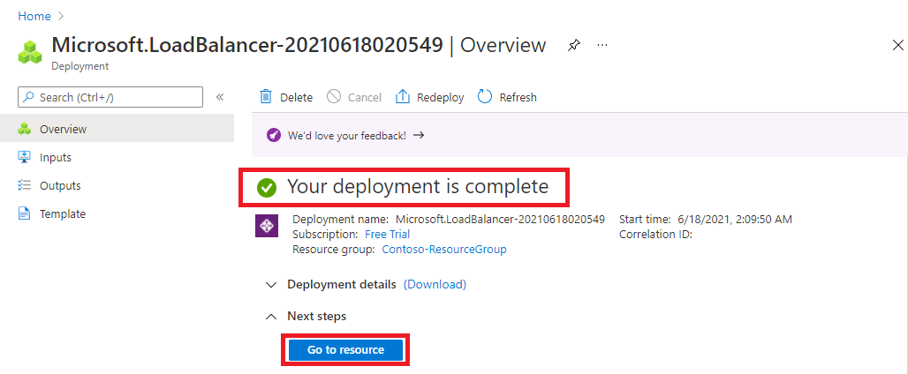

**Azure Load Balancer** operates at layer 4 of the Open Systems Interconnection (OSI) model. It's the single point of contact for clients. Azure Load Balancer distributes inbound flows that arrive at the load balancer's front end to backend pool instances. These flows are according to configured load-balancing rules and health probes. The backend pool instances can be Azure Virtual Machines or instances in a virtual machine scale set.

## Choosing a load balancer type

Load balancers can be public (also known as external) or internal (also known as private).

A [**public load balancer**](/azure/load-balancer/components) can provide outbound connections for virtual machines (VMs) inside your virtual network. These connections are accomplished by translating their private IP addresses to public IP addresses. External load balancers are used to distribute client traffic from the internet across your VMs. That internet traffic might come from web browsers, module apps, or other sources.

An [**internal load balancer**](/azure/load-balancer/components) is used where private IPs are needed at the frontend only. Internal load balancers are used to load balance traffic from internal Azure resources to other Azure resources inside a virtual network. A load balancer frontend can also be accessed from an on-premises network in a hybrid scenario.

> [!div class="mx-imgBorder"]
> 

 

## Azure load balancer and availability zones 

Azure services that support availability zones fall into three categories:

- Zonal services: Resources can be pinned to a specific zone. For example, virtual machines, managed disks, or standard IP addresses can be pinned to a specific zone, which allows for increased resilience by having one or more instances of resources spread across zones.

- Zone-redundant services: Resources are replicated or distributed across zones automatically. Azure replicates the data across three zones so that a zone failure does not impact its availability. 

- Non-regional services: Services are always available from Azure geographies and are resilient to zone-wide outages as well as region-wide outages.

Azure Load Balancer supports availability zones scenarios. You can use Standard Load Balancer to increase availability throughout your scenario by aligning resources with, and distribution across zones. Review this document to understand these concepts and fundamental scenario design guidance

A Load Balancer can either be zone redundant, zonal, or non-zonal. To configure the zone related properties (mentioned above) for your load balancer, select the appropriate type of frontend needed.

### Zone redundant
> [!div class="mx-imgBorder"]
> 

In a region with Availability Zones, a Standard Load Balancer can be zone-redundant. This traffic is served by a single IP address.

A single frontend IP address will survive zone failure. The frontend IP may be used to reach all (non-impacted) backend pool members no matter the zone. One or more availability zones can fail and the data path survives as long as one zone in the region remains healthy.

The frontend's IP address is served simultaneously by multiple independent infrastructure deployments in multiple availability zones. Any retries or reestablishment will succeed in other zones not affected by the zone failure.

### Zonal

You can choose to have a frontend guaranteed to a single zone, which is known as a zonal. This scenario means any inbound or outbound flow is served by a single zone in a region. Your frontend shares fate with the health of the zone. The data path is unaffected by failures in zones other than where it was guaranteed. You can use zonal frontends to expose an IP address per Availability Zone.

Additionally, the use of zonal frontends directly for load balanced endpoints within each zone is supported. You can use this configuration to expose per zone load-balanced endpoints to individually monitor each zone. For public endpoints, you can integrate them with a DNS load-balancing product like Traffic Manager and use a single DNS name.

> [!div class="mx-imgBorder"]
> 

For a public load balancer frontend, you add a zones parameter to the public IP. This public IP is referenced by the frontend IP configuration used by the respective rule.

For an internal load balancer frontend, add a zones parameter to the internal load balancer frontend IP configuration. A zonal frontend guarantees an IP address in a subnet to a specific zone.

## Selecting an Azure load balancer SKU

Two SKUs are available when you create a load balancer in Azure: Basic load balancers and Standard load balancers. These SKUs differ in terms of their scenario scope and scale, features, and cost. Any scenario that is possible with the Basic load balancer can also be created with the Standard load balancer.

To compare and understand the differences, review the table below.

| *Features*                                                                                                                                    | Standard Load Balancer                                                                                                                                  | Basic Load Balancer                                                                                     |
|:-|:-|:-|
| [Backend pool size](/azure/azure-resource-manager/management/azure-subscription-service-limits#load-balancer)                                 | Supports up to 1000 instances.                                                                                                                          | Supports up to 300 instances.                                                                           |
| Backend pool endpoints                                                                                                                        | Any virtual machines or virtual machine scale sets in a single virtual network.                                                                         | Virtual machines in a single availability set or virtual machine scale set.                             |
| [Health probes](/azure/load-balancer/load-balancer-custom-probe-overview#types)                                                               | TCP, HTTP, HTTPS                                                                                                                                        | TCP, HTTP                                                                                               |
| [Health probe down behavior](/azure/load-balancer/load-balancer-custom-probe-overview#probedown)                                              | TCP connections stay alive on an instance probe down and on all probes down.                                                                            | TCP connections stay alive on an instance probe down. All TCP connections end when all probes are down. |
| Availability Zones                                                                                                                            | Zone-redundant and zonal frontends for inbound and outbound traffic.                                                                                    | Not available                                                                                           |
| Diagnostics                                                                                                                                   | [Azure Monitor multi-dimensional metrics](/azure/load-balancer/load-balancer-standard-diagnostics)                                                      | [Azure Monitor logs](https://docs.microsoft.com/azure/load-balancer/load-balancer-monitor-log)          |
| HA Ports                                                                                                                                      | [Available for Internal Load Balancer](/azure/load-balancer/load-balancer-ha-ports-overview)                                                            | Not available                                                                                           |
| Secure by default                                                                                                                             | Closed to inbound flows unless allowed by a network security group. Internal traffic from the virtual network to the internal load balancer is allowed. | Open by default. Network security group optional.                                                       |
| Outbound Rules                                                                                                                                | [Declarative outbound NAT configuration](/azure/load-balancer/load-balancer-outbound-connections#outboundrules)                                         | Not available                                                                                           |
| TCP Reset on Idle                                                                                                                             | [Available on any rule](/azure/load-balancer/load-balancer-tcp-reset)                                                                                   | Not available                                                                                           |
| [Multiple front ends](/azure/load-balancer/load-balancer-multivip-overview)                                                                   | [Inbound and outbound](/azure/load-balancer/load-balancer-outbound-connections)                                                                         | Inbound only                                                                                            |
| Management Operations                                                                                                                         | Most operations < 30 seconds                                                                                                                            | 60-90+ seconds typical                                                                                  |
| SLA                                                                                                                                           | [99.99%](https://azure.microsoft.com/support/legal/sla/load-balancer/v1_0/)                                                                             | Not available                                                                                           |

**Microsoft recommends Standard load balancer. Standalone VMs, availability sets, and virtual machine scale sets can be connected to only one SKU, never both. Load balancer and the public IP address SKU must match when you use them with public IP addresses.**

**SKUs aren't mutable; therefore, you cannot change the SKU of an existing resource.**

## Creating and configuring an Azure load balancer

There are several tasks you need to perform to successfully create and configure an Azure Load Balancer. 

### Create the load balancer

In this example, we are looking at the tasks required to create and configure a **Public** (external) **load balancer** in a **Basic SKU**. The first task is to create the load balancer itself.

From the Azure portal home page, select **Create a resource**.
> [!div class="mx-imgBorder"]
> 

On the Create a resource page, you can either browse to try and find the resource type you want to create or enter your search criteria in the search box and press ENTER. For example, type **Load Balancer**. To narrow down the search results, you can use the filters to the right of the search box. For example, select **Publisher Type**, and then choose **Microsoft**. 
> [!div class="mx-imgBorder"]
> 

Then choose the **Load Balancer** resource from Microsoft.
> [!div class="mx-imgBorder"]
> 

On the Load balancer page, choose **Create** to start the process.
> [!div class="mx-imgBorder"]
> 

On the **Create load balancer** page, you must supply the following required information:

- **Subscription** - select the Azure subscription that you want to create your new load balancer resource in.

- **Resource group** - here you can select an existing resource group or create a new one.

- **Name** - provide a unique name for the instance.

- **Region** - select the region where the virtual machines were created.

- **Type** - this is where you select whether your load balancer is going to be **Internal** (private) or **Public** (external). If you choose **Internal**, you will need to specify a virtual network and IP address assignment, but if you choose **Public**, you will need to specify several Public IP address details. 

- **SKU** - here you can select either the **Standard** SKU or the **Basic** SKU (for production workloads you should choose **Standard**, but for testing and evaluation and training purposes, you could choose **Basic**, but you will not get all the possible load balancer features). Depending on which SKU you select here, the remaining configuration options will differ slightly.

- **Tier** - this is where you select whether your load balancer is balancing within a region (**Regional**) or across regions (**Global**) - If you select the **Basic** SKU above, this setting is greyed out.

- **Public IP address** - here you specify whether to create a new public IP address for your public-facing front-end, or use an existing one, and you also specify a name for your public IP address, and whether to use a dynamic or statically assigned IP address. You can optionally also assign an IPv6 address to your load balancer in addition to the default IPv4 one.

> [!div class="mx-imgBorder"]
> 

After you click **Review + Create**, the configuration settings for the new load balancer resource will be validated, and then you can click **Create** to start creating it. 
> [!div class="mx-imgBorder"]
> 

The resource will start to be deployed.
> [!div class="mx-imgBorder"]
> 

> [!div class="mx-imgBorder"]
> 

When it completes, you can click **Go to resource** to view the new load balancer resource in the portal.

> [!div class="mx-imgBorder"]
> .

 

### Add a backend pool

The next task is to create a backend pool in the load balancer and then add your virtual machines to it.

From the Azure portal home page, select **All resources**.

> [!div class="mx-imgBorder"]
> 

Select your load balancer from the list.

> [!div class="mx-imgBorder"]
> 

Under the **Settings** section choose **Backend pools**, and then **Add** to add a pool.

> [!div class="mx-imgBorder"]
> 

You need to enter the following information on the **Add backend pool** page.

- **Name**: Enter a unique name for the backend pool
- **Virtual network**: Specify the name of the virtual network where the resources are located that you will be adding to the backend pool
- **Associated to**: You need to associate the backend pool with one or more virtual machines, or to a virtual machine scale set
- **IP Version**: Select either **IPv4** or **IPv6**

You could add existing virtual machines to the backend pool at this point, or you can create and add them later. You then click **Add** to add the backend pool.

> [!div class="mx-imgBorder"]
> 

### Add virtual machines to the backend pool

The next task is to add the virtual machines to the existing back-end pool.

On the **Backend pools** page, select the backend pool from the list.

> [!div class="mx-imgBorder"]
> 

You need to enter the following information to add the virtual machine to the backend pool.

- **Virtual network**: Specify the name of the virtual network where the resources are located that you will be adding to the backend pool
- **Associated to**: You need to associate the backend pool with one or more virtual machines, or to a virtual machine scale set
- **IP Version**: Select either **IPv4** or **IPv6**

Then under the **Virtual machines** section, click **Add**.

> [!div class="mx-imgBorder"]
> 

Select the virtual machines you want to add to the backend pool and click **Add**.

> [!div class="mx-imgBorder"]
> 

Then click **Save** to add them to the backend pool.

> [!div class="mx-imgBorder"]
> 

> [!div class="mx-imgBorder"]
> 

 

### Add health probes

The next task is to create a health probe to monitor the virtual machines in the back-end pool.

On the **Backend pools** page of the load balancer, under **Settings**, select **Health probes**, and then click **Add**.

> [!div class="mx-imgBorder"]
> 

You need to enter the following information on the **Add health probe** page.

- **Name**: Enter a unique name for the health probe
- **Protocol**: Select either **TCP** or **HTTP**
- **Port**: Specify the destination port number for the health signal. The default is port **80**
- **Interval**: Specify the interval time in seconds between probe attempts. The default is **5** seconds
- **Unhealthy threshold**: Specify the number of consecutive probe failures that must occur before a virtual machine is considered to be in an unhealthy state. The default is **2** failures

You then click **Add** to add the health probe.

> [!div class="mx-imgBorder"]
> 

> [!div class="mx-imgBorder"]
> 

 

### Add a load balancer rule

The last task is to create a load balancing rule for the load balancer. A load balancing rule distributes incoming traffic that is sent to a selected IP address and port combination across a group of backend pool instances. Only backend instances that the health probe considers healthy receive new traffic.

On the **Health probes** page of the load balancer, under **Settings**, select **Load balancing rules**, and then click **Add**.

> [!div class="mx-imgBorder"]
> 

You need to enter the following information on the **Add load balancing rule** page.

- **Name**: Enter a unique name for the load  balancing rule
- **IP Version**: Select either **IPv4** or **IPv6**
- **Frontend IP address**: Select the existing public-facing IP  address of the load balancer
- **Protocol**: Select either the **TCP** or **UDP** protocol
- **Port**: Specify the port number for the load  balancing rule. The default is port **80**
- **Backend port**: You can choose to route traffic to the  virtual machine in the backend pool using a different port than the one that  clients use by default to communicate with the load balancer (port 80)
- **Backend pool**: Select an existing backend pool.  The virtual machines in this backend pool  will be the target for the load balanced traffic of this rule.
- **Health probe**: Select an existing health probe or create  a new one.   The load balancing rule uses the health  probe to determine which virtual machines in the backend pool are healthy and  therefore can receive load balanced traffic.
- **Session persistence**: You can choose **None**, or **Client IP**, or **Client IP and protocol**.   Session persistence specifies that  traffic from a client should be handled by the same virtual machine in the  backend pool for the duration of a session. **None**  specifies that successive requests from the same client may be handled by any  virtual machine. **Client IP** specifies  that successive requests from the same client IP address will be handled by  the same virtual machine. **Client IP and protocol**  specifies that successive requests from the same client IP address and  protocol combination will be handled by the same virtual machine.
- **Idle timeout(minutes)**: Specify the time to keep a TCP or HTTP  connection open without relying on clients to send *keep-alive* messages.   The default idle timeout is **4** minutes, which is also the minimum setting. The  maximum setting is 30 minutes.
- **Floating IP**: Choose between **Disabled** or **Enabled**.  With Floating IP set to **Disabled**, Azure exposes a traditional load  balancing IP address mapping scheme for ease of use (the VM instances' IP).   With Floating IP set to **Enabled**, it changes the IP address mapping to the  Frontend IP of the load balancer to allow for additional flexibility.

You then click **Add** to add the load balancing rule.

> [!div class="mx-imgBorder"]
> 

> [!div class="mx-imgBorder"]
> 

 

### Test the load balancer

Having completed the various tasks to create and configure your public load balancer and its components, you should then test your configuration to ensure it works successfully. The simplest way to do this is to copy the **Public IP Address** from the public load balancer resource you created and paste it into a web browser. You should receive a response from one of the VMs in your load balancer. You could then stop whichever VM randomly responds, and once that VM has stopped, refresh the browser page to verify that you receive a response from the other VM in the load balancer instead.