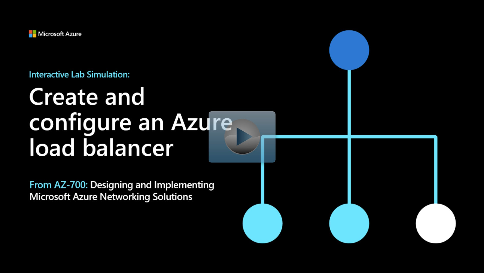

## Lab scenario

In this lab, you will create an internal load balancer for the fictional Contoso Ltd organization.

## Architecture diagram

:::image type="content" source="../media/4-exercise-create-configure-azure-load-balancer.png" alt-text="internal standard loadbalancer diagram":::

## Objectives

 -  **Task 1**: Create the virtual network
 -  **Task 2**: Create backend servers
    - Use a template to create the virtual machines. You can review the [lab template](https://github.com/MicrosoftLearning/AZ-700-Designing-and-Implementing-Microsoft-Azure-Networking-Solutions/blob/master/Allfiles/Exercises/M04/azuredeploy.json).
    - Use Azure PowerShell to deploy the template. 
 -  **Task 3**: Create the load balancer
 -  **Task 4**: Create load balancer resources
 -  **Task 5**: Test the load balancer

> [!NOTE]
> Click on the thumbnail image to start the lab simulation. When you're done, be sure to return to this page so you can continue learning. 

> [!NOTE]
> You may find slight differences between the interactive simulation and the hosted lab, but the core concepts and ideas being demonstrated are the same.

