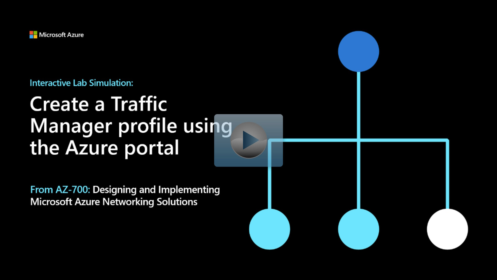

## Lab scenario
In this lab, you create a Traffic Manager profile to deliver high availability for the fictional Contoso Ltd organization's web application.

You create two instances of a web application deployed in two different regions (East US and West Europe). The East US region is the primary endpoint for Traffic Manager, and the West Europe region is the failover endpoint.

Then you create a Traffic Manager profile based on endpoint priority. This profile directs user traffic to the primary site running the web application. Traffic Manager continuously monitors the web application, and if the primary site in East US is unavailable, it provides automatic failover to the backup site in West Europe.

## Architecture diagram

:::image type="content" source="../media/6-exercise-create-traffic-manager-profile-using-azure-portal.png" alt-text="Screenshot of the traffic manager profile pointed to two app service plans.":::

## Objectives

 -  **Task 1**: Create the web apps
 -  **Task 2**: Create a Traffic Manager profile
 -  **Task 3**: Add Traffic Manager endpoints
 -  **Task 4**: Test the Traffic Manager profile

> [!NOTE]
> Click on the thumbnail image to start the lab simulation. When you're done, be sure to return to this page so you can continue learning. 

> [!NOTE]
> You may find slight differences between the interactive simulation and the hosted lab, but the core concepts and ideas being demonstrated are the same.

