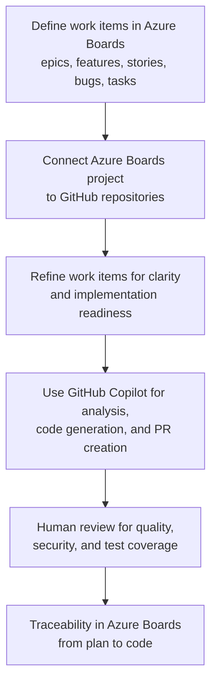

<!-- DOCUMENTATION COMMENT -->
This section introduces the integration between Azure Boards and GitHub Copilot, which allows teams to combine two powerful capabilities:

- **Azure Boards** - Acts as the central planning hub where teams define, prioritize, and organize work items (like user stories, tasks, and bugs) in a structured backlog.

- **GitHub Copilot** - An AI-powered coding assistant that helps developers write, understand, and complete code more efficiently during implementation.

### Key points
- **Single Source of Truth**: Azure Boards maintains the authoritative backlog and work priorities. This ensures everyone knows what needs to be done and in what order.
- **Streamlined Workflow**: Instead of switching between multiple tools, developers can reference work items from Azure Boards while coding in GitHub, and Copilot can help accelerate the implementation.
- **Better Collaboration**: This integration creates a transparent link between planning (what needs to be built) and coding (how it's being built), improving team communication.

**Simple Analogy**: Think of Azure Boards as your team's to-do list and GitHub Copilot as an intelligent assistant who helps you complete those tasks faster.
Azure Boards and GitHub Copilot integration combines structured planning with AI-assisted delivery. Azure Boards remains the source of truth for backlog hierarchy and prioritization, while GitHub and Copilot streamline implementation and collaboration.

## Core workflow model

In a typical flow, we refer to the end-to-end process of how users interact with Azure Boards through GitHub Copilot integration, starting from initial setup and configuration, moving through the daily workflow of creating and managing work items, and culminating in the synchronization of changes back to the repository. This flow encompasses several key phases: first, the user establishes the connection between their GitHub repository and Azure Boards project, ensuring that Copilot has the necessary permissions and context to interact with both systems. Next, as developers write code and make commits, Copilot intelligently assists in creating work items, linking code changes to existing tasks, and updating item statuses based on the development activities. Finally, the system maintains bidirectional synchronization so that any updates made in Azure Boards—such as priority changes, status transitions, or new task assignments—are reflected in the development context, creating a seamless feedback loop between planning and execution.

The flow could be represented like this:

1. Product and engineering teams define epics, features, user stories, bugs, and tasks in Azure Boards.
2. Teams connect the project to GitHub repositories.
3. Developers and leads refine work items for clarity and implementation readiness.
4. GitHub Copilot supports analysis, code generation, and pull request creation.
5. Human reviewers validate quality, security, and test coverage before merge.
6. Linked artifacts in Azure Boards provide traceability from plan to code.

## Role alignment

Clear role definition ensures accountability and leverages each team member's strengths. In the Azure Boards and GitHub integration, each role has distinct responsibilities that collectively enable efficient planning-to-delivery workflows. Product owners focus on vision and prioritization, team leads ensure quality and organization, developers drive implementation with AI assistance, reviewers maintain standards, and project managers provide visibility. This structured collaboration prevents bottlenecks, ensures that Copilot suggestions receive appropriate human oversight, and maintains traceability across the entire delivery lifecycle.

| Role | Main responsibility in this integration |
| --- | --- |
| Product owner | Prioritize and clarify desired outcomes in Boards |
| Team lead | Ensure backlog quality and delegation strategy |
| Developer | Execute and steer Copilot-assisted implementation |
| Reviewer | Validate correctness, risks, and standards |
| Project manager | Track progress and outcomes through linked artifacts |

## Expected outcomes

By integrating Azure Boards with GitHub and leveraging Copilot assistance, teams achieve measurable improvements in delivery efficiency and quality. These outcomes demonstrate the value of connecting planning artifacts directly to implementation, ensuring visibility across the entire workflow while maintaining human oversight of AI-generated suggestions.

- Faster cycle time for clearly scoped work.
- Better implementation consistency when criteria are explicit.
- Stronger delivery visibility because code activity is linked to work items.
- More effective handoffs across planning and engineering roles.

## Integration boundaries

Copilot accelerates implementation, but it doesn't replace planning accountability or engineering judgment. Teams still need:

- Well-defined requirements and acceptance criteria.
- Review and testing discipline.
- Clear governance for permissions and merge policies.

> [!IMPORTANT]
> **Why manual review remains critical:** While Copilot can generate code quickly, human reviewers provide essential oversight that AI cannot replicate. Reviewers catch logical errors, security vulnerabilities, performance issues, and ensure code aligns with team standards and business requirements. They also validate that generated solutions actually satisfy the original work item's acceptance criteria. This human judgment layer prevents technical debt, maintains code quality, and ensures accountability—making review an irreplaceable part of the workflow, not a bottleneck to bypass.

## Summary
This section covered the foundational elements of integrating Azure Boards with GitHub Copilot. You learned how this integration combines structured planning in Azure Boards with AI-assisted development in GitHub Copilot to streamline workflows. The core workflow model demonstrates the end-to-end process from defining work items through code review and traceability. Role alignment ensures accountability across product owners, team leads, developers, reviewers, and project managers. Expected outcomes highlight measurable improvements in cycle time, consistency, visibility, and handoffs. Finally, integration boundaries clarify that while Copilot accelerates implementation, human oversight, clear requirements, and testing discipline remain essential for maintaining quality and accountability.