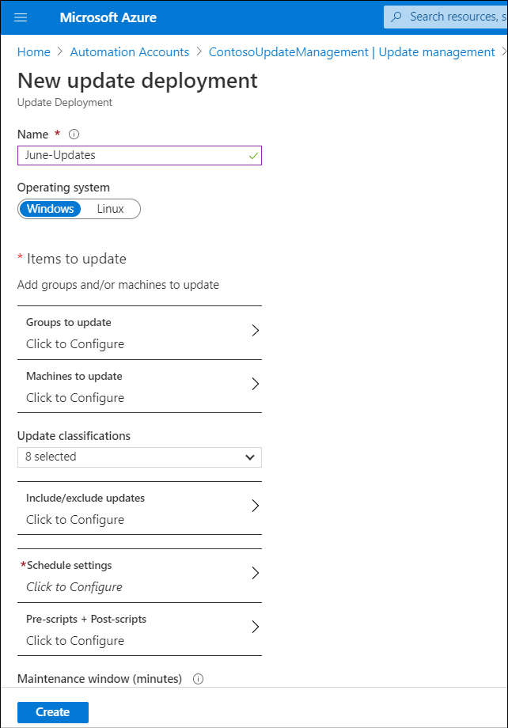

You can use the Azure portal to configure update jobs, and to schedule them to run against onboarded VMs and physical servers. To create an update deployment, in the Azure portal, navigate to your automation account, select **Update management**, and then select **Schedule update deployment**.

## Create an update deployment

In the Azure portal, on the **Schedule update management** blade, you must configure the update deployment properties. This requires configuring the update deployment using the settings described in the following table.

|Setting|Your action|
|----------------------------|----------------------------------|
|**Name**|Enter the name of the update deployment.|
|**Operating system**|Choose either **Windows** or **Linux**.|
|**Groups to update**|Select the groups to update. These are dynamic groups that Azure resolves at deployment time. You can preview the machines in the groups, but the final list of machines could change when the deployment starts. A query of more than 1,000 machines is currently not supported and will fail the update deployment. Azure and non-Azure machines are supported.|
|**Machines to update**|Select from a list of available machines.|
|**Update classifications**|Select from the following list: **Critical updates**, **Security updates**, **Update rollups**, **Feature packs**, **Service packs**, **Definition updates**, **Tools**, and **Updates**. You can also select **Select all** for the default values.|
|**Include/exclude updates**|Enter the knowledge base (KB) ID of any updates you want to exclude, or specifically include.|
|**Schedule settings**|Specify the start date and time, the time zone, and the recurrence values. If the schedule recurs, then specify the interval and any expiration value.|
|**Pre-scripts + Post-scripts**|Pre-scripts and Post-scripts are tasks that can be automatically executed before or after an update deployment runs. Configure up to one Pre-script and Post-script per deployment.|
|**Maintenance window (minutes)**|Set the maintenance window in minutes. The duration must be a minimum of 30 minutes and less than 6 hours. The last 20 minutes of the maintenance window is dedicated to machine restart. Any remaining updates will not be started after this interval is reached. Updates which are in progress will be applied. The default maintenance window is 120 minutes.|
|**Reboot options**|Choose one from the following list: **Reboot if required**, **Never reboot**, **Always reboot**, and **Only reboot - will not install updates**.|

## Additional reading

You can learn more by reviewing the following document.

- [Schedule an update deployment](https://aka.ms/schedule-an-update-deployment?azure-portal=true)
