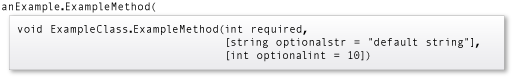

Named arguments enable you to specify an argument for a parameter by matching the argument with its name rather than with its position in the parameter list. Optional arguments enable you to omit arguments for some parameters. Both techniques can be used with methods, indexers, constructors, and delegates.

When you use named and optional arguments, the arguments are evaluated in the order in which they appear in the argument list, not the parameter list.

Named and optional parameters enable you to supply arguments for selected parameters. This capability greatly eases calls to COM interfaces such as the Microsoft Office Automation APIs.

## Named arguments

Named arguments free you from matching the order of arguments to the order of parameters in the parameter lists of called methods. The argument for each parameter can be specified by parameter name.

> [!NOTE]
> Named arguments improve the readability of your code by identifying what each argument represents.

Consider a method that uses the following method signature:

```csharp

static void PrintOrderDetails(string sellerName, int orderNum, string productName)
{
    // Code to print the order details
}

```

This method can be called successfully without using named arguments as long the arguments are in the correct order (defined by the method signature):

```csharp

PrintOrderDetails("Gift Shop", 31, "Red Mug");

```

If you don't remember the order of the parameters but know their names, you can send the arguments in any order.

```csharp

PrintOrderDetails(orderNum: 31, productName: "Red Mug", sellerName: "Gift Shop");
PrintOrderDetails(productName: "Red Mug", sellerName: "Gift Shop", orderNum: 31);

```

When used with positional arguments, named arguments are valid as long as they're used in the correct position.

The following example works correctly because: the parameter `productName` is explicitly named, isn't followed by any positional arguments, and is in the correct position.

```csharp

PrintOrderDetails("Gift Shop", 31, productName: "Red Mug");

```

Positional arguments that follow any out-of-order named arguments are invalid.

```csharp

// This generates CS1738: Named argument specifications must appear after all fixed arguments have been specified.
PrintOrderDetails(productName: "Red Mug", 31, "Gift Shop");

```

## Optional arguments

A method definition can specify whether its parameters are required or optional. Any call must provide arguments for all required parameters, but can omit arguments for optional parameters. A nullable reference type (`T?`) allows arguments to be explicitly `null` but does not inherently make a parameter optional.

Each optional parameter has a default value as part of its definition. If no argument is sent for that parameter, the default value is used. A default value must be one of the following types of expressions:

- a constant expression, such as a literal string or number.
- an expression of the form `new ValType()`, where `ValType` is a value type, such as an `enum` or a `struct`.
- an expression of the form `default(ValType)`, where `ValType` is a value type.

Optional parameters are defined at the end of the parameter list, after any required parameters. The caller must provide arguments for all required parameters and any optional parameters preceding those it specifies. Comma-separated gaps in the argument list aren't supported. For example, in the following code, instance method `ExampleMethod` is defined with one required and two optional parameters.

```csharp

public void ExampleMethod(int required, string optionalstr = "default string", int optionalint = 10)

```

The following call to `ExampleMethod` causes a compiler error, because an argument is provided for the third parameter but not for the second.

```csharp

// anExample.ExampleMethod(3, ,4);

```

However, if you know the name of the third parameter, you can use a named argument to accomplish the task.

```csharp

anExample.ExampleMethod(3, optionalint: 4);

```

IntelliSense uses brackets to indicate optional parameters, as shown in the following illustration:



> [!NOTE]
> You can also declare optional parameters by using the .NET `OptionalAttribute` class. `OptionalAttribute` parameters do not require a default value. However, if a default value is desired, consider using the `DefaultParameterValueAttribute` class.

In the following example, the constructor for `ExampleClass` has one parameter, which is optional. Instance method `ExampleMethod` has one required parameter, `required`, and two optional parameters, `optionalstr` and `optionalint`. The code in `Main` shows the different ways in which the constructor and method can be invoked.

```csharp

namespace OptionalNamespace
{
    class OptionalExample
    {
        static void Main(string[] args)
        {
            // Instance anExample does not send an argument for the constructor's
            // optional parameter.
            ExampleClass anExample = new ExampleClass();
            anExample.ExampleMethod(1, "One", 1);
            anExample.ExampleMethod(2, "Two");
            anExample.ExampleMethod(3);

            // Instance anotherExample sends an argument for the constructor's
            // optional parameter.
            ExampleClass anotherExample = new ExampleClass("Provided name");
            anotherExample.ExampleMethod(1, "One", 1);
            anotherExample.ExampleMethod(2, "Two");
            anotherExample.ExampleMethod(3);

            // The following statements produce compiler errors.

            // An argument must be supplied for the first parameter, and it
            // must be an integer.
            //anExample.ExampleMethod("One", 1);
            //anExample.ExampleMethod();

            // You can't leave a gap in the provided arguments.
            //anExample.ExampleMethod(3, ,4);
            //anExample.ExampleMethod(3, 4);

            // You can use a named parameter to make the previous
            // statement work.
            anExample.ExampleMethod(3, optionalint: 4);
        }
    }

    class ExampleClass
    {
        private string _name;

        // Because the parameter for the constructor, name, has a default
        // value assigned to it, it's optional.
        public ExampleClass(string name = "Default name")
        {
            _name = name;
        }

        // The first parameter, required, has no default value assigned
        // to it. Therefore, it isn't optional. Both optionalstr and
        // optionalint have default values assigned to them. They're optional.
        public void ExampleMethod(int required, string optionalstr = "default string",
            int optionalint = 10)
        {
            Console.WriteLine(
                $"{_name}: {required}, {optionalstr}, and {optionalint}.");
        }
    }

    // The output from this example is the following:
    // Default name: 1, One, and 1.
    // Default name: 2, Two, and 10.
    // Default name: 3, default string, and 10.
    // Provided name: 1, One, and 1.
    // Provided name: 2, Two, and 10.
    // Provided name: 3, default string, and 10.
    // Default name: 3, default string, and 4.
}

```

## Overload resolution for named and optional arguments

Overloaded methods are methods that have the same name but different signatures. The signature of a method consists of the name of the method and the type and kind (value, reference, or output) of each of its formal parameters. Overload resolution is the process of selecting the best method to call among several methods that have the same name but different signatures.

Use of named and optional arguments affects overload resolution in the following ways:

- A method is a candidate for execution if each of its parameters either is optional or corresponds, by name or by position, to a single argument in the calling statement, and that argument can be converted to the type of the parameter.
- If more than one candidate is found, overload resolution rules for preferred conversions are applied to the arguments that are explicitly specified. Omitted arguments for optional parameters are ignored.
- If two candidates are judged to be equally good, preference goes to a candidate that doesn't have optional parameters for which arguments were omitted in the call. Overload resolution generally prefers candidates that have fewer parameters.
