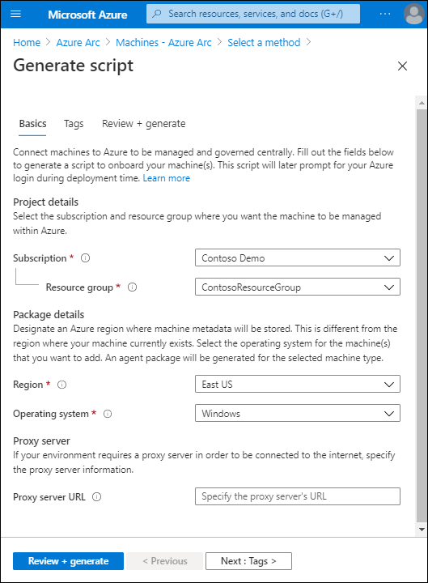
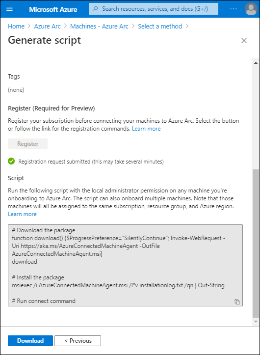

Azure Arc expands the support for Azure Resource Manager to resources running outside of Azure. This means that a physical server or a VM running in an on-premises datacenter can be registered with Azure Resource Manager and presented as a compute resource to the fabric controller. This applies to any server running the Windows Server or Linux server in an on-premises datacenter or hosted by a third-party cloud provider.

## Deploy Azure Arc to on-premises computers

Before the physical server or VM can register, you must install the Azure Connected Machine agent on each of the operating systems targeted for Azure Resource Manager-based management. The agent for Windows Server is implemented as a Microsoft Windows Installer (.msi), which is available from the Microsoft Download Center.

> [!TIP]  
> Download the Azure Connected Machine agent from the [Microsoft Download Center](https://aka.ms/AzureConnectedMachineAgent?azure-portal=true).

For smaller-scale deployments, you can use the onboarding script available directly from the Azure portal.

### Azure Arc for servers agent

The Azure Arc for servers agent enables you to manage both Windows and Linux computers that you host on-premises, or with another cloud provider. The Azure Connected Machine agent currently supports the following versions of the Windows and Linux operating systems:

- Windows Server 2012 R2 and later (including Windows Server Core)
- Ubuntu 16.04 and 18.04 (x64)
- CentOS Linux 7 (x64)
- SUSE Linux Enterprise Server (SLES) 15 (x64)
- Red Hat Enterprise Linux (RHEL) 7 (x64)
- Amazon Linux 2 (x64)

### Permissions

To onboard and manage machines in Azure Arc, you must have certain Azure permissions described in the following table.

|Ability|Permission requirement|
|-----------------------------------------------|------------------------------------------------------------|
|Onboard machines|Member of the Azure Connected Machine Onboarding role|
|Read, modify, re-onboard, and delete a machine.|Member of the Azure Connected Machine Resource Administrator role|

### Installation process

You can install the agent in three different ways:

- Double-click or open the file **AzureConnectedMachineAgent.msi**.
- Manually run the **Windows Installer package AzureConnectedMachineAgent.msi** from the Azure CLI.
- From an PowerShell session using a scripted method.

The installation creates a number of folders, Windows services, and environment variables during installation. These changes are detailed in the following table.

|Object type|Details|
|-----------|------------------------------------------------------------|
|Folders|`C:\Program Files\AzureConnectedMachineAgent`, `%ProgramData%\AzureConnectedMachineAgent`, `%ProgramData%\AzureConnectedMachineAgent\Tokens`, `%ProgramData%\AzureConnectedMachineAgent\Config`, `%SystemDrive%\Program Files\ArcConnectedMachineAgent\ExtensionService\GC`, `%ProgramData%\GuestConfig`, `%SystemDrive%\AzureConnectedMachineAgent\ExtensionService\downloads`|
|Services|Azure Hybrid Instance Metadata Service and Guest Configuration Service|
|Variables|IDENTITY_ENDPOINT (value: `http://localhost:40342/metadata/identity/oauth2/token`) and IMDS_ENDPOINT (value `http://localhost:40342`)|
|Local security group|Hybrid agent extension applications|

> [!NOTE]
> The Azure Connected Machine agent sends a heartbeat message to the Azure Arc service every 5 minutes. If the Azure Arc service stops receiving heartbeat messages from the connected machine, it considers it offline. The machine is then marked as **Disconnected** until heartbeats resume, at which time the machine is marked as **Connected**.

### Using a PowerShell Script method to onboard a machine

A typical way to onboard a computer is to generate and download a Windows PowerShell script from the Azure portal. To generate the script, use the following procedure:

1. In the Azure portal, search for **Azure Arc**, and then from the returned list, select **Azure Arc**.
2. In Azure Arc, select **Manage servers**.
3. On the **Machines - Azure Arc** page, select **Create machine - Azure Arc**.
4. On the **Select a method** page, select **Generate script**.
5. On the **Generate script** page, select the following information, and then select **Review + generate**.
   - Subscription
   - Resource group
   - Region
   - Operating system
   - Optionally, proxy server URL

     

6. When prompted, select **Download**.
7. Sign in as a local administrator on computers that you want to onboard, and then run the downloaded script.

     

When you install the script on target computers, the script downloads the Azure Arc agent, installs it, and then onboards the server. The script prompts you to authenticate to the target Azure subscription where the corresponding resources will be created. You must also enter a generated security code and also verify your request with multifactor authentication; for example, by using the Microsoft Authenticator app.

> [!NOTE]
> Computers will all be assigned to the same subscription, resource group, and Azure region.

In larger environments, you can use the Desired State Configuration (DSC) management platform in PowerShell, and an AD DS principal to perform the installation and registration in an unattended manner.

When you onboard a hybrid machine, it becomes a connected machine and is represented by a corresponding Azure resource. That resource has a unique Resource ID property. It belongs to a resource group inside a subscription, and it can benefit from Azure Resource Manager-based mechanisms such as Azure Policy and tags.

