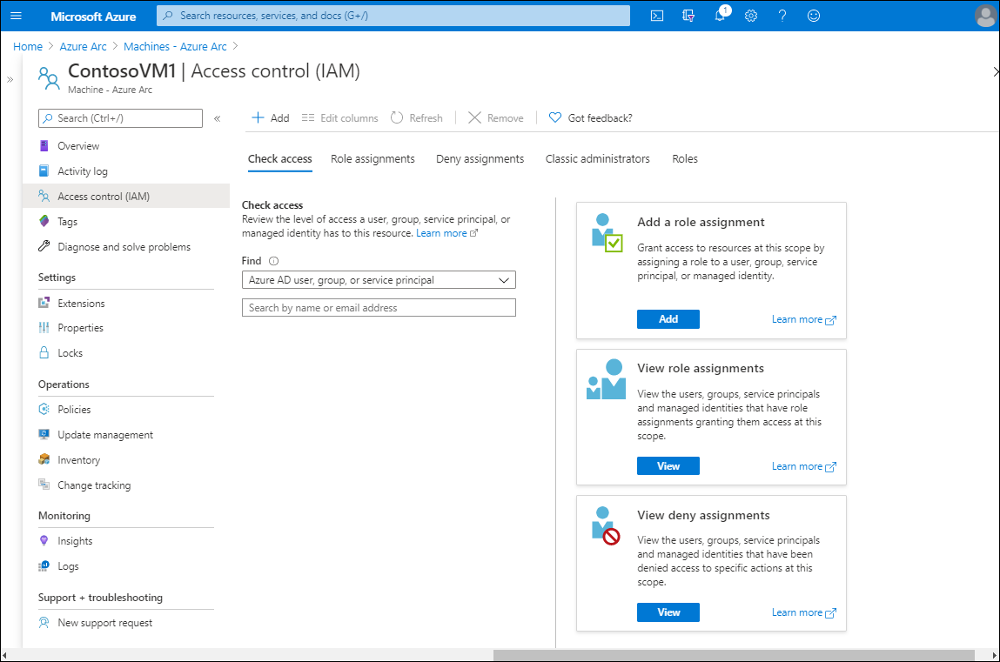

Azure Monitor stores logs collected from managed systems in a Log Analytics workspace. Each workspace constitutes a security boundary that you can protect with RBAC on the workspace level. However, the content of each workspace is also subject to an access control mechanism that reviews permissions assigned to individual resources from which logs were collected.

Determining which of these two mechanisms takes effect is based on several factors, including:

- Access mode. This represents the method you use to access the workspace, and defines the access control mode that's automatically applied. There are two access modes:
  - Workspace-context. This access mode is applicable when accessing logs from the **Azure Monitor** blade in the Azure portal. In this case, the scope is set to all data in all tables in the workspace.
  - Resource-context. This access mode is applicable when you're accessing logs from the pane of an individual resource. In this case, the scope is set to all data for that specific resource only.
- Access control mode. This is a workspace-level setting that defines how permissions are determined on the workspace and resource level. There are two access control modes:
  - Require workspace permissions. This mode is based on the workspace-level permissions when operating in context of the workspace or resource.
  - Use resource or workspace permissions. This mode is based on the workspace-level permissions when operating in the workspace context, and on resource-level permissions when operating in the resource context. This is the default setting for all workspaces.

While this works as intended for Azure resources, it poses a challenge when accessing data collected from on-premises computers. This is because they aren't subject to Azure RBAC. Azure Arc helps remediate this, because it assigns a resource ID and a corresponding Azure resource group to each non-Azure computer. This way, you can configure access to logs collected from on-premises computers using the same mechanism that applies to Azure resources.

## Manage access

To manage access using RBAC for on-premises resources, use the following procedure:

1. From the Azure portal, navigate to Azure Arc.
1. Select **Manage servers**.
1. From the list of managed servers, select the appropriate server, and then in the navigation pane, select **Access control (IAM)**.

    

The following table describes the five available tabs on the Access control (IAM) page, and the actions that you can perform on them.

|Tab|Explanation|
|----------------------|------------------------------------------------------------|
|Check access|You can use the links on the **Check access** tab to add a role assignment on the resource, review role assignments, and view deny assignments. You can also search for specific Azure AD security principals such as users and groups, and determine the access levels that they have on the resource. Learn more at [Quickstart: View the access a user has to Azure resources](https://aka.ms/check-access?azure-portal=true).|
|Role assignments|On the **Role assignments** tab, you can review the current role assignments and make changes as required. You can learn more about role assignments at [Add or remove Azure role assignments using the Azure portal](https://aka.ms/role-assignments-portal?azure-portal=true).|
|Deny assignments|Use the **Deny assignments** tab to review blocked users that are prevented from performing specific actions, even if a role assignment grants them the required access. Learn more about deny assignments at [List Azure deny assignments using the Azure portal](https://aka.ms/deny-assignments-portal?azure-portal=true).|
|Classic administrators|On the **Classic administrators** tab, review the classic administrators in your organization. These users are only necessary if you're still using Azure classic deployments. You can learn more at [Azure classic subscription administrators](https://aka.ms/classic-administrators?azure-portal=true).|
|Roles|On the **Roles** tab, you can assign user accounts to the built-in roles. You add a role assignment from the toolbar. You can learn more about roles at [Add or remove Azure role assignments using the Azure portal](https://aka.ms/role-assignments-portal?azure-portal=true).|

> [!TIP]
> On the toolbar, select **+ Add** to add a co-administrator or a new role assignment.

## Additional reading

You can learn more by reviewing the following document.

- [What is Azure role-based access control (Azure RBAC)?](https://aka.ms/role-based-access-control-overview?azure-portal=true)
