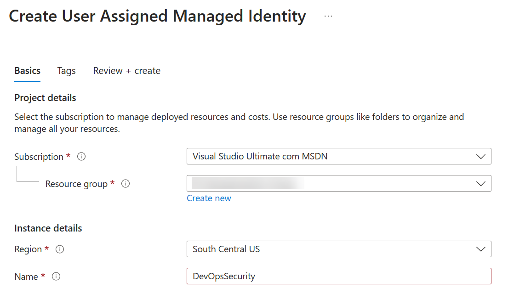
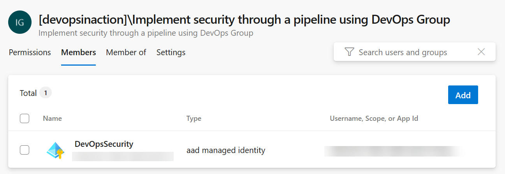

Managed Identity and Service Principals are two ways to authenticate and authorize access to Azure resources. Both provide a secure way to grant your Azure Pipelines access to Azure services without having to store credentials in the pipeline configuration.

In this unit, explore the benefits of using Managed Identity and Service Principals in Azure DevOps for service connections.

## Benefits of using managed identities

Managed identities provide several benefits when used in Azure DevOps:

- **Improved security:** They eliminate the need to store sensitive credentials in your pipeline, reducing the risk of credential exposure.
- **Simplified management:** You can manage identities through Azure, reducing the overhead of identity management in Azure DevOps.
- **Fine-grained access control:** Managed identities allow you to define the exact permissions and access levels required for your pipelines and agents.
- **Auditing and monitoring:** Authentication and authorization events are logged, making it easier to track access and detect potential security threats.

## Create a managed identity and add it to Azure DevOps

Create your Managed Identity in Azure and assign the appropriate permissions to it. Then, configure the agent to use the Managed Identity.

1. In the Azure portal, navigate to the Managed Identities resource.
2. Click + Create and configure the Managed Identity as appropriate.

    

3. Assign the necessary permissions to the Managed Identity, following the principle of least privilege.
4. In Azure DevOps, navigate to your organization and select Organization settings.
5. Click Users under general.
6. Add the Managed Identity as a user.

    

7. Choose the appropriate access level for the Managed Identity and projects.
8. Click to Add.
9. Click in Security under Pipelines.
10. Click to Add a new security group or choose an existing one.
11. Add the Managed Identity to the security group.

    

## Convert to a managed identity

To convert an existing service connection to use a managed identity, follow these steps:

1. Navigate to your Azure DevOps project, and then go to 'Project settings' then 'Service connections.'
2. Identify the service connection you want to convert to use a managed identity. Click in Edit and make a note of its settings, such as the scope and roles assigned to it. Also, make sure you know the pipelines using this service connection.
3. Delete the existing service connection by clicking on the ellipsis (three dots) next to the service connection and selecting 'Delete.'
4. Create a new service connection by clicking on 'New service connection' and selecting 'Azure Resource Manager' as the connection type (or choose the connection you need).
5. In the 'Authentication method' section, select 'Managed identity.'
6. Configure the scope and permissions for the managed identity using the settings from your previous service connection. This ensures that the managed identity has the same access and functionality as the original service connection.
7. Provide a name and description for the new service connection, and then click 'Save.'
8. Update your pipeline to use the new service connection with the managed identity. To do this, locate the service connection reference in your pipeline YAML file and replace the old service connection name with the new one (if it has changed).
9. Save and commit the updated pipeline YAML file.

## Challenge yourself

To practice converting to a Managed Identity, complete the following steps:

1. Choose a project in your Azure DevOps environment that requires access to an Azure resource.
2. Create a new service connection using Managed Identity.
3. Configure the appropriate permissions for the Managed Identity in the Azure portal.
4. Update your pipeline to use the newly created service connection with Managed Identity.
5. Execute the pipeline and verify that it runs successfully, accessing the Azure resource with the appropriate level of access.

For more information about managed identities and service connections, see:

- [Use Azure Active Directory service principals & managed identities](https://learn.microsoft.com/azure/devops/integrate/get-started/authentication/service-principal-managed-identity)
