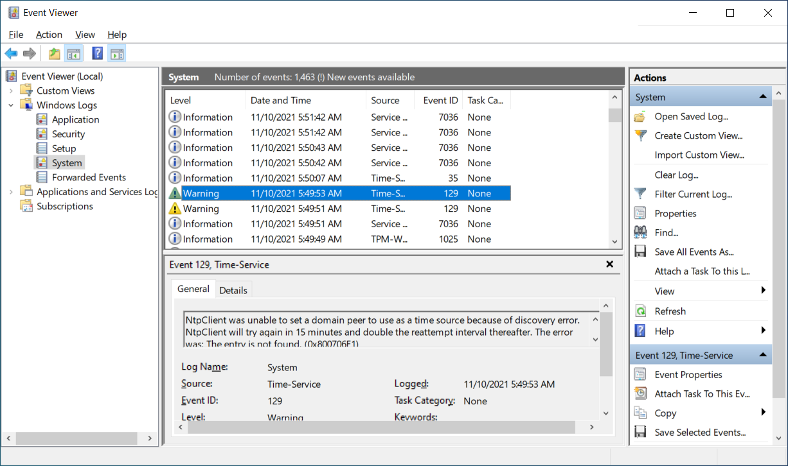
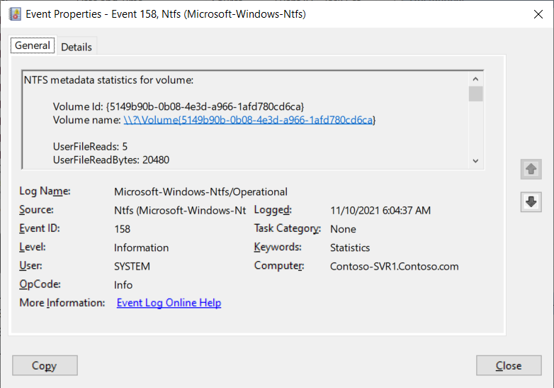

Event logs provide information about system events that occur within the Windows operating system. These events include information, warnings, and error messages about Windows components and installed applications. You typically use Event Viewer to provide access to Windows Server event logs.

## What is Event Viewer?

Event Viewer provides categorized lists of essential Windows log events, including application, security, setup, and system events. Event Viewer also provides log groupings for individual installed applications and specific Windows component categories. Individual events provide detailed information about the type of event that occurred. When an event occurs, Event Viewer provides details about the source of the event and detailed technical information to assist you in troubleshooting the event.

Additionally, Event Viewer allows you to consolidate logs from multiple computers onto a centralized server by using subscriptions. Finally, you can configure Event Viewer to run a specific action when a specified type of event occurs. This might include sending an email message, opening an application, or running a script.

Event Viewer in Windows Server contains the following important features:

- The ability to review multiple logs. You can filter for specific events across multiple logs. This makes it easier to investigate issues and troubleshoot the problems that might appear in several logs.

- The ability to customize views. You can use filtering to narrow searches to only the events in which you're interested, and you can save these filtered views.

- The ability to configure scheduled, automated tasks to run in response to events. Event Viewer is integrated with Task Scheduler.

- The ability to create and manage event subscriptions. You can collect events from remote computers and then store them locally.

> [!TIP]
> To collect events from computers, you must create an inbound rule in Windows Firewall to permit Windows Event Log Management.

Event Viewer tracks information in several different logs. These logs provide detailed information, including:

- A description of the event.

- An event ID number.

- The component or subsystem that generated the event.

- Information, warning, or error status.

- The time of the event.

- The user's name on whose behalf the event occurred.

- The computer on which the event occurred.

- A link to Microsoft Support or Microsoft Knowledge Base for more information about the type of event.

## What are the Windows Server logs?

The following table lists several of the built-in Event Viewer logs.

| Built-in log| Description and use|
| :--- | :--- |
| Application log | This log contains errors, warnings, and informational events that relate to the operation of apps such as Microsoft Exchange Server, the Simple Mail Transfer Protocol (SMTP) service, and other applications. |
| Security log | This log reports the results of auditing if you enable it. Audit events report success or failure depending on the event. For example, the log would report success or failure depending on whether a user was able to access a file. |
| Setup log | This log contains events that relate to application setup. |
| System log | Windows components and services log general events and classify them as errors, warnings, or information. The Windows operating system predetermines the events that system components log. |
| Forwarded events | This log stores events that Windows components collect from remote computers. To collect events from remote computers, you must create an event subscription. |

For example, the following screenshot displays the System event log for a server computer. The administrator has selected a Warning event that relates to the NntpClient.

## Application and service logs

The Applications and Services Logs node stores events from a single application or component rather than events that might have system-wide effects. This category of logs includes four subtypes:

- Admin

- Operational

- Analytic

- Debug

These logs are discussed in the following table.

| Log subtype| Description|
| :--- | :--- |
| Admin | Admin logs are of interest to administrators and support personnel who use Event Viewer to troubleshoot problems. These logs provide guidance about how to respond to issues. The events found in the Admin logs indicate a problem and a well-defined solution upon which an administrator can act. |
| Operational | Events in the Operational log are also useful for IT professionals, but they’re likely to require more interpretation. You can use operational events to analyze and diagnose a problem or occurrence and to trigger tools or tasks based on the problem or occurrence. |
| Analytic and Debug | Analytic and Debug logs aren't very user-friendly. Analytic logs store events that trace an issue, and they often log a high volume of events. Developers use Debug logs when they’re debugging applications. By default, both Analytic and Debug logs are hidden and disabled. |

The following screenshot shows an operational log from the Ntfs folder for a volume and consists of

Windows log files are 20,480 kilobytes (KB) in size, except the Setup log, which is 1,024 KB. The operating system overwrites events in the log files where necessary.

> [!TIP]
> If you want to clear a log manually, you must sign into the server as a local administrator.

If you want to configure event log settings centrally, you can do so by using Group Policy. Open the Group Policy Management Editor for your selected Group Policy Object, and then browse to Computer Configuration\Policies\Administrative Templates\Windows Components\Event Log Service.

For each log, you can define the following properties:

- The location of the log file

- The maximum size of the log file

- Automatic backup options

- Permissions on the logs

- Behavior that occurs when the log is full

