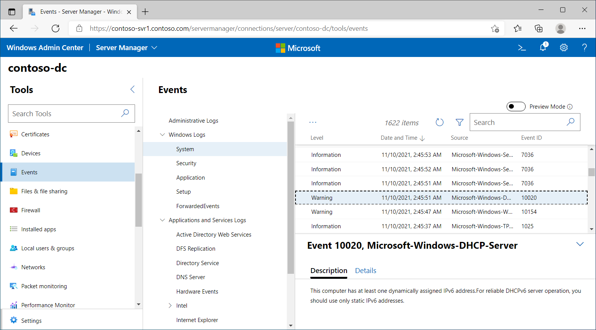
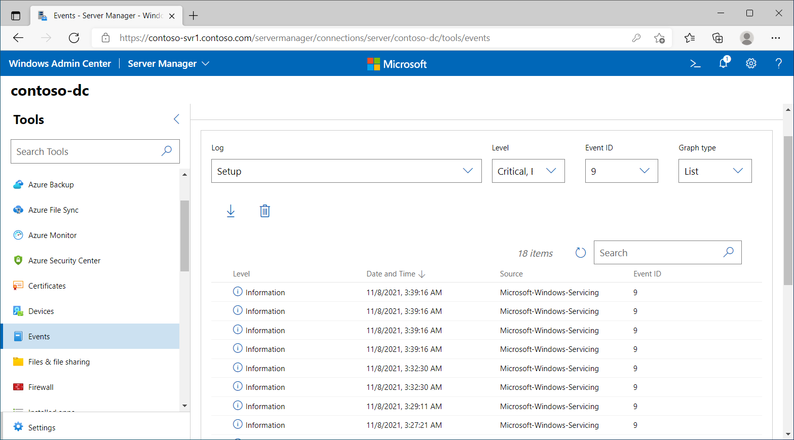

Windows Admin Center is a web-based console that you can use to manage computers that are running Windows Server and Windows 10. Typically, you use Windows Admin Center to manage servers instead of using Remote Server Administration Tools.

> [!TIP]
> Windows Admin Center works with any browser that’s compliant with modern standards, and you can install it on computers that run Windows 10 and Windows Server.
## Review event logs

You can use Windows Admin Center to review logs on added server computers. For example, the following screenshot displays the Windows System log. The administrator has selected a warning event with the ID of 10020. This event relates to the DHCP service running on the target server.

The following features are supported in Events:

- Browse and search events

- View event details

- Clear events from the log

- Export events from the log

## Use preview features

If you enable the Preview Mode, you can also use Events to perform the following functions.

- Create workspaces

- Save workspaces

- Delete workspaces

- View events in a stacked bar format

The following screenshot displays the Setup log being reviewed in Preview Mode. Events with an Event ID of 9 are added to a list.

